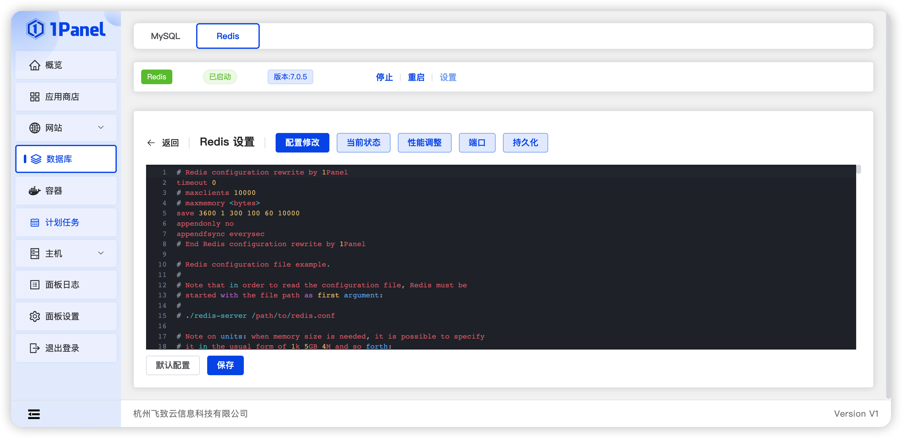
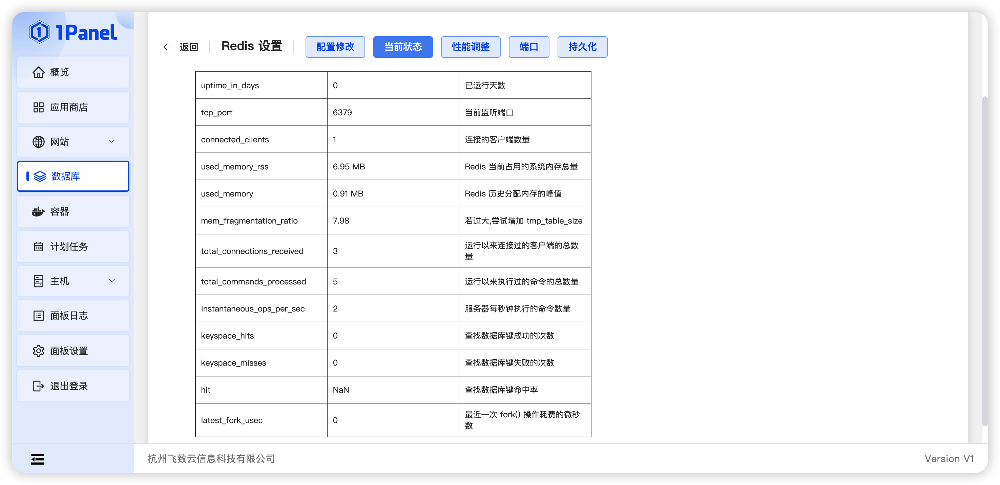
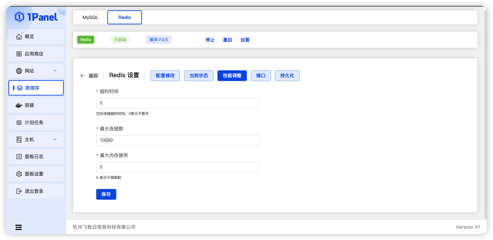
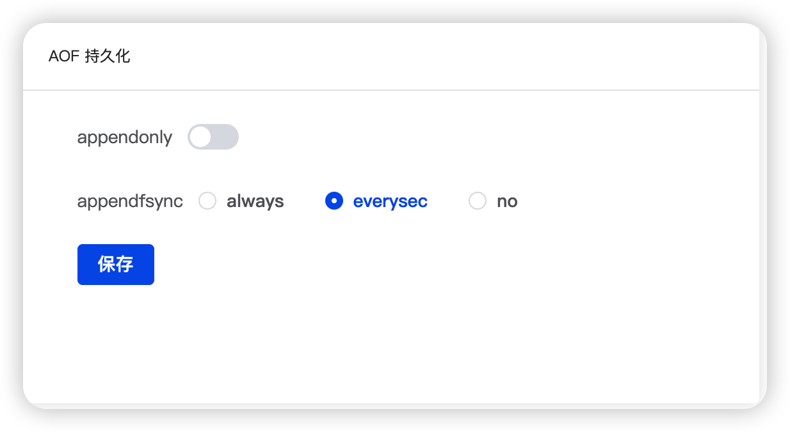
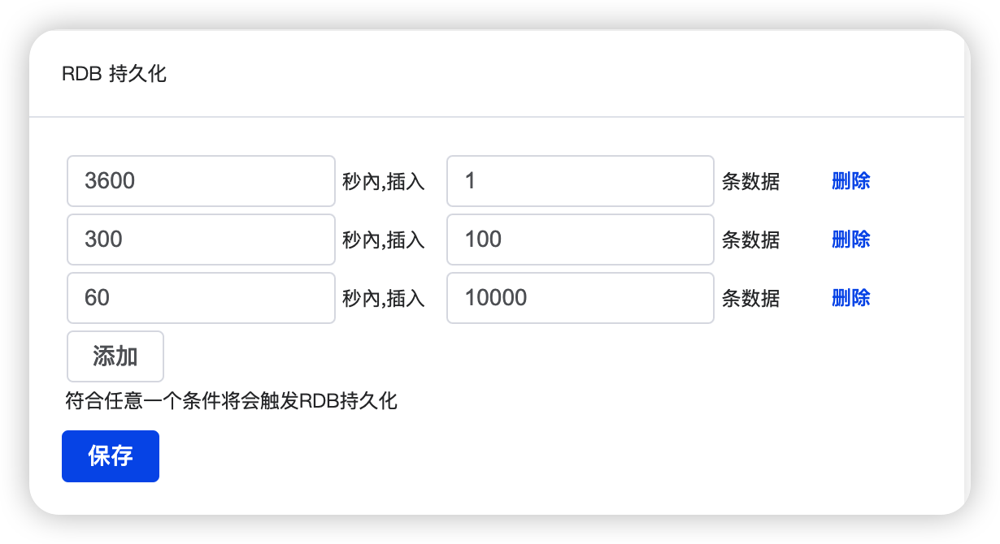

## 1 修改密码

!!! Abstract ""
    默认为随机密码，root 为最高权限账号密码，请谨慎操作。

## 2 Redis Commander

!!! Abstract ""
    WEB 图形化界面管理 redis 数据库的管理工具，此处不会详细讲解工具使用方法，[点击查看工具教程](http://joeferner.github.io/redis-commander/)

## 3 数据库配置

!!! Abstract ""
    点击状态栏设置按钮，即可进入 Redis 具体设置界面，具体包括配置修改、当前状态、性能调整、端口、持久化。
    其中配置界面可对 Redis 配置进行手动调整。

!!! Abstract ""
    - 系统 Redis 使用 Docker 安装，配置文件默认挂载在 /opt/1panel/apps/redis/[数据库名称]/conf/redis.conf。
    - **注意事项：** 错误的数据库配置将导致 Redis 服务不可用，请谨慎修改。
    - 如数据库配置不正确导致服务无法正常启动，可尝试恢复默认配置后保存。

## 4 当前状态

!!! Abstract ""
    当 Redis 查询缓慢时，可在设置界面，点击当前状态按钮，查看当前数据库包括内存分配、查询命中率等各个常用指标的状态，通过这些状态对 Redis 进行性能优化。

## 5 性能调整

!!! Abstract ""
    系统支持表单方式直接调整 Redis 相关参数，具体包括：超时时间、最大连接数、最大内存数。

## 6 端口

!!! Abstract ""
    除了在用户安装 Redis 应用时可自由选择端口外，设置界面也可以直接进行端口的修改操作。

## 7 持久化

!!! Abstract ""
    Redis 持久化分为两种：AOF 及 RDB，其中：
    
    - RBD: 
        - 实现： 父进程在保存 RDB 文件时，先 fork 出来一个子进程，然后子进程处理接下来的保存工作，父进程无需执行任何磁盘 I/O 操作。
        - 优点： 将 Redis 在某个时间点上的数据集保存在一个文件中，适用于灾难恢复，可以最大化 Redis 性能，速度更快，并且在恢复大数据集时速度更快。
        - 缺点： 有丢失数据的风险，需要设置备份频率，一旦发生故障停机时，可能会丢失数据，而且当数据集比较大时，fork 子进程将会非常耗时造成服务停止。
    - AOF：
        - 实现： 定时或者在每次写入命令时追加操作到日志文件中，日志文件只进行追加操作，当 AOF 文件变的过大时，自动对 AOF 进行重写，重写仅保留恢复当前数据集所需的最小命令集合。
        - 优点： 有序保存了对数据库执行的所有写入操作，数据不容易丢失，即使发生故障停机，也只会丢失上一次写入日志文件操作之后的数据，更可靠且更容易对文件进行分析。
        - 缺点： 一般相同的数据集来说，AOF 体积要更大，而且速度可能会慢于 RDB。

!!! Abstract ""

    - appendonly: 是否开启 AOF 备份
    - appendfsync: 同步频率
        - always: 每次写入时；
        - everysec: 每秒；
        - no: 不同步。

!!! Abstract ""

    - 设置持久化策略，当 Redis 满足其中任意一个条件时，将触发 RDB 持久化。 