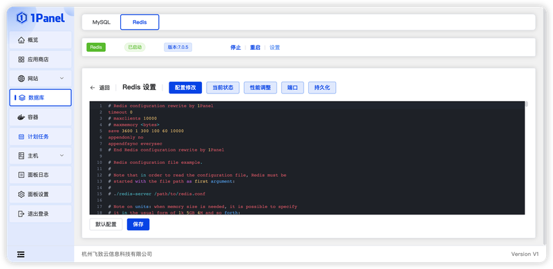
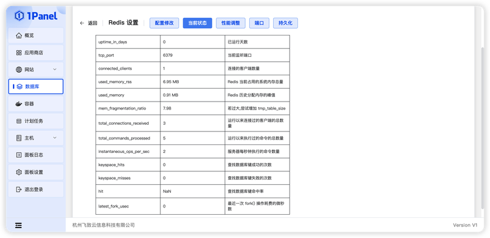
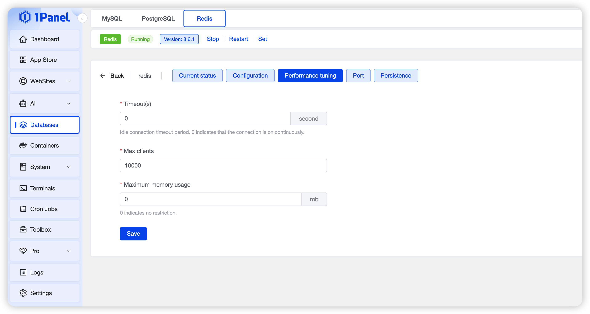
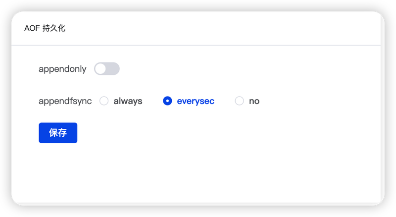
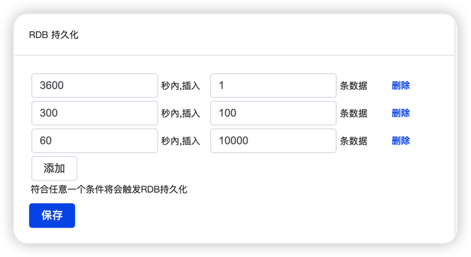

## 1 Change Password

!!! note ""
    The default password is random. `root` is the account with the highest privileges; please operate with caution.

## 2 Redis Commander

!!! note ""
    A web-based GUI tool for managing Redis databases. For detailed usage, see the [official documentation](http://joeferner.github.io/redis-commander/).

## 3 Database Configuration

!!! note ""
    Click the settings button in the status bar to enter the Redis settings interface, which includes configuration editing, current status, performance tuning, port, and persistence.
    You can manually adjust Redis configuration in the configuration interface.

{: .browser-mockup}

!!! note ""
    - Redis is installed via Docker; the configuration file is mounted at `/opt/1panel/apps/redis/[database-name]/conf/redis.conf`
    
    **Warning**: Incorrect configuration may make Redis unavailable; modify with caution. If the service fails to start due to invalid configuration, restore the default settings and save.

## 4 Current Status

!!! note ""
    When Redis queries are slow, you can go to the settings interface and click **Current Status** to view key metrics such as memory allocation and query hit ratio for performance optimization.

{: .browser-mockup}

## 5 Performance Tuning

!!! note ""
    The system supports form-based adjustment of Redis parameters, including: timeout, max connections, and max memory.

{: .browser-mockup}

## 6 Port

!!! note ""
    Besides setting the port during Redis installation, you can modify it directly in the settings interface.

## 7 Persistence

!!! note ""
    Redis supports two persistence modes: AOF and RDB.
    
    - RDB
        - Implementation: The parent process forks a child process to save the RDB file; the parent process does not perform disk I/O.
        - Advantages: Saves a point-in-time snapshot of the dataset, ideal for disaster recovery; maximizes Redis performance and is faster for large dataset recovery.
        - Disadvantages: Risk of data loss; depends on backup frequency. Forking can be time-consuming for large datasets and may pause the service.
    - AOF
        - Implementation: Appends write operations to a log file either on each write or periodically. The log is rewritten automatically when it becomes too large, keeping only the minimal commands needed to restore the current dataset.
        - Advantages: Logs all write operations in order; more durable, less data loss on crash, and easier to analyze.
        - Disadvantages: Larger file size for the same dataset; may be slower than RDB.

{: .browser-mockup}

!!! note ""
    - appendonly: Whether to enable AOF persistence
    - appendfsync: Sync frequency
        - always: Sync on every write
        - everysec: Sync every second
        - no: No explicit sync

{: .browser-mockup}

!!! note ""
    Set the persistence policy. RDB persistence is triggered when **any** of the conditions are met.
