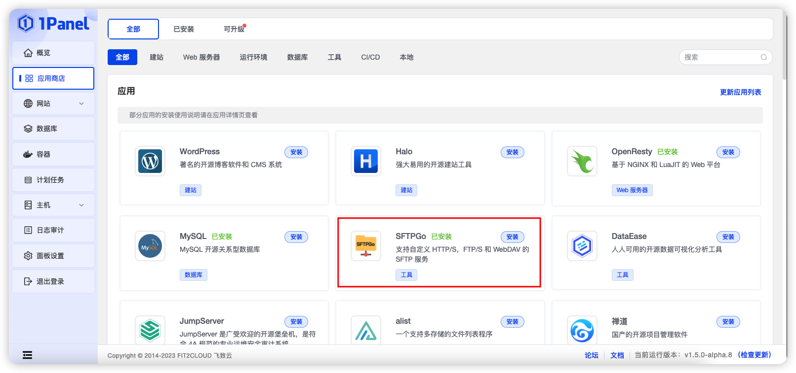
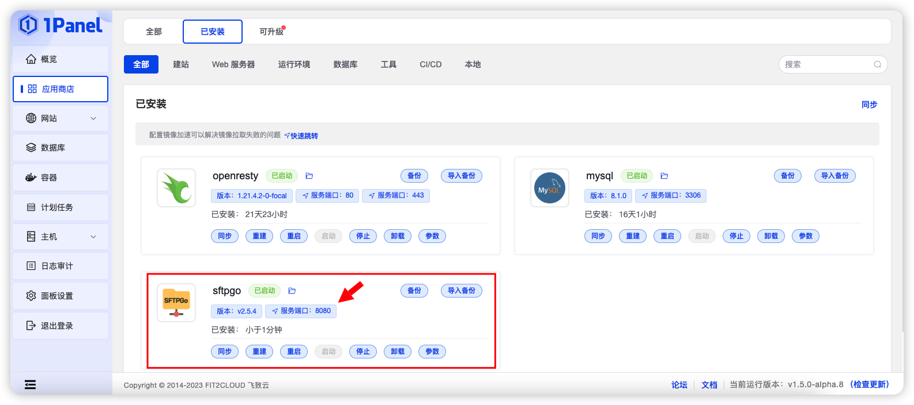
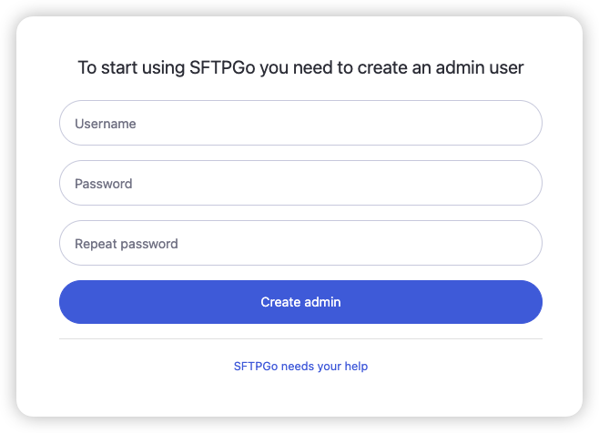
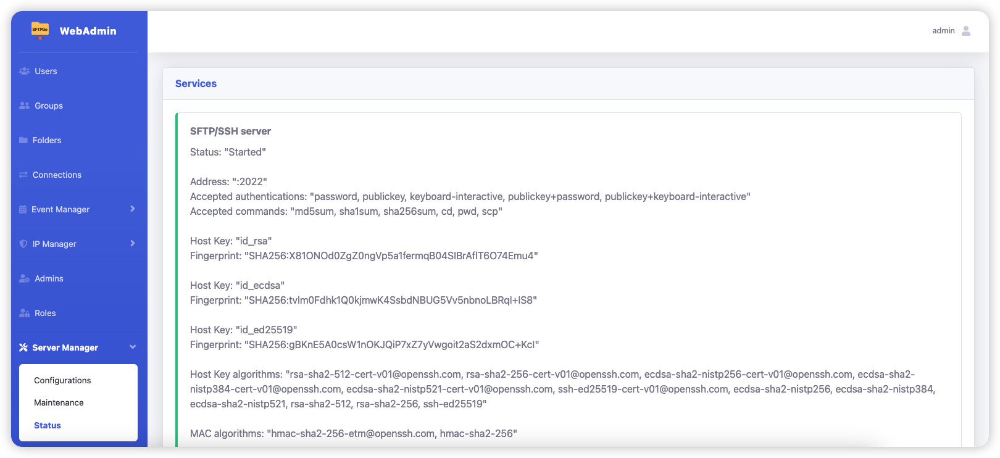
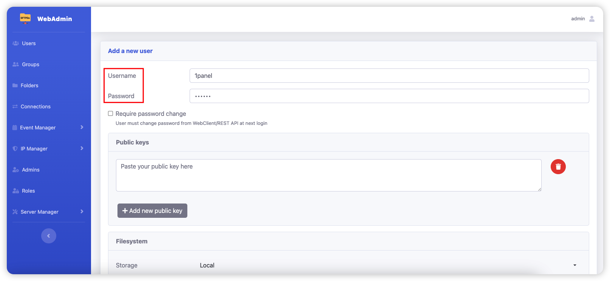
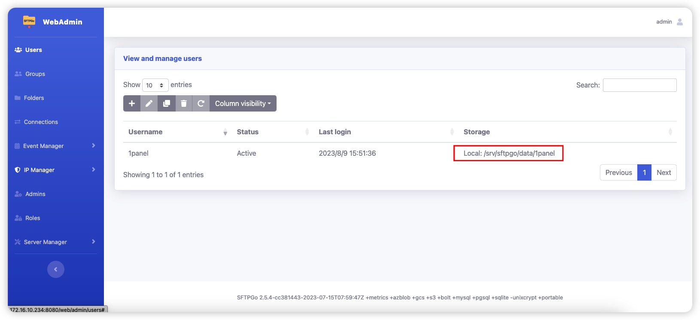
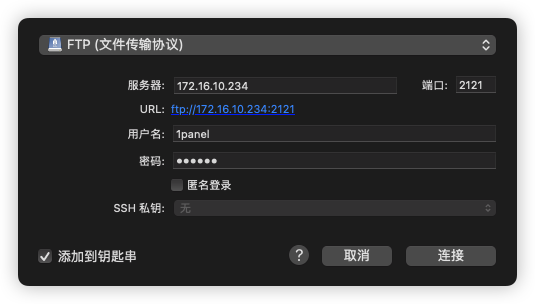
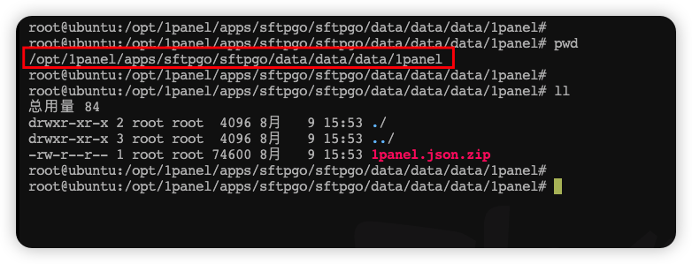

## 安装 SFTPGo

!!! Abstract ""
    1Panel 系统借助 SFTPGo 应用，可以快速创建 SFTP、FTP 和 WebDAV 服务，支持多用户、多目录、多权限。

> 在应用列表找到 SFTPGo 应用，点击安装，输入端口等信息后，点击确认即可安装成功。

!!! Abstract "注意"
    
    - 修改 FTP 外部地址（可以是 1Panel 服务器的 IPv4 地址，也可以是域名）
    - 点开 `高级设置`，勾选 `端口外部访问`

## 使用 SFTPGo

!!! Abstract ""
    进入已安装应用列表，找到 SFTPGo 应用，点击服务端口，进入 SFTPGo 管理界面。

### 创建管理员

!!! Abstract ""
    第一次需要创建管理员用户名密码，输入用户名密码，点击 `Create admin` 按钮即可。

### 查看服务状态

!!! Abstract ""
    点击左侧菜单栏 `Server Manager` `Status` 按钮，可以查看 SFTP、FTP 和 WebDAV 等服务的连接信息。

### 创建用户

!!! Abstract ""
    点击左侧菜单栏 `Users` 按钮，输入用户名密码，点击右下角 `Submit` 按钮即可。

!!! Abstract ""
    - 上图标红的部分，是用户的数据目录。
    - 由于 1Panel 是容器化安装，在安装时已经将 `/srv/sftpgo/` 目录挂载到了宿主机的应用目录中，所以用户的数据目录实际上是应用目录下的 `./data/data/` 目录。

> 上图 1panel 用户的数据目录为：`/opt/1panel/apps/sftpgo/sftpgo/data/data/data/1panel/`

### 上传文件测试

!!! Abstract ""
    使用 FileZilla、Cyberduck 等 FTP 客户端，输入用户名密码，连接 FTP 服务，上传文件测试。

更多使用情况，参考 [SFTPGo 官方文档](https://github.com/drakkan/sftpgo/blob/main/docs/howto/getting-started.md)
