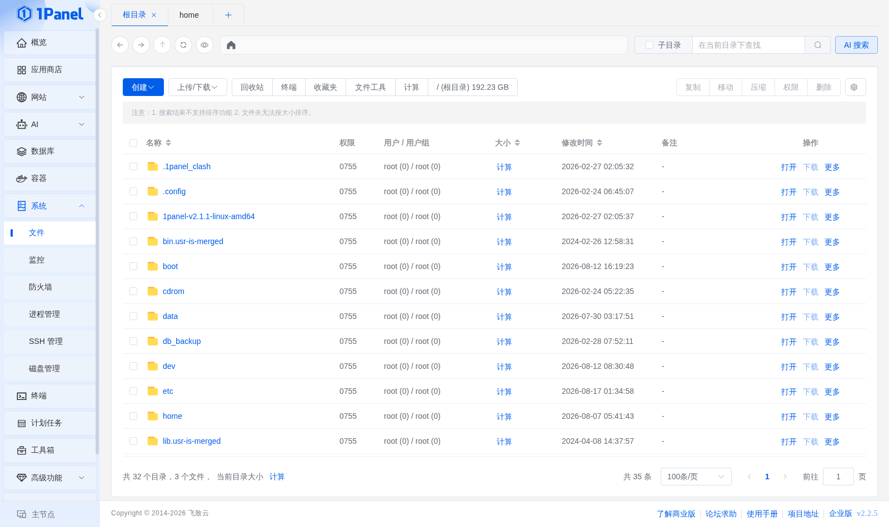
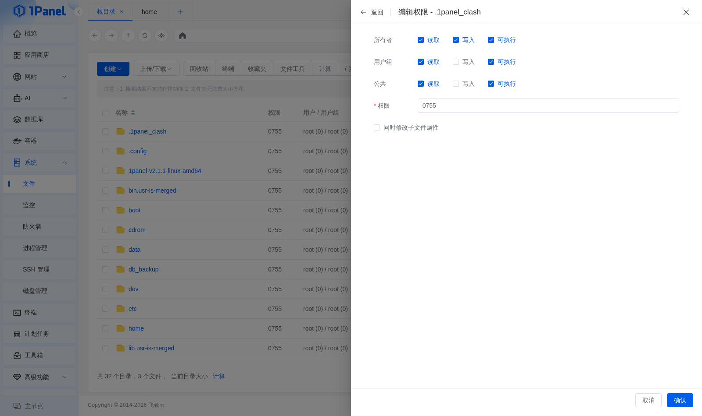
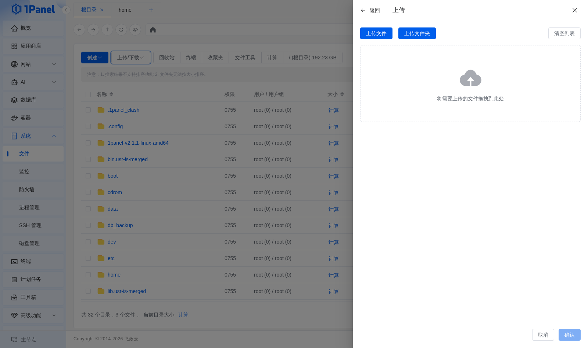
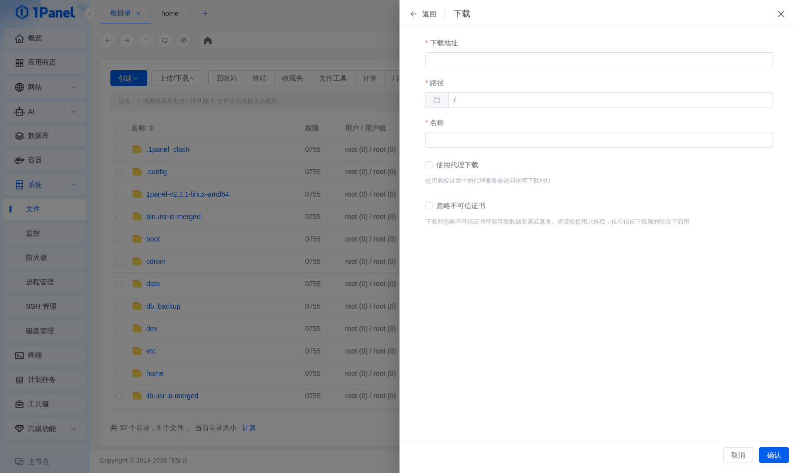
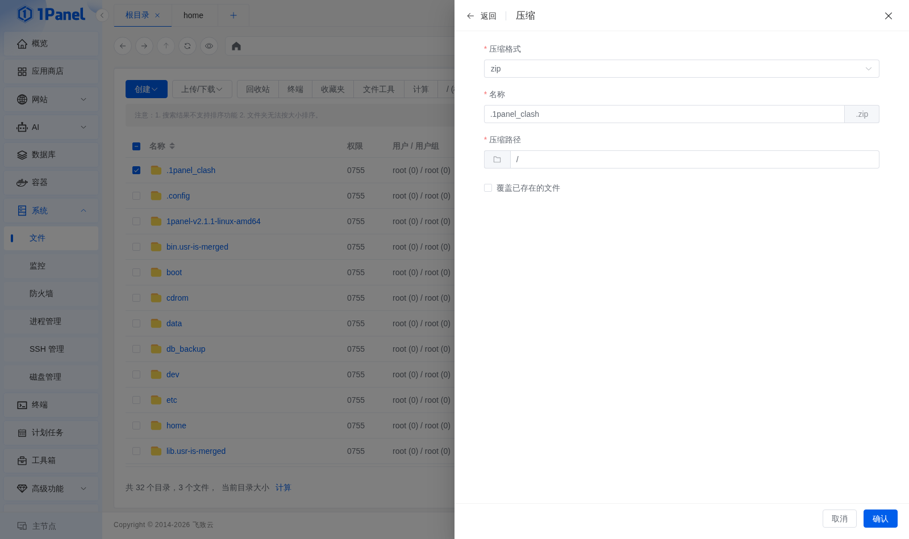

# 文件

!!! note ""
    文件管理实现了很多实用的文件操作，除了基本的剪切、复制、粘贴、删除操作，还支持上传和下载文件、解压和压缩、加密和解密、批量操作。

## 1 文件操作

!!! note ""
    文件列表展示名称、权限、用户/用户组、大小、修改时间、备注等信息。选中文件后，工具栏中的 **复制、移动、压缩、权限、删除** 等按钮会变为可用，右侧操作列还提供 **打开、下载、更多** 等入口。

## 2 修改权限

!!! note ""
    点击文件列表「权限」列中的值（类似 0755、0644），可对文件的权限进行修改。

!!! note ""
    Linux 中文件权限可按照以下三个不同角色分别进行设置：

    - **所有者**：文件所属用户
    - **用户组**：文件所属用户组
    - **公共**：其它用户

    在修改权限的窗口中，可直接勾选不同角色所具备的 **读取、写入、可执行** 权限，下方的权限代码会随之自动变化。

    如果要修改的是目录的权限，勾选 **同时修改子文件属性** 后，目录中的所有文件和目录的权限也都会发生变化。

## 3 上传文件

!!! note ""
    点击工具栏中的 **上传/下载 -> 上传**，可将本地电脑的文件上传到服务器上。上传窗口支持上传文件、上传文件夹，也可以直接把文件拖拽到窗口中的虚线区域。

## 4 在线下载文件

!!! note ""
    如果想从其它服务器上下载文件到当前服务器上，可点击工具栏上的 **上传/下载 -> 远程下载**，填写下载地址、保存路径和文件名称后确认。如有需要，可以开启 **使用代理下载** 或 **忽略不可信证书**。

## 5 下载文件

!!! note ""
    如果需要将服务器上的文件下载到本地，点击文件右侧下拉菜单中的 **下载** 即可。

## 6 压缩和解压

!!! note ""
    文件管理支持多种格式的压缩和解压。选中文件后点击 **压缩**，选择压缩格式、填写名称和压缩路径，确认即可生成压缩包。

