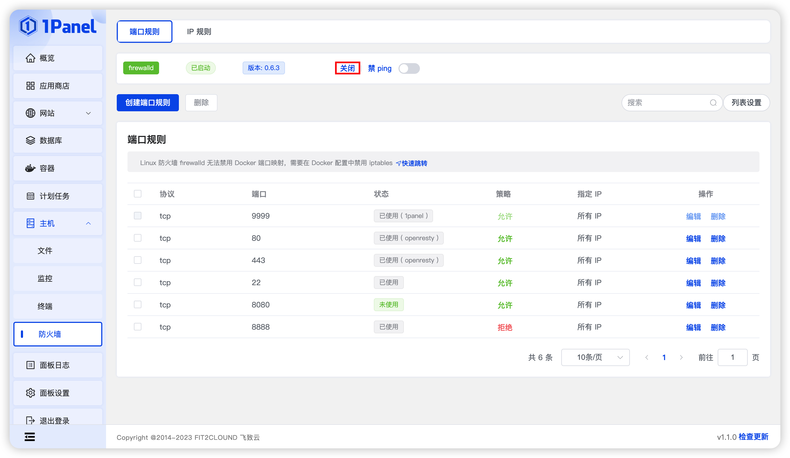
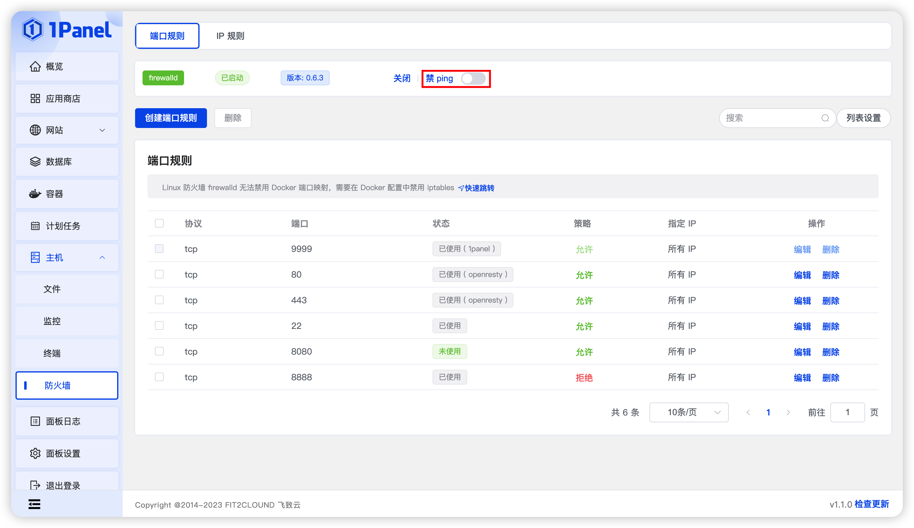
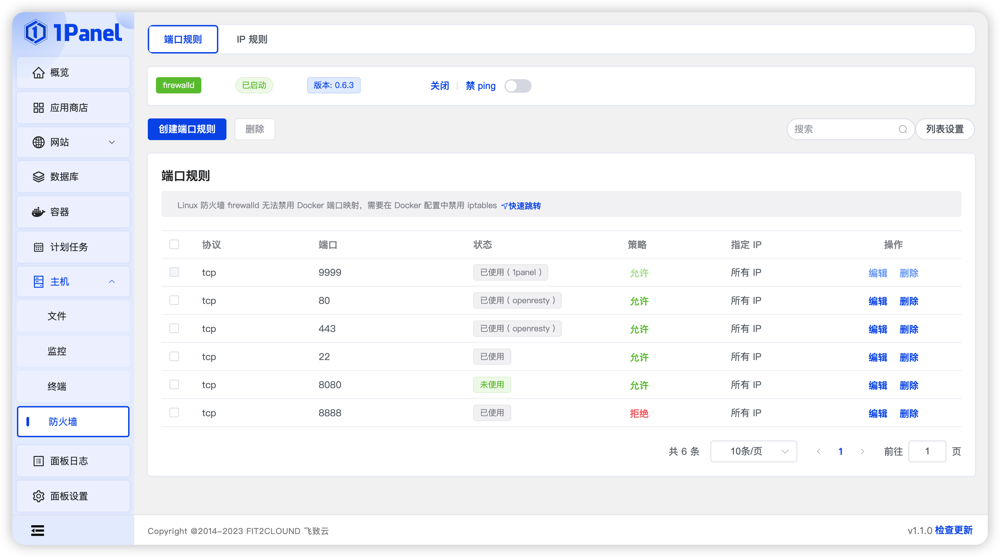
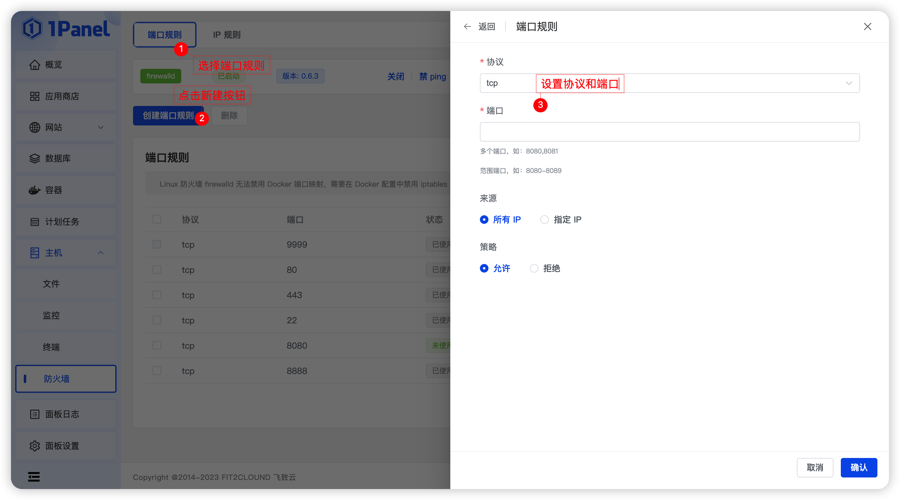
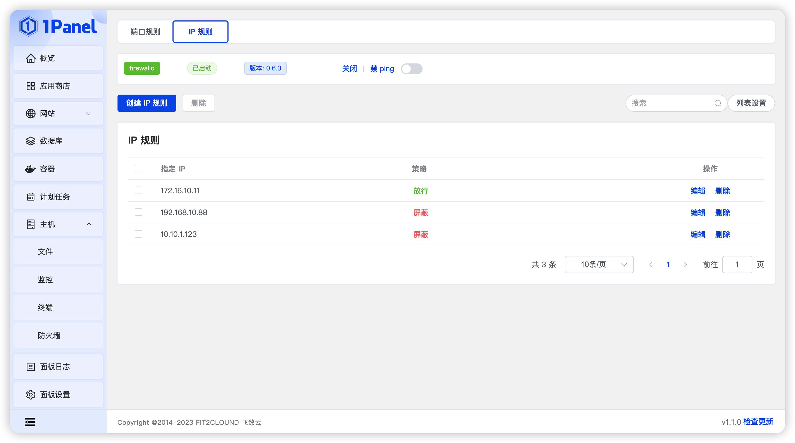
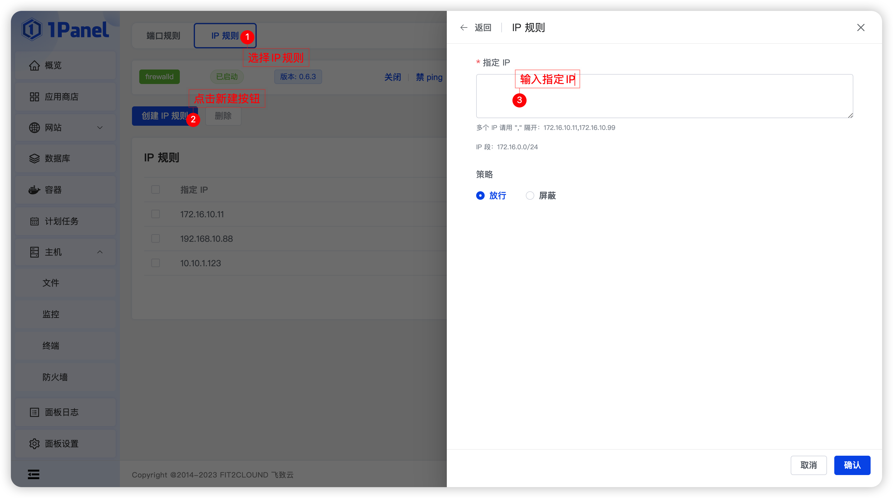

!!! Abstract ""
    **1Panel 集成了两种广泛使用的 Linux 防火墙软件：Firewalld 和 UFW。**

    - Centos 使用的是 Firewall 防火墙。
    - Debian/Ubuntu使用的是 UFW 防火墙。

## 1 安装

=== "RedHat / CentOS"
    !!! Abstract ""
        **1、更新软件包**

        ```shell
        sudo yum update
        ```

        **2、安装 firewalld**
        
        ```shell
        sudo yum install firewalld
        ```

        **3、启动 firewalld**
        
        ```shell
        sudo systemctl start firewalld
        ```

        **4、设置开机启动 firewalld**
        
        ```shell
        sudo systemctl enable firewalld
        ```

=== "Ubuntu / Debian"
    !!! Abstract ""
        **1、更新软件包**

        ```shell
        sudo apt update
        ```

        **2、安装 ufw**
        
        ```shell
        sudo apt install ufw
        ```

        **3、启动 ufw**
        
        ```shell
        sudo ufw enable
        ```

## 2 防护墙状态

!!! Abstract ""
    **点击防火墙开关按钮，即可开启或关闭防火墙。**
    


!!! Abstract ""
    **点击禁 ping 按钮，即可开启或关闭 PING 命令。**

    - 禁用 PING 命令的主要功能是：为了防止用户频繁 PING 服务器而导致服务器性能下降。



## 3 端口规则

!!! Abstract ""
    **点击创建端口规则按钮，即可设置端口规则。**

    - 协议：默认为 TCP 协议，有 TCP、UDP、TCP/UDP 协议，根据你的实际情况选择。
    - 端口：输入你要设置规则的端口，自定义，端口范围是：0-65535。
    - 来源：默认为所有 IP，选择有：所有 IP、指定 IP。
    - 策略：默认为允许，有允许、拒绝。


!!! Abstract ""
    **端口放行成功后，可以查看防火墙列表查看当前端口的运行情况。**





## 4 IP 规则

!!! Abstract ""
    **点击创建 IP 规则按钮，即可设置IP规则**

    - 指定 IP
    - 策略：默认为放行，有放行、屏蔽。




