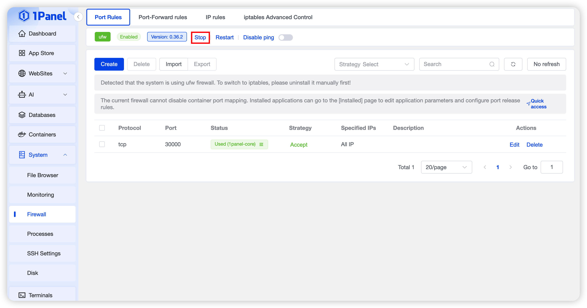
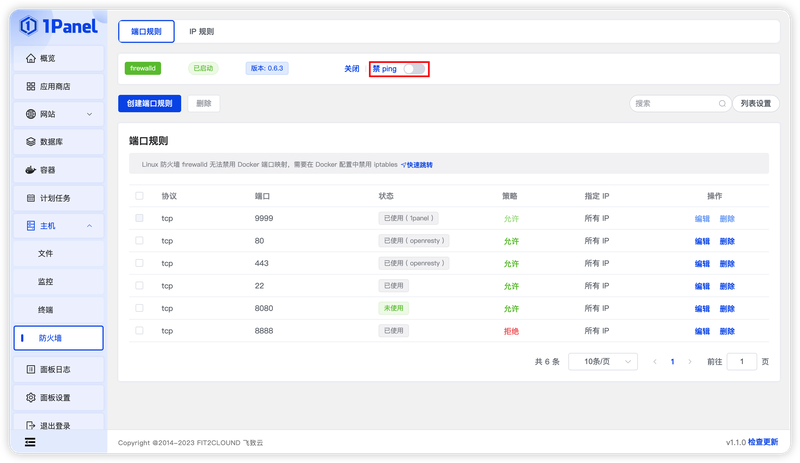
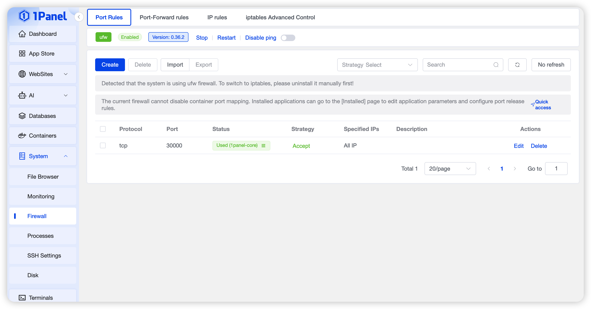
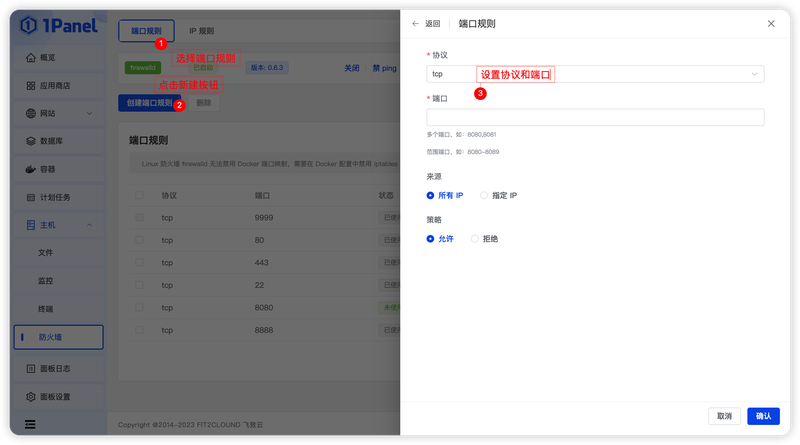
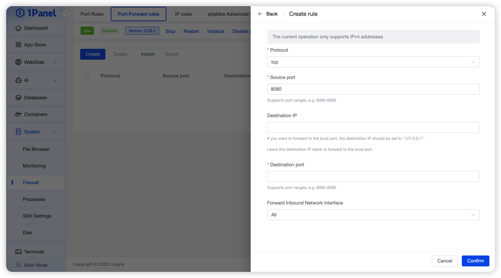
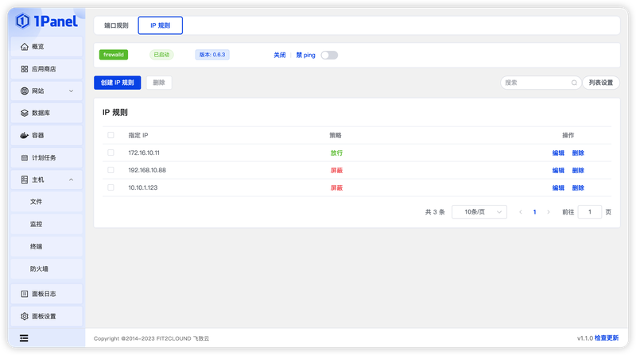
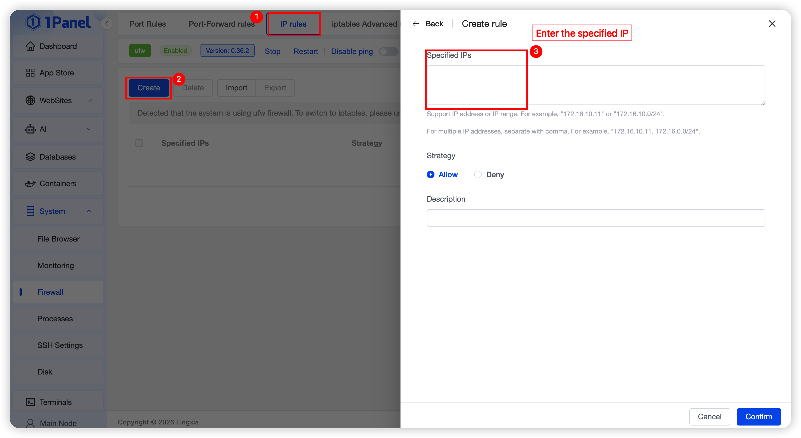

# 防火墙

!!! note ""
    1Panel 可管理 Firewalld、UFW 和 iptables。页面包含 **端口规则**、**端口转发**、**IP 规则** 和 **iptables 高级控制**；实际可用能力取决于当前节点检测到的防火墙类型。

    - RedHat/CentOS 使用的是 Firewall 防火墙
    - Debian/Ubuntu 常用 UFW 防火墙
    - 使用 iptables 时，可使用 1Panel 的高级控制页面

## 1 安装

=== "RedHat / CentOS"
    !!! note ""
        **1、更新软件包**

        ```bash
        sudo yum update
        ```

        **2、安装 firewalld**
        
        ```bash
        sudo yum install firewalld
        ```

        **3、启动 firewalld**
        
        ```bash
        sudo systemctl start firewalld
        ```
        
        **4、如果你在远程位置连接你的服务器，在启用 firewalld 防火墙之前，你必须显式允许进来的 SSH 连接。否则，你将永远都无法连接到机器上。**

        ```bash
        sudo firewall-cmd --zone=public --add-port=22/tcp --permanent
        ```
        
        > 如果 SSH 运行在非标准端口，你需要将上述命令中的 22 端口替换为对应的 SSH 端口。
        
        **5、放开 1Panel 系统端口。**

        ```bash
        sudo firewall-cmd --zone=public --add-port=8090/tcp --permanent
        ```

        > 上述命令中的 8090 端口需要替换为安装 1Panel 系统时自定义的端口。

        **6、重新加载防火墙规则，使更改生效**

        ```bash
        sudo firewall-cmd --reload
        ```

        **7、设置开机启动 firewalld**
        
        ```bash
        sudo systemctl enable firewalld
        ```

=== "Ubuntu / Debian"
    !!! note ""
        **1、更新软件包**

        ```bash
        sudo apt update
        ```

        **2、安装 UFW**
        
        ```bash
        sudo apt install ufw
        ```

        **3、如果你在远程位置连接你的服务器，在启用 UFW 防火墙之前，你必须显式允许进来的 SSH 连接。否则，你将永远都无法连接到机器上。**

        ```bash
        sudo ufw allow 22/tcp
        ```
        
        > 如果 SSH 运行在非标准端口，你需要将上述命令中的 22 端口替换为对应的 SSH 端口。

        **4、放开 1Panel 系统端口。**

        ```bash
        sudo ufw allow 8090/tcp
        ```

        > 上述命令中的 8090 端口需要替换为安装 1Panel 系统时自定义的端口。

        **5、启动 UFW**
        
        ```bash
        sudo ufw enable
        ```

## 2 防火墙状态

!!! note ""
    **点击防火墙开关按钮，即可开启或关闭防火墙。**
    
<div class="browser-mockup" markdown>



</div>

!!! note ""
    **点击禁 ping 按钮，即可开启或关闭 PING 命令。**

    - 禁用 PING 命令的主要功能是：为了防止用户频繁 PING 服务器而导致服务器性能下降

<div class="browser-mockup" markdown>



</div>

## 3 端口规则

!!! note ""
    **点击创建端口规则按钮，即可设置端口规则。**

    - 协议：默认为 TCP 协议，有 TCP、UDP、TCP/UDP 协议，根据你的实际情况选择
    - 端口：输入你要设置规则的端口，自定义，端口范围是：0-65535
    - 来源：默认为所有 IP，选择有：所有 IP、指定 IP
    - 策略：默认为允许，有允许、拒绝


!!! note ""
    **端口放行成功后，可以查看防火墙列表查看当前端口的运行情况。**

<div class="browser-mockup" markdown>



</div>

<div class="browser-mockup" markdown>



</div>

## 4 端口转发

!!! note ""
    **点击创建端口转发按钮，即可设置端口转发规则。**

    - 协议：默认为 TCP 协议，有 TCP、UDP、TCP/UDP 协议，根据你的实际情况选择
    - 源端口：发送至源端口的报文，将被转发至 `目标 IP:目标端口`，端口范围是：0-65535
    - 目标 IP：如果是本机端口转发，目标IP为：127.0.0.1；如果目标IP不填写，则默认为本机端口转发
    - 目标端口：接收转发报文的目标端口

<div class="browser-mockup" markdown>



</div>

## 5 IP 规则

!!! note ""
    **点击创建 IP 规则按钮，即可设置IP规则**

    - 指定 IP
    - 策略：默认为放行，有放行、屏蔽

<div class="browser-mockup" markdown>



</div>

<div class="browser-mockup" markdown>



</div>

## 6 iptables 高级控制

高级控制仅在当前防火墙为 iptables 时可用，用于查看和维护更细粒度的链与规则。Firewalld 或 UFW 环境会显示不支持提示。

!!! warning "远程连接保护"
    修改防火墙开关、默认策略、SSH 端口或 iptables 链可能立即中断远程连接。操作前应确认云安全组、带外登录方式和回滚命令可用，不要删除 1Panel 或 Docker 仍在使用的规则。
