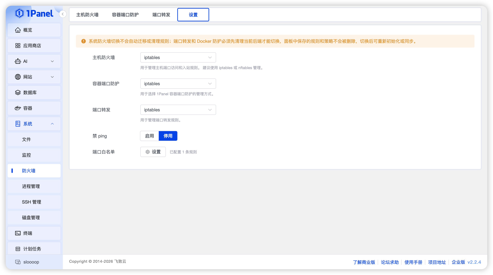
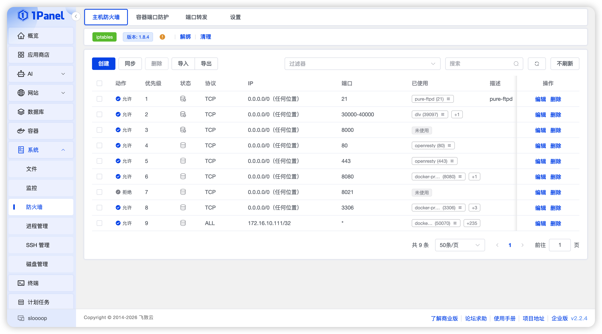
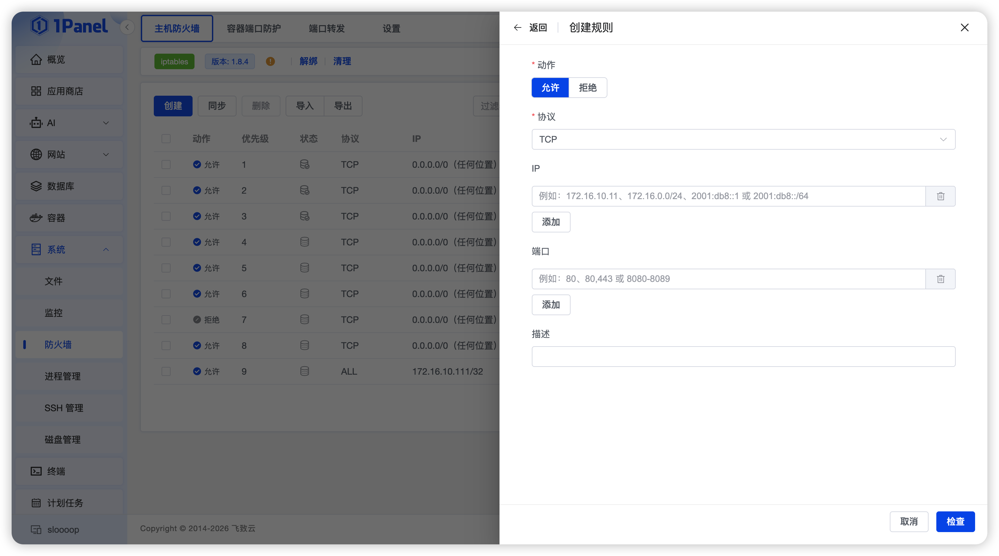
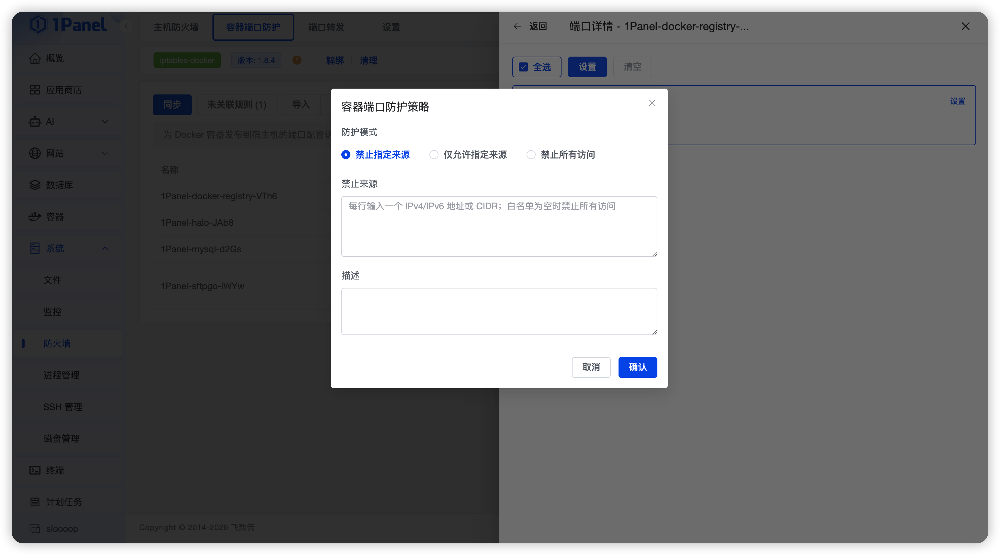
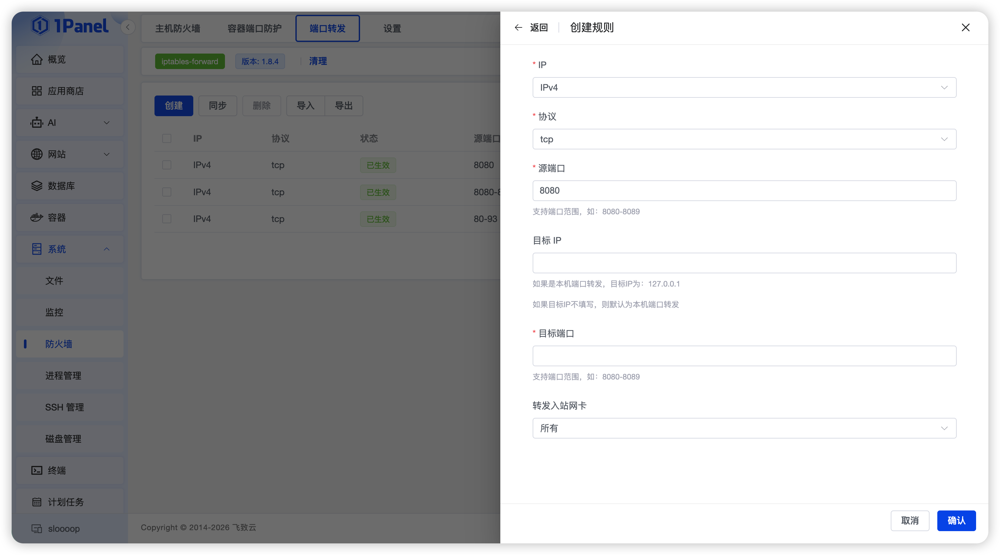
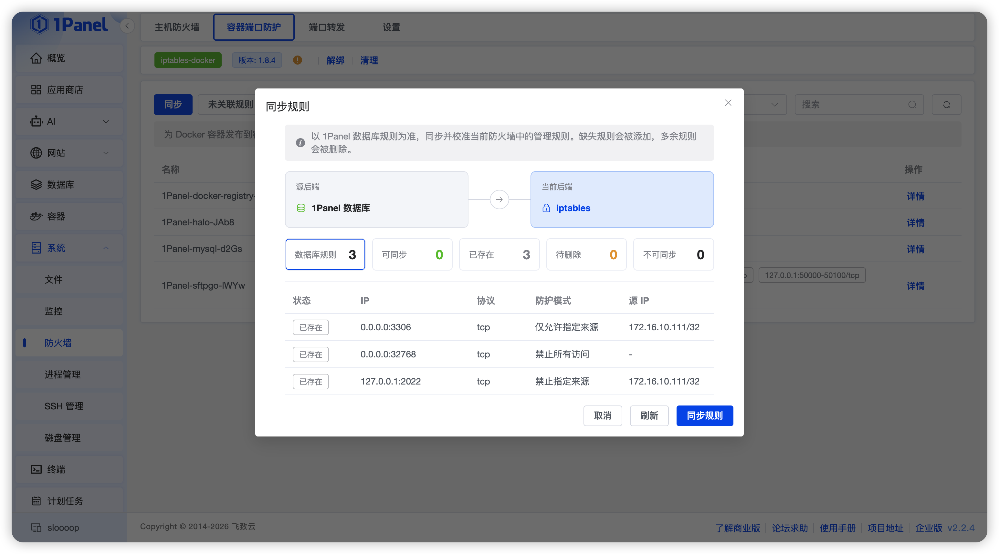

# 防火墙

!!! note ""
    1Panel 防火墙提供系统防火墙、Docker 端口防护和端口转发等功能，本文介绍相关功能及防火墙设置的使用方法。

!!! warning "重要提示"
    防火墙配置错误可能导致面板或 SSH 无法访问。首次启用、切换后端、添加丢弃规则、调整规则顺序或重置防火墙前，请保留一个可用的 SSH 会话，并确保可以通过云厂商控制台、VNC、物理终端等方式登录服务器。

## 1 功能概览

!!! note ""
    1Panel 防火墙包含四个页面：

    | 页面 | 用途 |
    | --- | --- |
    | 系统防火墙 | 管理进入服务器的访问规则，例如开放端口、限制来源 IP、丢弃指定流量 |
    | Docker 端口防护 | 限制外部访问 Docker 已发布端口的来源 |
    | 端口转发 | 将服务器上的端口转发到本机或其他服务器的目标端口 |
    | 设置 | 选择防火墙后端，设置禁 Ping 和防火墙端口白名单 |

    这三类防火墙功能相互独立，可以使用不同后端。例如：

    - 系统防火墙使用 firewalld。
    - Docker 端口防护使用 nftables。
    - 端口转发使用 iptables。

## 2 使用前准备

!!! note ""
    建议在开始配置前完成以下检查：

    1. 记录当前 1Panel 面板端口。
    2. 记录当前 SSH 端口；如果 SSH 未使用默认的 22 端口，尤其需要确认。
    3. 确认防火墙端口白名单中包含必须保持访问的业务端口。
    4. 保留当前 SSH 会话，新规则验证成功前不要关闭。
    5. 准备云厂商控制台、VNC 或物理终端等带外登录方式。
    6. 如果服务器同时启用了安全组，请确认安全组也允许相应端口和来源。

    防火墙规则只控制服务器本机流量。云服务器安全组、上级路由器、运营商网络和应用自身的监听地址，也可能影响最终访问结果。

## 3 防火墙设置

!!! note ""
    进入【主机 - 防火墙 - 设置】，可以配置系统防火墙、Docker 端口防护和端口转发所使用的后端。


{: .original}

### 3.1 后端支持范围

!!! note ""
    | 后端 | 系统防火墙 | Docker 端口防护 | 端口转发 |
    | --- | --- | --- | --- |
    | firewalld | 支持 | 不支持 | 不支持 |
    | UFW | 支持 | 不支持 | 不支持 |
    | iptables | 支持 | 支持 | 支持 |
    | nftables | 支持 | 支持 | 支持 |

    `iptables-nft` 在 1Panel 中按 iptables 使用，设置页可能显示实际检测到的 iptables 实现。

### 3.2 如何选择后端

!!! note ""
    - 系统已经稳定使用 firewalld 或 UFW 时，通常可以继续使用原有后端。
    - 新系统优先使用发行版默认且维护良好的防火墙后端。
    - Docker 端口防护和端口转发应根据 Docker 和系统当前实际使用的 iptables/nftables 环境选择。
    - 不建议在不清楚现有规则来源时频繁切换后端。
    - 选择新后端不会自动迁移旧后端中的规则，切换前请阅读“后端切换与规则同步”。

### 3.3 状态说明

!!! note ""
    设置页和状态栏可能显示以下状态：

    | 状态 | 含义 |
    | --- | --- |
    | 未安装 | 服务器中未检测到该后端所需命令 |
    | 运行中 | firewalld 或 UFW 服务正在运行 |
    | 已停止 | firewalld 或 UFW 已安装，但服务未运行 |
    | 未初始化 | 1Panel 所需的规则结构尚未创建 |
    | 已解绑 | 规则结构存在，但尚未接入实际流量路径 |
    | 已绑定 | 规则结构已接入实际流量路径 |
    | 异常 | IPv4、IPv6、规则结构或运行状态不完整，需要查看提示详情 |

    对于 iptables 和 nftables：

    - **初始化**：创建 1Panel 使用的规则结构并使其生效。
    - **绑定**：将已存在的规则重新接入实际流量路径。
    - **解绑**：暂时停止规则生效，但保留规则。
    - **清理**：删除 1Panel 在该后端创建的规则结构。

### 3.4 禁 Ping

!!! note ""
    启用“禁 Ping”后，服务器会忽略 IPv4 Ping；系统支持 IPv6 时也会同步处理 IPv6 Ping。

    注意：

    - 禁 Ping 不等于关闭网络访问，只是忽略 ICMP Echo 请求。
    - 某些监控、健康检查或网络诊断依赖 Ping，启用前请确认不会影响业务。
    - 云平台安全组也可能单独控制 ICMP。

### 3.5 防火墙端口白名单

!!! note ""
    端口白名单用于保护必须保持可访问的端口，并在防火墙启用或重启时同步放行规则。

    默认白名单为：

    - IPv4 TCP 80
    - IPv4 TCP 443
    - IPv4 UDP 443

    1Panel 还会自动保护：

    - 当前面板端口。
    - 当前 SSH 端口；无法读取 SSH 配置时按 22 端口处理。

    白名单规则支持：

    - 地址族：IPv4、IPv6。
    - 协议：TCP、UDP。
    - 单端口：例如 `80`。
    - 端口范围：例如 `8000-8100`。

    同一地址族、同一协议下，不允许添加重复或相互重叠的端口范围。

!!! warning "注意"
    白名单是安全保护的一部分，不建议删除面板、SSH 或其他必要管理端口。修改白名单后，请立即使用新会话验证访问。

## 4 系统防火墙

!!! note ""
    系统防火墙用于管理进入服务器本机的流量，常见用途包括：

    - 开放网站、数据库、运维工具等端口。
    - 只允许指定 IP 或网段访问某个端口。
    - 丢弃指定 IP 或网段的流量。
    - 分别管理 IPv4 和 IPv6 规则。
    - 查看并接管系统中已有的外部规则。

### 4.1 首次启用

#### firewalld 或 UFW

!!! note ""
    1. 进入 **系统防火墙**。
    2. 在顶部状态栏确认后端名称。
    3. 点击“启动”。
    4. 根据提示确认是否需要重启 Docker。
    5. 启动成功后，新开浏览器或 SSH 会话验证面板和服务器连接。

    停止或重启 firewalld/UFW 时，系统会提示 Docker 相关影响。停止 firewalld 时，1Panel 会尽量保留并恢复与其联动的 Fail2Ban 状态。

#### iptables 或 nftables

!!! note ""
    1. 进入 **设置**，确认系统防火墙后端。
    2. 确认面板、SSH 和必要业务端口已加入白名单。
    3. 返回 **系统防火墙**，点击“初始化”。
    4. 确认 IPv4、IPv6 状态均正常。
    5. 使用新会话验证面板和 SSH。

    如果规则已经初始化但处于解绑状态，点击“绑定”即可重新启用；点击“解绑”可暂时停止 1Panel 规则生效而不删除规则。

### 4.2 规则列表状态

!!! note ""
    系统防火墙会同时读取 1Panel 记录和服务器实际规则，因此列表中可能出现以下状态：

    | 状态 | 含义 | 可执行操作 |
    | --- | --- | --- |
    | 1Panel 管理 | 由 1Panel 创建，记录与服务器实际规则一致 | 编辑、排序、删除 |
    | 已接管 | 原本是系统外部规则，后来由 1Panel 接管 | 编辑、排序、删除 |
    | 外部规则 | 由系统命令、其他软件或人工创建，尚未由 1Panel 管理 | 查看、符合条件时接管 |
    | 已保护 | 面板、SSH、白名单或系统预置规则 | 不允许直接修改 |
    | 已漂移 | 1Panel 记录与服务器实际规则不一致或规则已丢失 | 先排查或重新同步 |

    列表中显示的“正在使用”用于帮助判断放行规则是否对应当前监听进程或 Docker 发布端口。它是辅助提示，不代表该端口一定可以从公网访问。


{: .original}

### 4.3 添加规则

!!! note ""
    点击“添加”后，根据实际需求填写以下内容。


{: .original}

#### 地址族

!!! note ""
    - IPv4：用于 IPv4 地址和流量。
    - IPv6：用于 IPv6 地址和流量。
    - 某些后端会提供同时适用于 IPv4/IPv6 的显示或配置方式。

    地址和地址族必须匹配。例如，IPv4 规则不能填写 IPv6 来源地址。

#### 策略

!!! note ""
    | 策略 | 含义 |
    | --- | --- |
    | 允许 | 允许匹配的流量 |
    | 丢弃 | 静默丢弃匹配的流量，客户端通常表现为超时 |

    当前暂不支持主动返回失败结果的“拒绝（REJECT）”规则。

#### 协议

!!! note ""
    常见协议包括 TCP、UDP、ICMP、ICMPv6 和全部协议。不同后端可用选项可能不同。

    - 网站、SSH、数据库通常使用 TCP。
    - DNS、QUIC 等业务可能使用 UDP。
    - IPv4 Ping 使用 ICMP。
    - IPv6 Ping 使用 ICMPv6。

#### IP 地址

!!! note ""
    可以填写：

    - 单个 IPv4：`203.0.113.10`
    - IPv4 网段：`203.0.113.0/24`
    - 单个 IPv6：`2001:db8::10`
    - IPv6 网段：`2001:db8::/64`
    - 留空：任意地址

#### 端口

!!! note ""
    可以填写：

    - 单端口：`22`
    - 端口范围：`8000-8100`
    - 留空：任意端口

    使用端口时应选择 TCP 或 UDP。一次填写多个地址、协议或端口时，系统可能拆分为多条规则；单次最多生成 256 条。

#### 网卡和连接状态

!!! note ""
    iptables、nftables 等后端可提供入口网卡、连接状态等高级选项。不了解其作用时建议留空。

#### 优先级或顺序

!!! note ""
    防火墙通常按顺序匹配规则，前面的规则可能先于后面的规则生效。

    - iptables、nftables、UFW 使用规则位置。
    - firewalld 的高级规则可使用优先级；较老版本可能不支持非零优先级。

    添加丢弃规则时应特别注意顺序，避免它先于面板、SSH 或业务放行规则命中。

### 4.4 常用规则示例

#### 对所有来源开放 TCP 端口 8080

!!! note ""
    | 字段 | 值 |
    | --- | --- |
    | 策略 | 允许 |
    | 协议 | TCP |
    | 来源 IP | 留空 |
    | 目标端口 | 8080 |

#### 只允许办公网访问 SSH

!!! note ""
    假设办公网为 `203.0.113.0/24`，SSH 端口为 22：

    1. 添加允许规则：来源 `203.0.113.0/24`、TCP、目标端口 22。
    2. 确认允许规则已经生效，并从办公网新建 SSH 会话测试。
    3. 再根据需要添加丢弃其他来源访问 22 的规则。
    4. 确认丢弃规则排在正确位置，不会覆盖管理白名单。

#### 丢弃单个 IP 的流量

!!! note ""
    | 字段 | 值 |
    | --- | --- |
    | 策略 | 丢弃 |
    | 协议 | 全部 |
    | 来源 IP | `203.0.113.10` |
    | 目标端口 | 留空 |

    如果该 IP 是当前访问面板的客户端 IP，系统会阻止可能导致当前管理连接中断的操作。

### 4.5 重复、覆盖和冲突提示

!!! note ""
    提交规则前，1Panel 会检查当前服务器规则，并给出处理建议：

    | 提示 | 含义 |
    | --- | --- |
    | 可创建 | 未发现明显冲突 |
    | 已存在等价管理规则 | 1Panel 已管理相同规则，无需重复创建 |
    | 存在等价外部规则 | 系统已有相同规则，可选择接管 |
    | 当前规则已被其他规则覆盖 | 更宽泛的同策略规则已经包含当前规则 |
    | 与现有规则部分重叠 | 匹配范围有交集，需要确认是否仍要创建 |
    | 与现有规则冲突 | 匹配范围重叠且策略相反，可能无法按预期生效 |
    | 存在不支持解析的规则 | 目标区域中有 1Panel 无法安全判断的规则 |
    | 可能导致管理连接中断 | 规则可能影响面板、SSH、白名单或当前客户端 |

    如果检查后服务器规则又发生变化，提交时可能提示需要重新检查。刷新页面并重新提交即可。

### 4.6 接管外部规则

!!! note ""
    对于 1Panel 能准确识别的外部规则，可以点击“接管”。接管不会重复创建同一条规则，而是将现有规则纳入 1Panel 管理。

    不建议接管以下规则：

    - 不清楚由哪个软件创建的规则。
    - Fail2Ban、容器平台、VPN 或安全软件自动维护的规则。
    - 显示为不透明、部分解析或受保护的规则。
    - 运行时和持久化状态不一致的规则。

    被接管后，规则可以由 1Panel 编辑或删除；这可能影响原先创建它的软件。

### 4.7 编辑、排序和删除

!!! note ""
    - 只有“1Panel 管理”和“已接管”且状态正常的规则可以编辑。
    - 不能在编辑时直接更换规则所属后端或地址族范围；需要删除后重新创建。
    - 排序时不能跨越外部规则、受保护规则或无法解析的规则。
    - 删除正在被进程或 Docker 使用的放行规则时，页面会显示额外提醒。
    - 如果规则已被其他工具修改，1Panel 会拒绝使用过期状态继续操作；刷新后再处理。

### 4.8 导入和导出

#### 导出

!!! note ""
    - 勾选规则后导出所选规则。
    - 未勾选时，导出当前全部可编辑的 1Panel 管理规则。
    - 外部、受保护、无法解析和漂移规则不会作为普通可编辑规则导出。

#### 导入

!!! note ""
    - 导入文件为 1Panel 导出的 JSON 格式。
    - 规则会转换到当前系统防火墙后端。
    - IPv4/IPv6 规则可能根据目标后端自动拆分。
    - 导入仍会执行重复、冲突和锁死风险检查。
    - 单批最多处理 256 条规则；更大的文件会分批提交。

    建议先在测试服务器验证导入文件，不要直接导入来源不明的规则文件。

### 4.9 重置防火墙

!!! note ""
    “重置”是高风险操作，不等同于删除勾选规则。

    - 对 iptables/nftables：删除 1Panel 在当前后端创建的系统防火墙结构和相关管理记录。
    - 对 firewalld：恢复 firewalld 默认配置并禁用服务。
    - 对 UFW：执行 UFW 重置。

    重置前请：

    1. 导出需要保留的规则。
    2. 确认有带外登录方式。
    3. 确认其他软件是否依赖当前防火墙配置。
    4. 仔细核对确认框要求输入的后端名称。

## 5 Docker 端口防护

### 5.1 为什么需要 Docker 端口防护

!!! note ""
    Docker 发布端口后，流量可能走 Docker 自己的转发路径，普通系统防火墙的入站规则不一定能完整限制它。Docker 端口防护专门用于控制这些已发布端口的来源。

    例如，容器将内部 3306 发布为服务器的 `0.0.0.0:3306`，可以使用 Docker 端口防护只允许办公网访问。

### 5.2 首次启用

!!! note ""
    1. 确认 Docker 正常运行。
    2. 进入 **Docker 端口防护**。
    3. 检查页面显示的后端是否与当前 Docker 环境一致。
    4. 点击“初始化”。
    5. 确认 IPv4、IPv6 状态为“生效”。
    6. 为需要保护的发布端口添加策略。
    7. 从允许和不允许的来源分别测试访问。

    如果防护已初始化但处于解绑状态，可以点击“绑定”恢复；“解绑”会停止防护生效，但保留策略。

### 5.3 发布端口说明

!!! note ""
    页面按容器、Compose 项目、1Panel 应用和端口分组展示 Docker 发布端口。

    一个策略的目标由以下信息共同确定：

    - IPv4 或 IPv6。
    - 宿主机发布 IP。
    - 宿主机发布端口。
    - TCP 或 UDP。

    策略针对的是“宿主机发布端口”，不是容器内部端口。

    以下地址表示对所有对应地址开放：

    - IPv4：`0.0.0.0`
    - IPv6：`::`


{: .original}

### 5.4 防护模式

!!! note ""
    | 模式 | 作用 | 适用场景 |
    | --- | --- | --- |
    | 拒绝指定来源 | 仅拒绝填写的 IP 或网段，其他来源允许 | 屏蔽恶意 IP、临时封禁网段 |
    | 仅允许指定来源 | 只允许填写的 IP 或网段，其他来源拒绝 | 数据库、管理后台、内网服务 |
    | 拒绝所有来源 | 拒绝所有新的外部访问 | 临时关闭已发布端口但不修改容器配置 |

    来源可以填写单个 IP 或 CIDR 网段，多个来源可使用逗号、空格或换行分隔。来源地址必须与端点地址族一致。

    “仅允许指定来源”不填写来源时，相当于拒绝全部来源。保存前请仔细确认。

### 5.5 生效状态

!!! note ""
    | 状态 | 含义 |
    | --- | --- |
    | 生效 | 防护规则已正确接入 Docker 流量路径 |
    | 未启用 | 防护结构或 Docker 对应规则不存在 |
    | 未生效 | 防护已初始化，但入口跳转缺失、重复、顺序错误或检查失败 |

    常见异常原因：

    - iptables、ip6tables 或 nft 命令缺失。
    - Docker 自身的防火墙规则尚未创建。
    - 1Panel 防护规则被其他工具删除。
    - 防护入口不在第一位。
    - 出现多个重复的 1Panel 防护入口。
    - Docker 或防火墙状态读取失败。

    遇到异常时可先点击“重试”或“绑定”。如果仍无法恢复，再检查 Docker 服务和当前后端。

### 5.6 孤立策略

!!! note ""
    数据库中存在策略，但当前没有找到对应 Docker 发布端口时，该策略会显示为“孤立策略”。常见原因：

    - 容器已停止或删除。
    - 容器重新创建后发布 IP 或端口变化。
    - Compose 配置发生变化。
    - IPv4/IPv6 发布方式变化。

    孤立策略不会自动删除，因为容器可能只是暂时不可用。确认端口不会恢复后，再手动删除该策略。

### 5.7 导入、导出和同步

!!! note ""
    - 导出会保存当前全部 Docker 防护策略，不包含容器运行状态。
    - 导入按发布端点去重，并批量写入策略。
    - 同步以 1Panel 中保存的策略为准，使当前后端与保存状态一致。
    - 同步预览中的“将删除”表示目标后端存在但 1Panel 当前保存策略中没有的规则。

### 5.8 清理 Docker 防护后端

!!! note ""
    清理会删除 1Panel 创建的 Docker 防护规则结构，并将防护状态设为禁用。保存的策略记录可继续用于后续同步或重新初始化。

    执行前请确认当前业务是否依赖这些限制；清理后，Docker 发布端口可能重新对所有来源开放。

## 6 端口转发

### 6.1 功能说明

!!! note ""
    端口转发用于将访问本机某个端口的流量转发到另一个目标地址和端口。

    示例：

    ```text
    访问本机 8080/TCP → 转发到 10.0.0.20:80
    ```

    端口转发不等同于应用层反向代理：

    - 端口转发工作在网络层，不识别域名、URL 或 HTTP 头。
    - 网站按域名转发通常应使用网站反向代理。
    - 转发目标可以是本机，也可以是其他可路由地址。

### 6.2 首次启用

!!! note ""
    1. 进入 **端口转发**。
    2. 确认后端为 iptables 或 nftables。
    3. 点击“初始化”。
    4. 系统会启用 IPv4/IPv6 内核转发并创建所需规则。
    5. 确认 IPv4、IPv6 状态正常。
    6. 添加转发规则并进行连通性测试。

    初始化会修改系统的 IP forwarding 设置。即使删除全部转发规则，内核转发开关也可能仍保持启用。

### 6.3 添加转发规则

!!! note ""
    | 字段 | 说明 |
    | --- | --- |
    | 地址族 | IPv4 或 IPv6 |
    | 协议 | TCP、UDP 或同时创建 TCP/UDP |
    | 源端口 | 客户端访问当前服务器的端口，可填写单端口或范围 |
    | 目标 IP | 实际接收流量的地址；留空或 localhost 表示本机 |
    | 目标端口 | 目标服务端口，可填写单端口或范围 |
    | 入站网卡 | 可选；留空表示所有网卡 |

    目标 IP 必须与地址族一致：

    - IPv4 规则使用 IPv4 目标地址。
    - IPv6 规则使用 IPv6 目标地址。

    端口范围必须从小到大，并位于 `1-65535`。


{: .original}

### 6.4 常用示例

#### 转发到内网服务器

!!! note ""
    | 字段 | 值 |
    | --- | --- |
    | 地址族 | IPv4 |
    | 协议 | TCP |
    | 源端口 | 8080 |
    | 目标 IP | `10.0.0.20` |
    | 目标端口 | 80 |
    | 入站网卡 | 留空 |

#### 只允许从指定网卡进入

!!! note ""
    在“入站网卡”中填写服务器实际网卡名，例如 `eth0`。网卡名填写错误会导致规则无法匹配。

### 6.5 同步状态

!!! note ""
    | 状态 | 含义 |
    | --- | --- |
    | 已同步 | 1Panel 保存规则与服务器实际规则一致 |
    | 运行时缺失 | 1Panel 保存了规则，但服务器实际规则不存在 |
    | 仅运行时存在 | 服务器中有规则，但 1Panel 保存列表中没有 |

    如果添加或删除时服务器规则应用失败，1Panel 会保留期望配置并在页面显示同步异常。修复后端后，可通过同步重新收敛。

    强制删除仅适用于删除操作：它允许在运行时删除失败时先移除 1Panel 保存的规则，残留规则会显示为“仅运行时存在”，需要后续继续清理。

### 6.6 导入和导出

!!! note ""
    - 导出内容包括地址族、协议、源端口、目标 IP、目标端口和入站网卡。
    - 导入会检查格式并跳过与现有规则完全相同的项目。
    - 导入前应确认目标地址可达，避免创建无效转发。

### 6.7 清理端口转发后端

!!! note ""
    清理会删除 1Panel 在当前后端创建的转发规则结构，但保存的转发规则仍可用于切换后端后的同步。

    清理前请确认：

    - 当前业务不再依赖这些转发规则。
    - 新后端已经准备好接管，或已经安排维护窗口。
    - IPv4 和 IPv6 都已测试。

## 7 后端切换与规则同步

### 7.1 同步预览状态

!!! note ""
    | 状态 | 含义 |
    | --- | --- |
    | 待同步 | 目标后端缺少该规则，同步时会创建 |
    | 已存在 | 目标后端已有等价规则，同步时跳过 |
    | 将删除 | 目标后端存在额外规则，同步时会删除 |
    | 已阻止 | 规则无法转换、存在冲突或有安全风险 |

    执行同步前，必须仔细查看“将删除”和“已阻止”项目。


{: .original}

### 7.2 切换系统防火墙后端

!!! note ""
    推荐流程：

    1. 导出当前系统防火墙规则。
    2. 确认面板端口、SSH 端口和必要业务端口处于保护状态。
    3. 在设置页选择新系统防火墙后端。
    4. 启动新后端，或完成初始化和绑定。
    5. 打开“规则同步”，选择旧后端作为来源、新后端作为目标。
    6. 查看同步预览，处理所有已阻止规则。
    7. 第一次同步时不要勾选“重置来源”。
    8. 同步后使用新连接验证面板、SSH 和业务端口。
    9. 确认无误后，再按需同步并重置旧来源。

    系统防火墙同步会在后台任务中执行，并在结束前验证目标规则。存在无法同步的规则时，不允许安排“同步后重置来源”。

    不同后端的规则能力不完全相同，切换时可能发生：

    - 一条双栈规则拆分为 IPv4 和 IPv6 两条。
    - 规则位置或优先级无法完全保留。
    - 某些源端口、连接状态或高级选项不受目标后端支持。
    - 外部规则无法自动迁移，需先接管或手工重建。

### 7.3 切换 Docker 防护或端口转发后端

!!! note ""
    Docker 防护和端口转发只支持 iptables、nftables，并以 1Panel 当前保存的规则为同步来源。

    推荐流程：

    1. 导出当前配置作为备份。
    2. 确认页面中没有未处理的“运行时缺失”或异常状态。
    3. 清理旧后端；旧后端仍初始化时，设置页会阻止直接切换。
    4. 在设置页选择新后端。
    5. 初始化新后端。
    6. 打开同步预览，确认待创建和将删除项目。
    7. 执行同步。
    8. 分别验证 IPv4、IPv6 和实际业务访问。

!!! warning "注意"
    清理旧后端到新后端初始化完成之间可能存在短暂空窗期，建议在维护窗口执行。

## 8 常见使用场景

### 8.1 只开放网站端口

!!! note ""
    1. 确认面板和 SSH 端口已受保护。
    2. 添加 TCP 80 允许规则。
    3. 添加 TCP 443 允许规则。
    4. 使用 HTTP/3 时，再添加 UDP 443 允许规则。
    5. 验证网站后，再根据需要添加更宽泛的丢弃规则。

### 8.2 数据库只允许固定 IP 访问

!!! note ""
    以 MySQL 3306 为例：

    1. 添加允许规则：来源为办公公网 IP 或网段、TCP、目标端口 3306。
    2. 从允许来源测试连接。
    3. 再添加丢弃其他来源访问 3306 的规则。
    4. 确认允许规则优先于丢弃规则。
    5. 同时确认 MySQL 的监听地址和用户授权范围。

    如果 MySQL 运行在 Docker 且通过 Docker 发布端口，应优先在“Docker 端口防护”中限制来源。

### 8.3 临时关闭 Docker 发布端口

!!! note ""
    1. 找到对应容器和发布端口。
    2. 选择“拒绝所有来源”。
    3. 保存后确认状态为生效。
    4. 业务恢复时删除策略或改为“仅允许指定来源”。

    这种方式不修改容器的端口发布配置，适合临时隔离。

### 8.4 将本机端口转发到内网服务

!!! note ""
    1. 确认服务器能够访问目标内网 IP 和端口。
    2. 初始化端口转发。
    3. 添加源端口、目标 IP 和目标端口。
    4. 必要时在系统防火墙和云安全组中开放源端口。
    5. 从外部客户端测试连接。

## 9 故障排查

!!! note ""
    建议先根据现象判断问题位于哪一层：

    ```text
    无法访问
     ├─ 服务未监听                 → 检查应用或容器
     ├─ 本机可以访问，外部不能访问   → 检查系统防火墙和云安全组
     ├─ 普通服务正常，Docker 端口异常 → 检查 Docker 发布端口和 Docker 端口防护
     ├─ 转发入口可连接，目标无响应    → 检查目标服务、路由和 IP forwarding
     └─ 只有 IPv4 或 IPv6 异常       → 分别检查对应地址族的规则和监听状态
    ```

    排障时建议遵循以下顺序：

    1. 确认应用或容器是否正在运行。
    2. 确认服务是否监听预期地址、端口和协议。
    3. 确认 1Panel 页面中的规则状态。
    4. 确认系统防火墙或 Docker 防护是否已经绑定并生效。
    5. 确认云安全组、上级网络和目标服务器防火墙。
    6. 最后再考虑删除、重置或切换后端等高影响操作。

### 9.1 页面提示未检测到防火墙

!!! note ""
    - 检查系统是否安装 firewalld、UFW、iptables 或 nftables。
    - 同时安装 firewalld 和 UFW 时可能被判定为冲突。
    - 检查设置页保存的后端是否已经被卸载。
    - iptables 需要相应的 restore 命令可用。
    - 在容器或受限系统中，内核防火墙能力可能不可用。

### 9.2 规则已添加但端口仍无法访问

!!! note ""
    依次检查：

    1. 防火墙是否运行，或规则是否已初始化并绑定。
    2. 规则地址族是否与客户端一致。
    3. 协议是否正确，例如 TCP 与 UDP 是否选错。
    4. 来源 IP 或网段是否填写正确。
    5. 规则顺序是否被前面的丢弃规则覆盖。
    6. 应用是否监听正确端口和地址。
    7. 云安全组或上级网络是否允许访问。
    8. Docker 端口是否需要在 Docker 端口防护中单独配置。

### 9.3 添加规则时提示可能导致失联

!!! note ""
    说明规则可能影响：

    - 当前面板连接来源。
    - 面板端口。
    - SSH 端口。
    - 防火墙端口白名单。
    - 已受保护的系统规则。

    请缩小来源或端口范围、调整规则顺序，或先补充明确的允许规则。不要绕过提示直接在命令行创建同类高风险规则。

### 9.4 规则显示已漂移

!!! note ""
    常见原因：

    - 人工在命令行修改或删除了规则。
    - 其他安全软件重写了规则。
    - 防火墙服务重载后运行时与持久化状态不同。
    - 后端切换不完整。

    处理建议：

    1. 刷新页面确认状态。
    2. 查看规则原始内容和作用范围。
    3. 确认是否由其他软件维护。
    4. 通过同步恢复，或在确认安全后清理旧记录并重新创建。

### 9.5 firewalld 提示运行时与持久化不一致

!!! note ""
    这表示当前运行规则和重启后加载的 permanent 规则不同。为避免重启后规则变化，1Panel 会阻止部分修改。

    先确认哪一侧是正确配置，再使用 firewalld 自身的 reload 或规则修复方式使两者一致，然后刷新 1Panel 页面。

### 9.6 Docker 防护未生效

!!! note ""
    - 确认 Docker 正在运行且已经创建防火墙规则。
    - 确认页面所选后端与 Docker 当前后端一致。
    - 点击“绑定”或“重试”。
    - 检查是否有其他软件调整 Docker 防火墙入口顺序。
    - Docker 重启后刷新页面；1Panel 会尝试自动恢复，但 Docker 启动较慢时可能需要手动重试。

### 9.7 端口转发规则显示运行时缺失

!!! note ""
    - 检查转发后端是否已初始化。
    - 检查 IPv4/IPv6 forwarding 是否启用。
    - 检查目标 IP 与地址族是否一致。
    - 修复后端后执行规则同步。
    - 查看页面顶部是否显示最近一次同步错误。

### 9.8 后端无法切换

!!! note ""
    - Docker 防护或端口转发的旧后端仍处于初始化状态时，必须先清理旧后端。
    - iptables 和 nftables 同时存在已绑定的系统规则时，应先确认实际生效路径，再清理不再使用的一侧。
    - 先使用规则同步预览确认目标后端能够接受当前配置。

### 9.9 修改防火墙后面板或 SSH 无法访问

!!! note ""
    优先使用云厂商控制台、VNC 或物理终端登录服务器，不要反复重启服务器或盲目重置防火墙。

    登录后依次确认：

    1. 面板和 SSH 服务是否仍在运行。
    2. 实际面板端口、SSH 端口是否与白名单一致。
    3. 最近添加的丢弃规则是否覆盖了管理端口或当前来源 IP。
    4. 规则顺序是否发生变化。
    5. IPv4 和 IPv6 是否使用了不同规则。
    6. firewalld、UFW、iptables、nftables 是否出现多个后端同时生效。

    如果能够进入 1Panel，优先使用“解绑”临时停止 1Panel 直连规则，再修正规则；不要直接执行“重置”，因为重置的影响范围更大。

    恢复访问后，应重新检查端口白名单，并从新的浏览器或 SSH 会话验证连接。

### 9.10 本机可以访问端口，外部无法访问

!!! note ""
    常见原因：

    - 应用只监听 `127.0.0.1` 或 `::1`。
    - 系统防火墙未放行该端口。
    - 云安全组未放行。
    - 来源 IP 限制填写错误。
    - 客户端使用 IPv6，但只创建了 IPv4 规则，或反之。
    - 服务运行在 Docker 中，但容器没有发布端口。

    先确认服务监听地址。如果只监听本机回环地址，即使防火墙放行也无法从外部访问。

### 9.11 只有 IPv4 或 IPv6 可以访问

!!! note ""
    1. 检查域名是否同时解析出 A 和 AAAA 记录。
    2. 检查应用是否同时监听 IPv4 和 IPv6。
    3. 在规则列表中分别筛选 IPv4、IPv6。
    4. 查看状态栏是否提示某个地址族未安装、未初始化或未绑定。
    5. 检查云安全组是否分别允许 IPv4、IPv6。
    6. Docker 发布端口也要分别检查 `0.0.0.0` 和 `::` 端点。

    不要因为 IPv4 测试成功就认为 IPv6 规则同样生效。

### 9.12 规则同步出现“已阻止”

!!! note ""
    常见原因包括：

    - 目标后端不支持当前规则的高级选项。
    - 规则会影响面板、SSH 或当前管理连接。
    - 目标后端已有冲突规则。
    - 来源规则无法被完整识别。
    - 双栈规则包含无法安全拆分的 IPv4/IPv6 地址。

    处理建议：

    1. 展开“已阻止”列表查看具体原因。
    2. 在来源后端中简化该规则，或在目标后端手动创建等价规则。
    3. 再次刷新同步预览。
    4. 所有关键规则验证通过前，不要选择“重置来源”。

### 9.13 同步预览显示“将删除”

!!! note ""
    “将删除”表示目标后端存在额外规则，但 1Panel 当前保存配置中没有对应项目。同步是以 1Panel 保存配置为准的收敛操作，因此这些目标端规则会被移除。

    执行前应确认：

    - 该规则是否由其他软件创建。
    - 该规则是否仍被业务使用。
    - 是否应先在 1Panel 中补充或接管该规则。
    - 是否选错了目标后端。

    不确定时应取消同步，先导出配置并确认规则来源。

### 9.14 导入规则失败或部分成功

!!! note ""
    - 检查文件是否为 1Panel 导出的 JSON 格式。
    - 检查端口是否位于 `1-65535`，范围是否从小到大。
    - 检查 IP、CIDR 和地址族是否一致。
    - 检查目标后端是否支持文件中的协议和高级选项。
    - 检查是否存在重复、覆盖或冲突规则。
    - 大批量导入会分批处理，前一批成功并不保证后一批也能成功。

    出现部分成功时，先刷新规则列表确认已写入项目，再修正失败项目后单独导入，避免重复提交整个文件。

### 9.15 Docker 防护显示生效，但访问结果不符合预期

!!! note ""
    依次检查：

    1. 测试连接是否在策略创建前就已经建立；已有连接可能暂时保持。
    2. 实际访问的是 IPv4 还是 IPv6。
    3. 策略对应的宿主机发布 IP、发布端口和协议是否正确。
    4. 容器是否重新创建并改变了发布端点。
    5. 客户端来源是否经过 NAT，服务器看到的来源 IP可能与客户端公网 IP 不同。
    6. 是否存在多个容器或端点发布相同业务端口。

    请断开已有连接后重新测试，并同时从允许来源和不允许来源验证。

### 9.16 端口转发可建立连接，但业务没有返回数据

!!! note ""
    可能原因：

    - 目标服务未运行或只监听回环地址。
    - 当前服务器无法访问目标 IP 或目标端口。
    - 目标服务器的防火墙拒绝来自转发服务器的流量。
    - 返回路由不正确，响应没有回到转发服务器。
    - 源端口范围和目标端口范围不对应。
    - 目标服务使用了额外的动态端口或应用层重定向。

    先从转发服务器本机直接访问目标 IP 和目标端口。如果本机到目标都不通，应先修复目标服务或网络路由，而不是继续调整转发规则。

### 9.17 重启服务器或 Docker 后规则丢失

!!! note ""
    - 检查设置页选择的后端是否仍然正确。
    - 检查系统防火墙是否已绑定，转发和 Docker 防护是否已初始化。
    - Docker 启动较慢时，1Panel 自动恢复可能暂时失败，可在 Docker 完全启动后手动重试。
    - 查看规则是否显示“运行时缺失”或“已漂移”。
    - 确认没有其他启动脚本、安全软件或网络管理工具在开机时覆盖规则。

    不要通过重复初始化掩盖问题。应先确认是哪一个组件在重启后修改了规则。

### 9.18 firewalld 和 UFW 同时安装导致冲突

!!! note ""
    1Panel 为避免两个服务同时控制系统防火墙，检测到 firewalld 和 UFW 同时存在时可能拒绝自动选择。

    处理前先确认当前实际使用哪个服务及其现有规则，然后停用并卸载不再使用的一方。不要在未备份规则时同时重置两个服务。

## 10 高级只读检查

!!! note ""
    以下命令仅用于查看状态。请根据实际后端选择，不需要全部执行。

    ```bash
    # firewalld / UFW
    firewall-cmd --state
    firewall-cmd --zone=public --list-all
    ufw status numbered

    # iptables 系统规则
    iptables -S INPUT
    iptables -S 1PANEL_BASIC_BEFORE
    iptables -S 1PANEL_BASIC
    iptables -S 1PANEL_BASIC_AFTER
    ip6tables -S 1PANEL_BASIC

    # nftables
    nft -a list table ip nft_1panel_filter
    nft -a list table ip6 nft_1panel_filter
    nft -a list table ip nft_1panel_forward
    nft -a list table ip nft_1panel_docker

    # IP forwarding
    sysctl net.ipv4.ip_forward
    sysctl net.ipv6.conf.all.forwarding

    # 监听端口和本机地址
    ss -lntup
    ip -br address

    # 路由和目标可达性
    ip route
    ip route get 10.0.0.20

    # Docker 防护
    
    docker ps --format 'table {{.Names}}\t{{.Ports}}'
    
    docker port <容器名称或 ID>
    iptables -S DOCKER-USER
    iptables -S 1PANEL_DOCKER
    ```

    如果系统实际使用 `iptables-nft`，请使用设置页显示的实现命令或系统对应命令。

    不要在不理解后果时执行 flush、reset、delete table、删除链或覆盖规则文件等命令。

## 11 常见问题

### 11.1 系统防火墙已经开放端口，为什么 Docker 服务仍不通？

!!! note ""
    Docker 发布端口使用独立转发路径，系统防火墙入站规则不一定覆盖。请同时检查 Docker 端口发布、Docker 端口防护和云安全组。

### 11.2 删除 Docker 防护策略会关闭容器端口吗？

!!! note ""
    不会。删除策略只移除 1Panel 的访问限制，Docker 发布端口仍然存在，反而可能变得对更多来源开放。

### 11.3 解绑和清理有什么区别？

!!! note ""
    - 解绑：规则暂时不生效，但规则结构和配置仍保留，可重新绑定。
    - 清理：删除当前后端中由 1Panel 创建的规则结构，通常用于停用或切换后端。

### 11.4 切换后端会自动带上原来的规则吗？

!!! note ""
    不会。必须通过规则同步迁移或从导出文件重新导入。

### 11.5 为什么有些系统规则只能查看，不能编辑？

!!! note ""
    这些规则可能是外部规则、受保护规则、系统预置规则，或 1Panel 无法安全解析的规则。为了避免破坏系统和其他软件的配置，默认只读。

### 11.6 为什么删除放行规则时提示端口正在使用？

!!! note ""
    1Panel 检测到本机进程或 Docker 发布端口正在使用该端口。删除后服务可能仍在监听，但外部连接可能被阻断，请确认业务影响。

### 11.7 禁 Ping 后监控报警是否正常？

!!! note ""
    如果监控使用 ICMP Ping 检测服务器存活，禁 Ping 后会报警。可以改用 TCP/HTTP 健康检查，或关闭禁 Ping。

### 11.8 端口白名单和普通允许规则有什么区别？

!!! note ""
    普通允许规则用于业务访问控制；端口白名单还参与面板的安全保护，在启用、重启和高风险规则检查时用于避免关键端口被误封。必要管理端口应放入白名单，不要只依赖普通允许规则。

### 11.9 “丢弃”和“拒绝”有什么区别？

!!! note ""
    - 丢弃：不回复客户端，扫描者更难判断端口状态，但客户端需要等待超时。
    - 拒绝：立即向客户端返回失败结果。

    当前系统防火墙规则仅支持丢弃，暂不支持拒绝（REJECT）。

### 11.10 启停系统防火墙为什么会询问是否重启 Docker？

!!! note ""
    firewalld 或 UFW 的启停、重载可能影响 Docker 创建的网络规则。重启 Docker 可以让 Docker 重新建立其规则，但也会影响正在运行的容器业务。请根据维护窗口和实际网络状态决定。

### 11.11 修改规则后，已有连接为什么没有立即断开？

!!! note ""
    已有 TCP 连接可能被连接跟踪视为已建立流量，仍可暂时保持。验证丢弃规则时，应关闭原连接并新建连接；必要时等待连接跟踪状态过期。

### 11.12 系统防火墙能否完全代替 Docker 端口防护？

!!! note ""
    不能保证。Docker 发布端口通常走转发路径，不一定完整经过普通系统入站规则。限制 Docker 发布端口来源时，应使用 Docker 端口防护，并同时检查系统防火墙和云安全组。

### 11.13 清理后端会删除导入或保存的配置吗？

!!! note ""
    清理主要删除当前后端中由 1Panel 创建的规则结构。端口转发和 Docker 防护保存的配置仍可用于重新初始化或同步；系统防火墙执行“重置”时影响更大，应在操作前导出规则。

### 11.14 不同后端之间可以直接导入同一份规则吗？

!!! note ""
    系统防火墙导入时会尝试转换到当前后端，但不同后端能力并不完全一致。高级选项、规则顺序、双栈规则和外部原生规则可能无法完整转换，应以导入检查结果为准。

### 11.15 同步和导入有什么区别？

!!! note ""
    - 同步：用于已有后端或保存配置之间的迁移与收敛，会显示待创建、已存在、将删除和已阻止项目。
    - 导入：从 JSON 文件新增规则，通常不会用文件内容完整替换目标后端。

    切换后端优先使用同步；跨服务器复制少量规则可以使用导入、导出。

### 11.16 云安全组和 1Panel 防火墙谁优先？

!!! note ""
    两者位于不同位置，没有统一的“规则优先级”。流量必须同时通过云安全组和服务器本机防火墙：任意一层拒绝，最终都无法访问。

### 11.17 是否需要为 IPv4 和 IPv6 分别添加规则？

!!! note ""
    取决于后端和页面提供的地址族选项。即使后端支持双栈，也应分别验证 IPv4 和 IPv6。只创建 IPv4 规则不会自动保证 IPv6 受到相同限制。

### 11.18 为什么规则显示端口未使用，但服务实际可以访问？

!!! note ""
    “正在使用”基于当前可识别的本机监听进程和 Docker 发布端口生成，只是辅助信息。代理转发、短生命周期进程、其他网络命名空间或检测权限都可能导致显示不完整，应以实际监听状态和连接测试为准。

## 12 安全建议

!!! note ""
    - 优先使用“只允许指定来源”，不要把数据库、管理后台等敏感端口开放给所有来源。
    - 添加丢弃规则前，先建立并验证更具体的允许规则。
    - IPv4 和 IPv6 应分别检查，避免只限制 IPv4 而遗漏 IPv6。
    - 定期检查外部规则、漂移规则和孤立 Docker 策略。
    - 后端切换和重置应在维护窗口进行。
    - 每次大批量导入前先导出当前规则。
    - 不要同时让多个防火墙管理工具修改同一组规则。
    - Fail2Ban、Docker、VPN、安全软件和云安全组都可能影响最终访问路径，排障时需要一起考虑。
    - 验证规则时应新建连接；已有 TCP 连接可能暂时不受新规则影响。
    - 完成高风险操作后，分别从允许来源和不允许来源测试结果。
