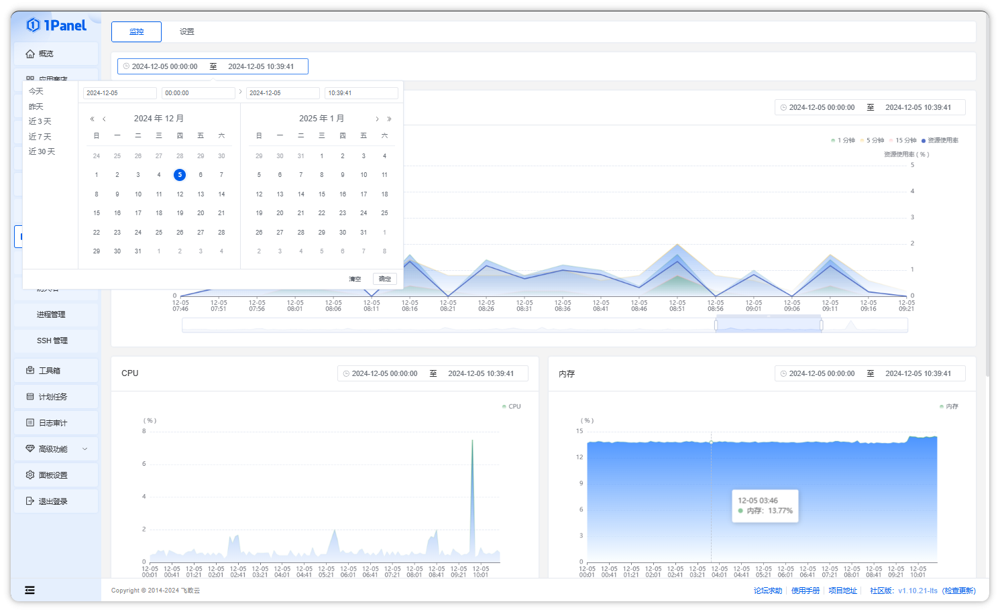

## 1 查看监控

!!! note ""
    点击【主机 - 监控】菜单，进入监控报表，直观的了解服务器的运行状态，包含【平均负载】、【CPU性能监控】、【内存使用监控】、【磁盘IO监控】、【网络IO监控】。

    通过时间监控指标上方的时间选择组件，可以调整监控数据的时间范围。

## 2 修改设置

!!! note ""
    在监控设置页面，可以开启/关闭监控功能，修改监控数据的保存时长，修改监控数据的采集间隔，或者手动清空监控记录。