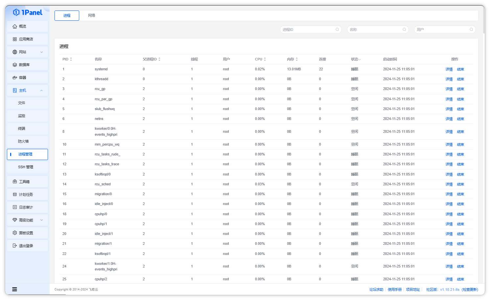
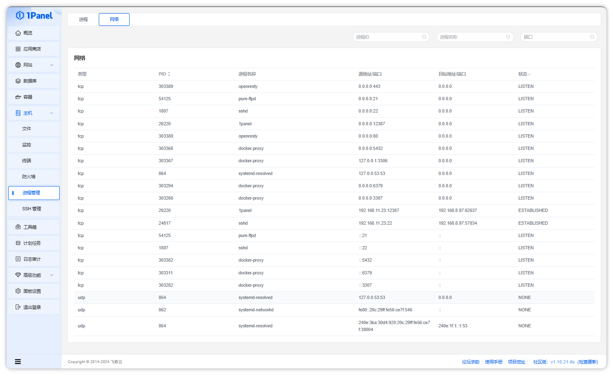

## 1 查看进程

!!! note ""
    点击【主机 - 进程管理】菜单，进入进程管理页面。

    - 在列表中可以查看系统中的所有进程信息
    - 列表上方筛选组件可以根据进程 ID、进程名称、用户等信息对进程进行筛选
    - 列表中可以根据 PID、父进程 ID、CPU 使用率、内存使用率进行排序，根据进程状态进行筛选
    - 点击操作列的 `详情`，可以查看进程的更多信息，包括基本信息、内存信息、打开的文件、环境变量及网络连接信息等
    - 点击操作列的 `结束`，可以结束掉指定进程

## 2 查看网络连接信息

!!! note ""
    点击当前页面上方的 `网络` 选项，可以进入网络连接列表。

    - 在列表中可以查看系统中的所有网络连接及端口使用信息
    - 列表上方筛选组件可以更具进程 ID、进程名称、端口号进行筛选
    - 列表中可以根据 PID 进行排序，根据连接状态进行筛选

