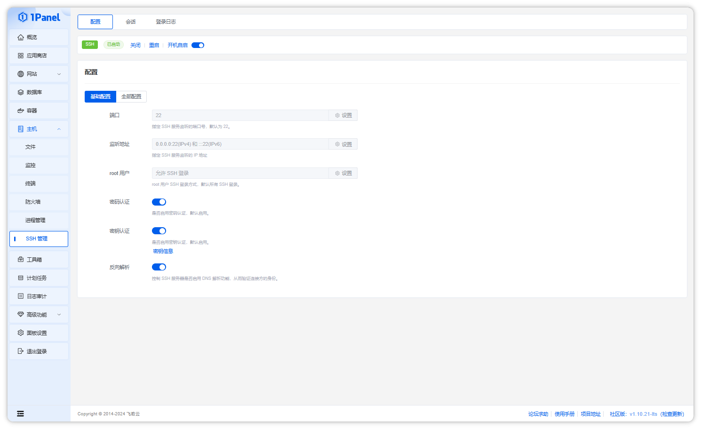
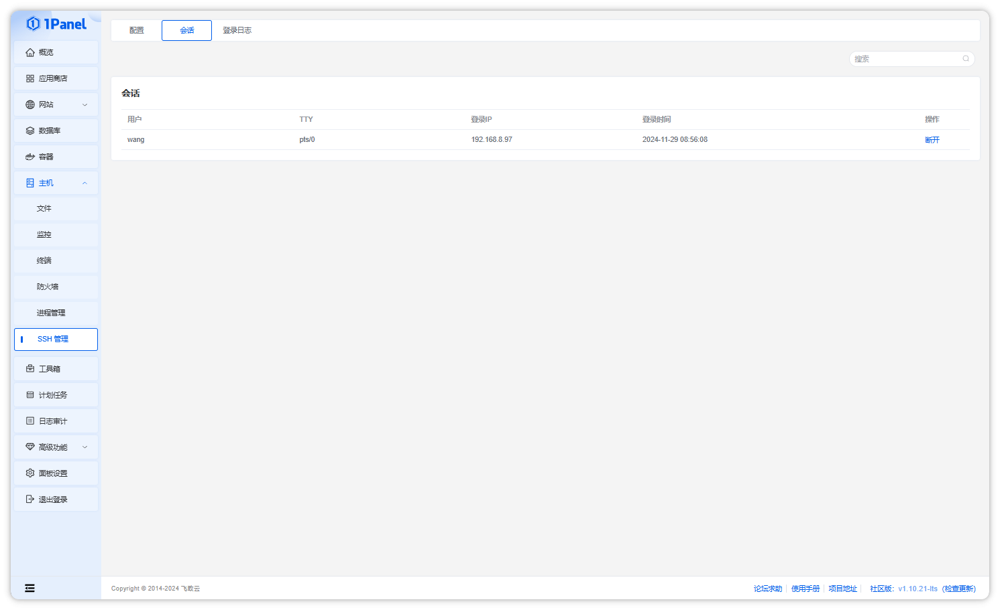
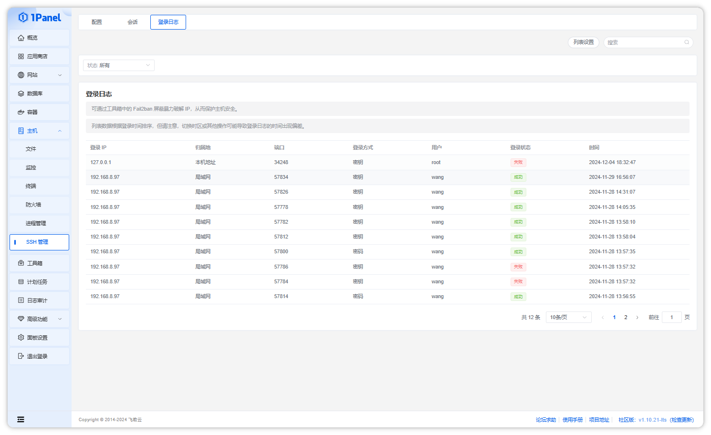

## 1 配置 SSH 服务

!!! note ""
    在 SSH 管理配置页面，可以开启/关闭/重启 SSH 服务，设置 SSH 服务开机自启动，同时支持可视化调整监听端口、监听地址等常用配置，或者通过配置文件方式修改其他配置。

## 2 管理 SSH 会话

!!! note ""
    点击当前页面上方的 `会话` 选项，可以进入 SSH 会话列表。

    - 在列表中可以查看系统中的所有活跃的 SSH 会话信息
    - 点击操作列的 `断开`，可以断开指定的 SSH 会话

## 2 查看 SSH 登录日志

!!! note ""
    点击当前页面上方的 `登录日志` 选项，可以进入 SSH 登录日志列表。

