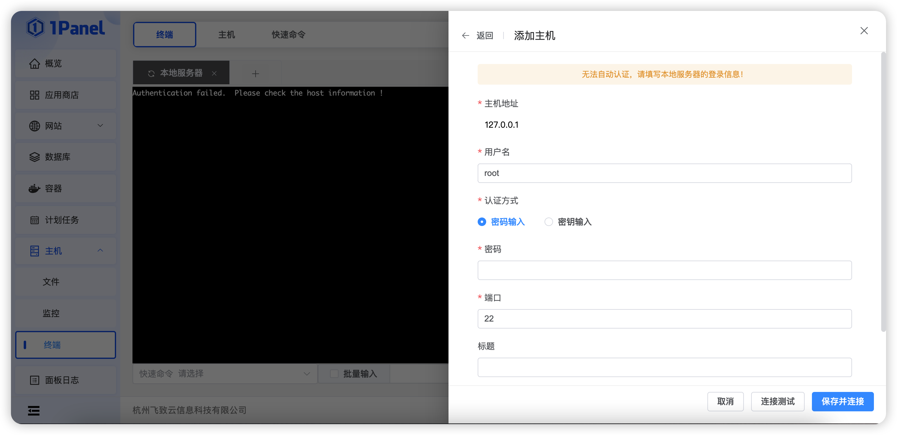
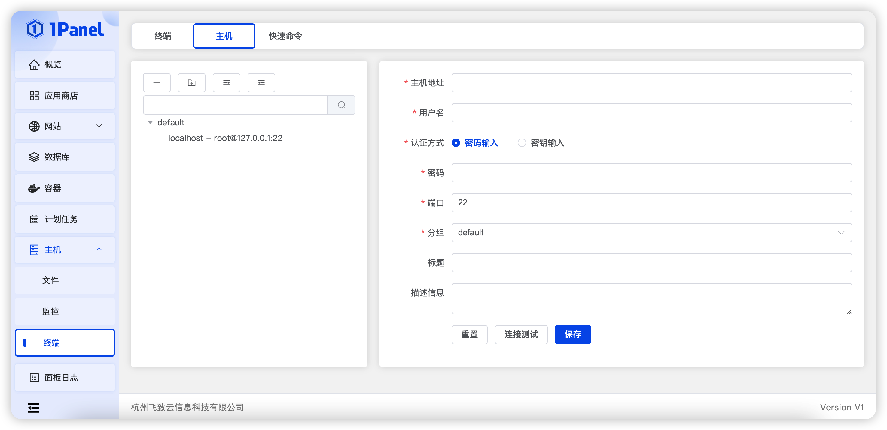

## 1 终端管理

!!! Abstract ""
    点击【主机 - 终端】菜单，进入终端页面，终端默认连接本地服务器，如未填写本地服务器登录信息，则连接失败。

    - 支持直接选择已有主机连接（【终端 - 主机】菜单中维护）和连接新主机；
    - 支持重新连接；
    - 支持打开多个本地服务器；
    - 支持全屏操作；
    - 支持快速快速命令（需要在【终端 - 快速命令】菜单中维护），用户可预定于常用快速命令；
    - 支持当前所有连接批量输入。

## 2 主机管理

!!! Abstract ""
    维护主机信息，支持主机分组。

