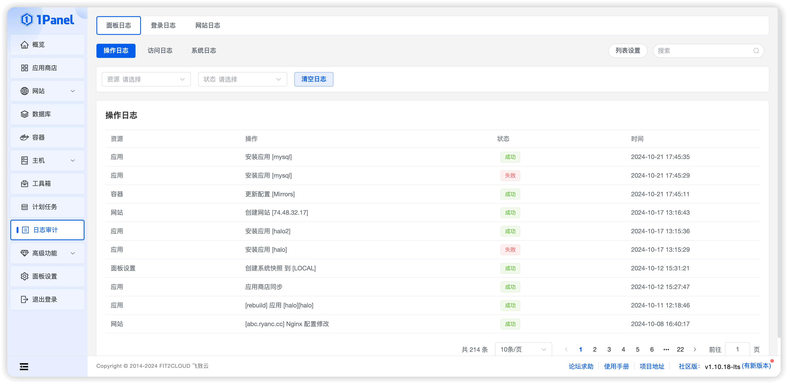
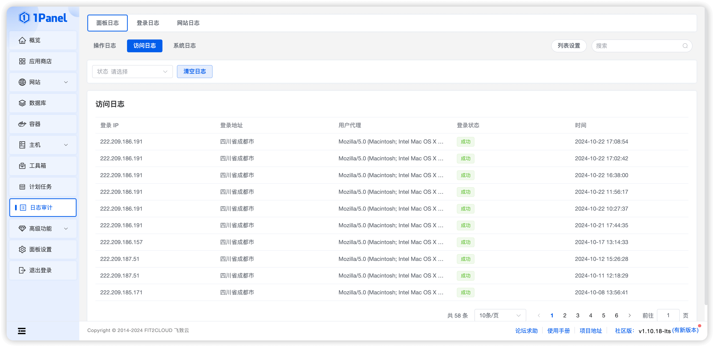
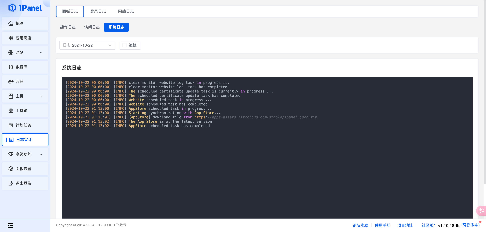
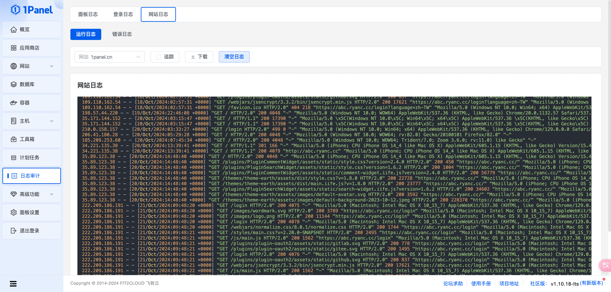
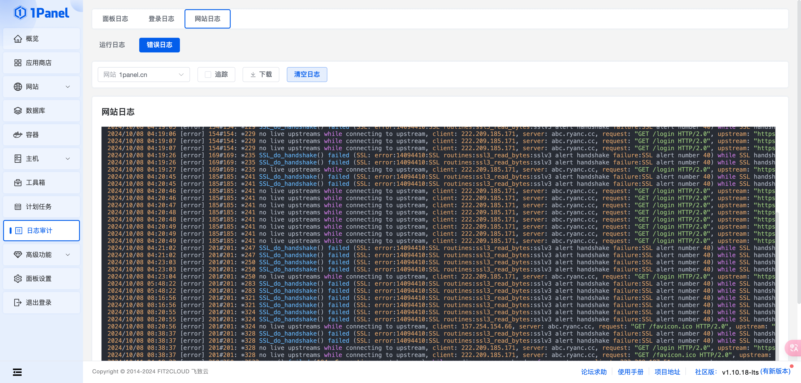

## 1 面板日志

### 操作日志

用于记录用户在 1Panel 上进行的操作。

### 访问日志

用于记录 1Panel 控制台的访问日志。

### 系统日志

用于记录 1Panel 服务的运行日志，可用于开发人员等快速定位问题。

## 2 登录日志

主要记录服务器的 ssh 登录记录，可用于查询是否有人恶意登录和操作。

!!! note "提示"

    日志内容从操作系统 SSH 登录日志文件中读取而来，文件位置一般为 `/var/log/secure` 或者 `/var/log/auth.log`。

    当需要清理登录日志时，可以手动删除上述文件中的历史内容。

## 3 网站日志

用于查看在 1Panel 上创建的各个网站的日志，分为运行日志和错误日志，可以用于排查网站的访问问题。

