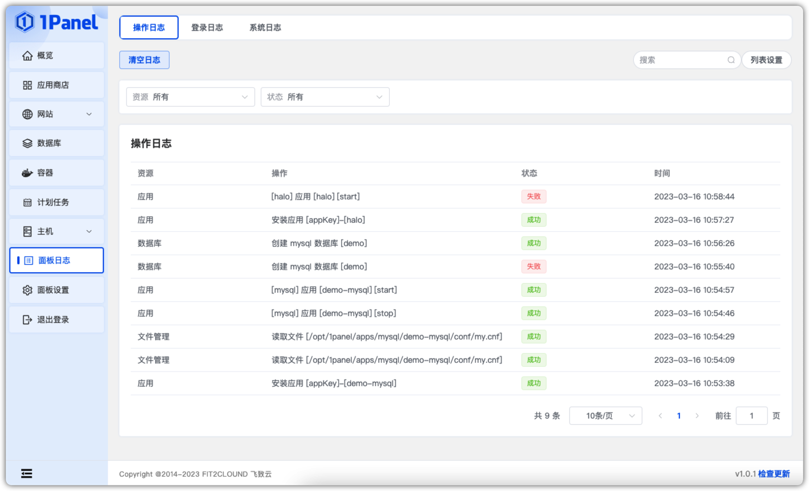
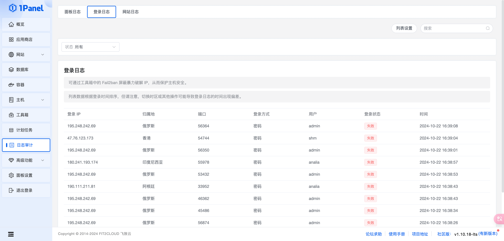
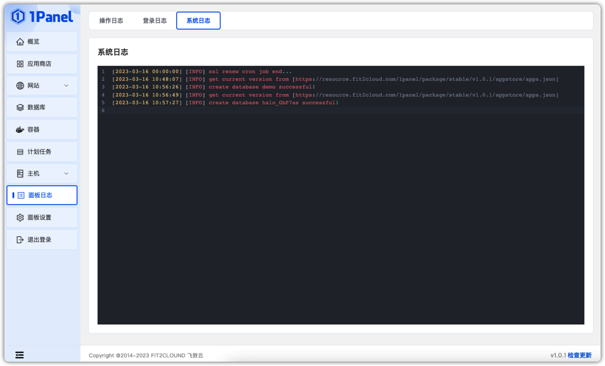

## 1 操作日志

!!! Abstract ""
    主要记录当前面板操作的日志及状态，比如在面板上站点的添加，数据库的添加，支持资源及状态过滤。

## 2 登录日志

!!! Abstract ""
    主要记录当前面板登录记录，可用于查询是否有人恶意登录和操作。

## 3 系统日志

!!! Abstract ""
    用于查看 1Panel 服务自身的运行日志，可用于开发人员等快速定位问题。

