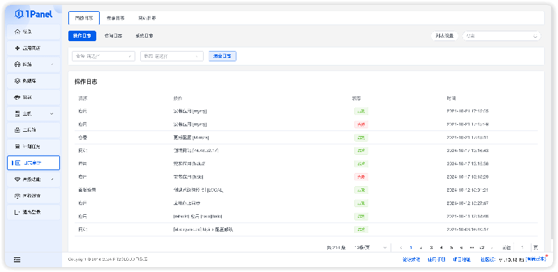
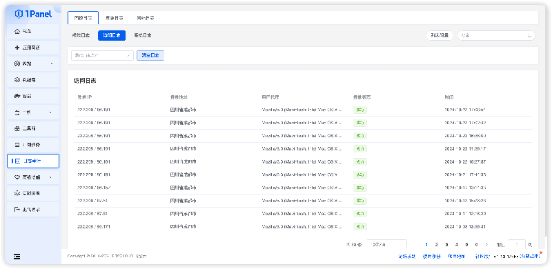
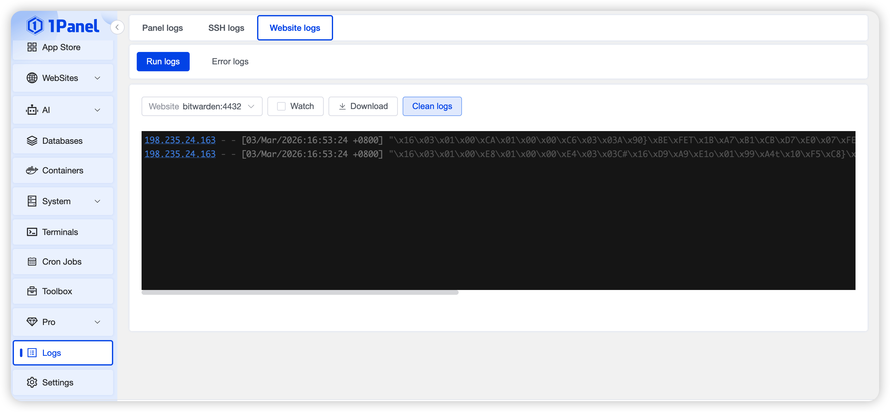
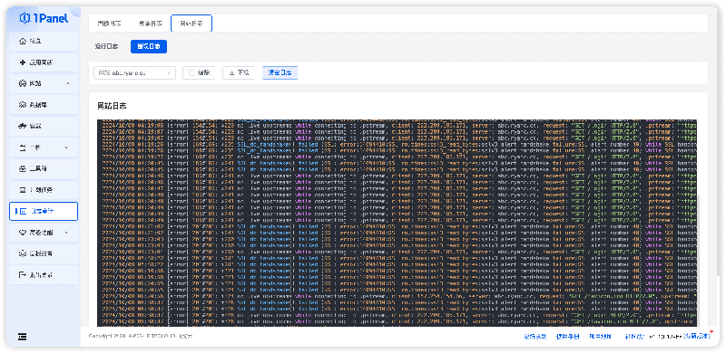
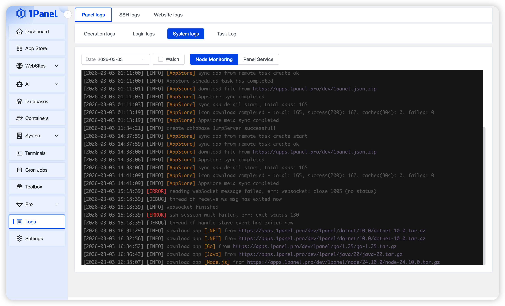
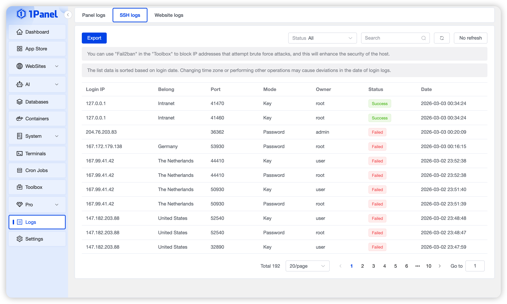

# 日志审计

!!! note ""
    日志审计用于查询 1Panel 操作、面板访问、网站、系统、SSH 登录和后台任务日志。入口为左侧菜单 **日志审计**。社区版、专业版和企业版均可使用，用户需要具有日志查看权限。

## 1 操作日志

!!! note ""
    记录用户在 1Panel 中执行的操作，可按时间、用户、来源 IP、状态或操作内容筛选。排查配置被修改、资源被删除或权限操作时，应结合操作时间和操作详情确认执行人及结果。

{: .original}

## 2 访问日志

!!! note ""
    记录对 1Panel 控制台的访问请求，用于排查异常请求、接口错误或来源 IP。访问日志不是 SSH 登录日志，两者的数据来源和用途不同。

{: .original}

## 3 网站日志

!!! note ""
    选择网站后查看 OpenResty 访问日志和错误日志，可按关键字或时间排查网站访问问题。页面能否读取日志取决于网站类型、OpenResty 状态和日志配置。

{: .original}

{: .original}

## 4 系统日志

!!! note ""
    查看 1Panel 服务运行日志，可按日志级别筛选并下载。升级、任务下发、接口调用或服务异常时，可先在此定位错误时间和上下文。

{: .original}

## 5 登录日志

!!! note ""
    展示操作系统的 SSH 登录记录和登录状态，用于检查异常来源和暴力尝试。数据通常来自 `/var/log/secure` 或 `/var/log/auth.log`，实际路径由发行版和 SSH 日志配置决定。

!!! note "日志来源"
    清理或轮转系统 SSH 日志会同步影响页面可查询的历史记录。1Panel 不会为被操作系统删除的 SSH 日志单独保留完整副本。

{: .original}

## 6 任务日志

!!! note ""
    后台任务会记录任务名称、状态、开始时间等信息。可按任务状态筛选，并打开详情查看实时或已完成日志。应用安装、升级、备份、模型下载等异步操作失败时，应根据页面提示进入对应任务详情。

!!! warning "敏感信息"
    日志可能包含主机地址、路径、用户名或接口参数。下载或提交日志前应移除密码、令牌、Cookie、私钥和其他敏感信息。
