## 1 面板

!!! Abstract ""
    支持面板的一些基础设置，具体包括：
     
    - 用户名称，账户密码： 1Panel 系统仅支持单主机单用户，此处是系统登录的验证信息，在初次登陆时由用户初始化。
    - 主题颜色： 系统支持亮色（light）和 暗色（dark），可根据用户使用习惯手动切换。
    - 面板别名： 用户可自定义面板名称。
    - 系统语言： 系统当前支持中文和英文。 
    - 超时时间： 此处为系统用户登陆后，多长时间未操作系统自动退出，最小超时时间为 300 秒。
    - 服务器时间： 同步服务器时间，时区为默认的东八区，同步服务器为 pool.ntp.org。

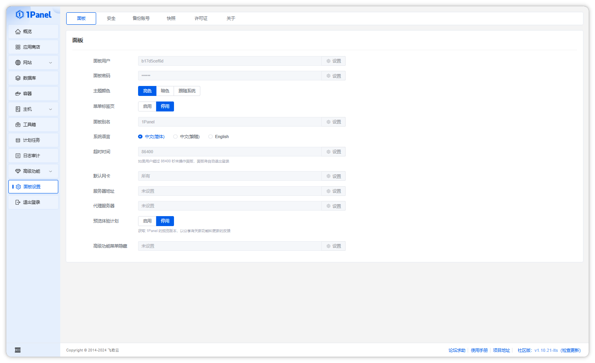

## 2 安全

!!! Abstract ""
    针对一些系统要求等级比较高的用户，我们增加了一些安全设置，具体包括：

    - 面板端口： 系统默认的端口为 9999 ，支持端口自定义，但是需要谨慎操作，防止与应用端口冲突导致服务无法启动，建议修改端口前先执行 netstat -tunlp | grep [端口] 查看端口是否正在使用。
    - 密码过期时间： 系统支持设置密码过期天数，默认未设置，当密码超过过期时间时，系统将跳转到改密界面，需要修改账户密码，且新密码不能与老密码相同。
    - 密码复杂度校验： 开启后，账户密码必须长度大于 8 位，且包含数字、字母及特殊字符，如 Password@2023。
    - 两部校验： 开启 MFA 登录验证，登录时输入用户名密码后，需要手机或者浏览器扫描二维码完成登录，提升系统安全等级。

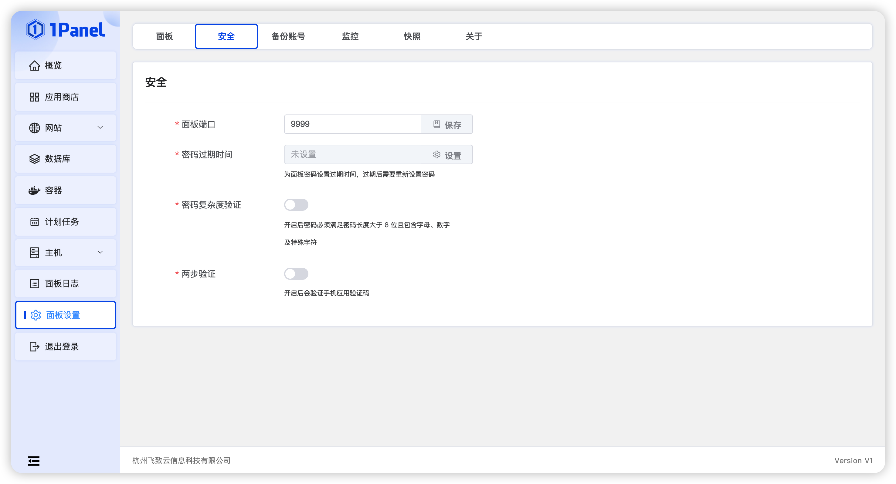

## 3 备份账号

### 已支持的备份账号

!!! Abstract ""

    **支持添加本地服务器磁盘和第三方账号：**

    - 亚马逊 S3 云存储
    - 阿里云 OSS
    - 腾讯云 COS
    - 微软 OneDrive
    - 七牛云 Kodo
    - 又拍云 对象存储
    - MINIO
    - SFTP

### OneDrive 自定义配置

!!! Abstract ""

    **在调用 Onedrive API 时需要使用到 4 个参数：**

    - client_id: 客户端ID
    - client_secret: 客户端密码
    - redirect_uri: 重定向地址
    - scope: API权限

1. 访问并登录 MicroSoft Azure：https://portal.azure.com/#blade/Microsoft_AAD_RegisteredApps/ApplicationsListBlade

2. 点击新注册，并填写注册信息，其中的重定向 URI 作为 重定向 Url 参数
    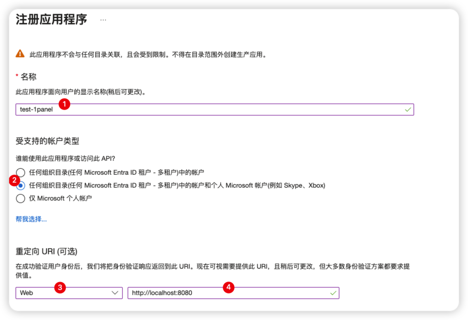

3. 主页上的 应用程序(客户端) ID 作为 客户端 ID
    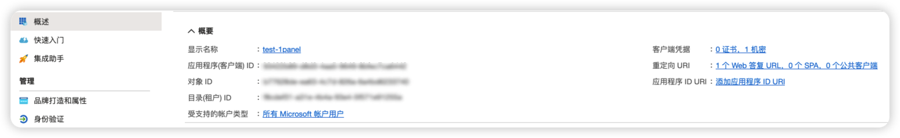

4. 在 证书和密码 页面新建客户端密码，填写相关信息，生成的值作为 客户端密钥
    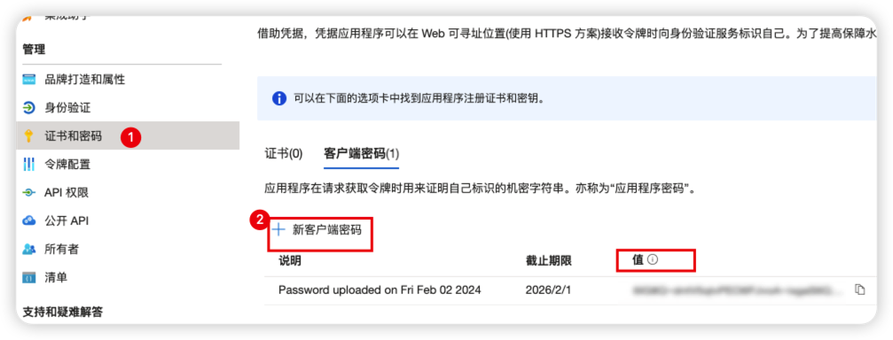

5. 在 API 权限页面选择需要的权限，添加权限，Microsoft Graph，委托的权限，勾选 Files.ReadWrite.All、offline_access、User.Read，这将作为 scope 传递
    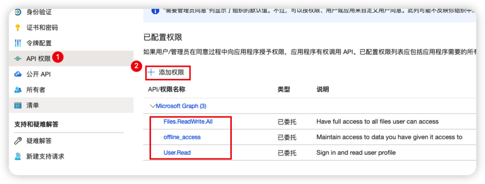

### OneDrive 账号绑定
    1. 点击 OneDrive 授权码获取按钮
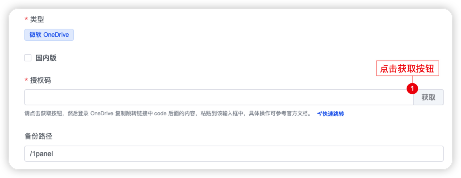

    2. 输入 Onedrive 账号信息
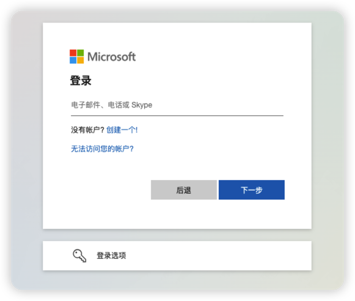

    3. 信任 1panel 服务
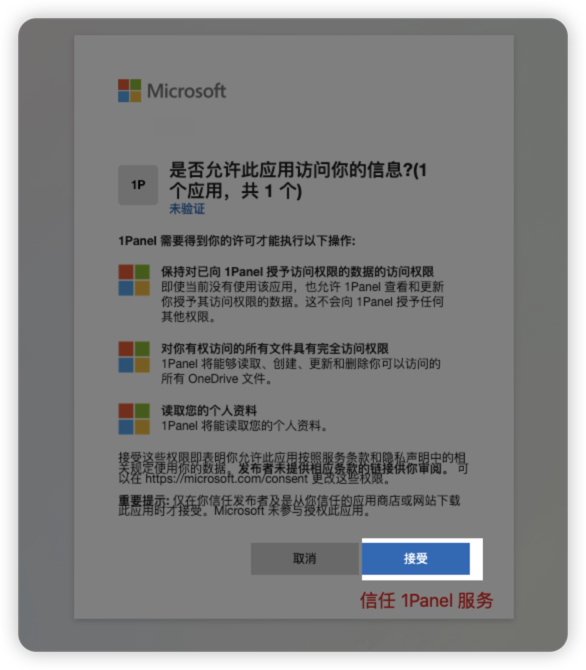

    4. 复制授权码到 1Panel 授权码输入框 (注意不要包含 &session_state=xxx 部分)
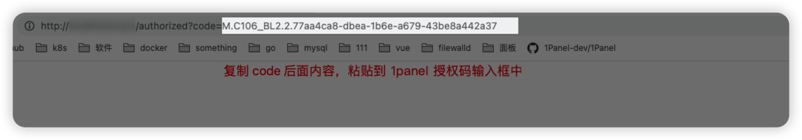

### WebDAV 连接 AList
    1. 从应用商店安装好 AList 后（记得打开端口外部访问），在容器日志中查看初始化密码，跳转到 AList 管理界面。

    2. 存储 菜单中添加对应的存储，记住该路径。
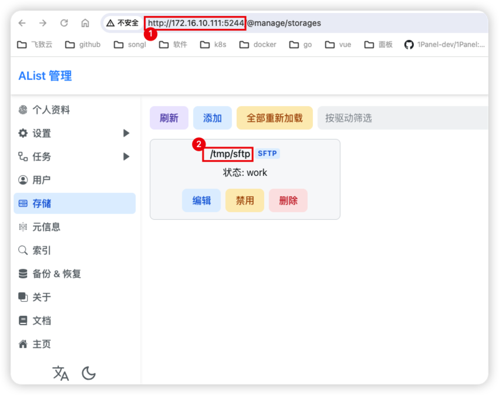

    3. 1Panel 备份账号中，WebDAV 添加该备份账号，这里的路径应该是 /dav/${2步骤中的路径}/xxx，如此处的 /dav/tmp/sftp/1panel，完成绑定。
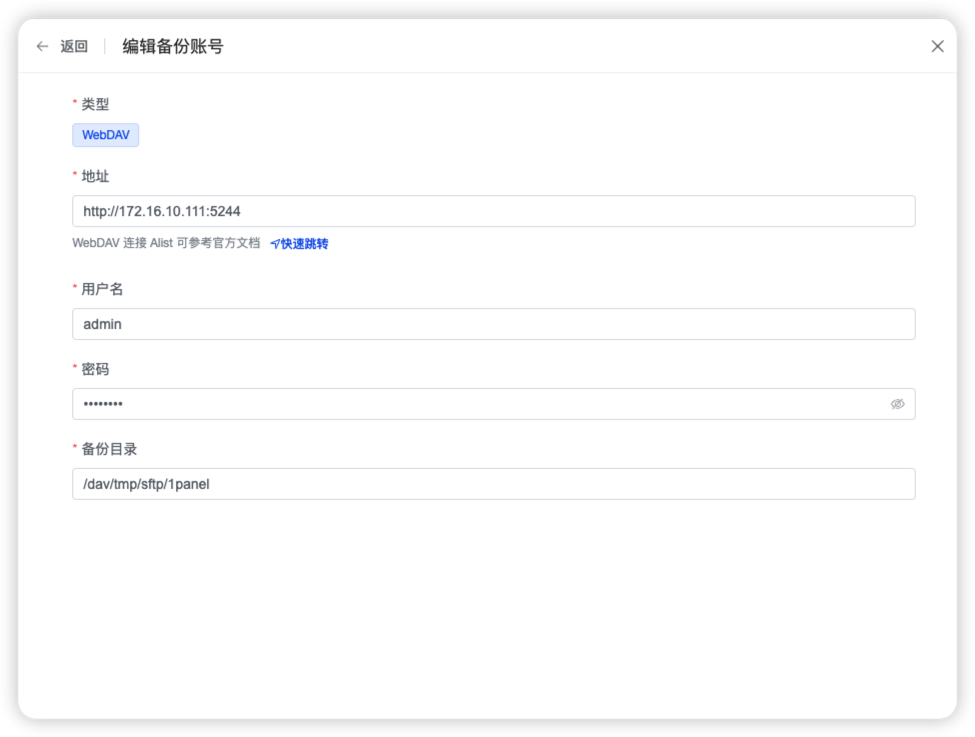

### 部分对象存储服务商与亚马逊 S3 云存储的兼容性

|服务商|文档|兼容访问风格|兼容性|
| ----- | ---- | ----- | ----- |
|阿里云|https://help.aliyun.com/document_detail/410748.html|Virtual Hosted Style|✅|
|腾讯云|[https://cloud.tencent.com/document/product/436/41284](https://cloud.tencent.com/document/product/436/41284)|Virtual Hosted Style /  Path Style|✅|
|七牛云|https://developer.qiniu.com/kodo/4088/s3-access-domainname|Virtual Hosted Style /  Path Style|✅|
|百度云|https://cloud.baidu.com/doc/BOS/s/Fjwvyq9xo|Virtual Hosted Style /  Path Style|✅|
|京东云| https://docs.jdcloud.com/cn/object-storage-service/api/regions-and-endpoints |Virtual Hosted Style|✅|
|金山云|https://docs.ksyun.com/documents/6761|Virtual Hosted Style|✅|
|青云|https://docsv3.qingcloud.com/storage/object-storage/s3/intro/|Virtual Hosted Style /  Path Style|✅|
|网易数帆|[https://sf.163.com/help/documents/89796157866430464](https://sf.163.com/help/documents/89796157866430464)|Virtual Hosted Style|✅|
|Cloudflare|Cloudflare S3 兼容性API [https://developers.cloudflare.com/r2/data-access/s3-api/](https://developers.cloudflare.com/r2/data-access/s3-api/)|Virtual Hosted Style /  Path Style|✅|
| Oracle Cloud |[https://docs.oracle.com/en-us/iaas/Content/Object/Tasks/s3compatibleapi.htm](https://docs.oracle.com/en-us/iaas/Content/Object/Tasks/s3compatibleapi.htm)|Virtual Hosted Style /  Path Style|✅|
|自建minio|\-|Path Style|✅|
|又拍云|[https://help.upyun.com/knowledge-base/aws-s3%E5%85%BC%E5%AE%B9/](https://help.upyun.com/knowledge-base/aws-s3%E5%85%BC%E5%AE%B9/)|Virtual Hosted Style /  Path Style|✅|
|华为云|文档未说明是否兼容，工单反馈不保证兼容性，实际测试可以使用|Virtual Hosted Style|❓|
|Ucloud|只支持 8MB 大小的分片，本插件暂不支持 [https://docs.ucloud.cn/ufile/s3/s3\_introduction](https://docs.ucloud.cn/ufile/s3/s3_introduction)|\-|❌|

## 4 监控

!!! Abstract ""
    支持设置是否开启服务器监控和监控日志保留天数

## 5 快照

!!! Abstract ""

    快照用于全量备份 1Panel 所产生的数据，具体包括：
    
    - Docker 配置文件，路径为 /etc/docker/daemon.json；
    - 应用商店应用，可在【应用商店 - 已安装】中查看；
    - 本地备份数据，可在【面板设置 - 备份账号】中查看；
    - 1Panel 产生的数据，将压缩整个 [安装目录]/1panel 目录，包括数据库文件；
    - 1panel 二进制文件，路径为 /usr/local/bin/1panel；
    - 1pctl 命令行工具，路径为 /usr/local/bin/1pctl；
    - 1panel.service 路径为 /etc/systemd/system/1panel.service；

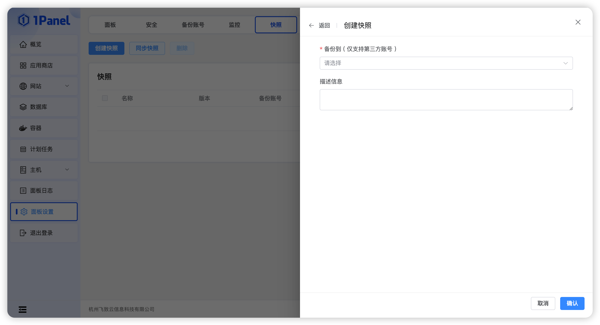

!!! Abstract ""

    - 创建和同步快照只支持选择第三方账号。
    - 快照恢复过程中，将对恢复前数据进行备份，默认的备份路径为 [安装目录]/original_[快照名]。
    - 快照恢复失败后，可选择根据【面板日志 - 系统日志】排查失败原因后，重试恢复，或者直接回滚到恢复之前的版本。
    - 如果上述操作都不能使服务正常运行，则需要手动拿到恢复前的备份文件，手动替换当前系统数据，然后重启系统。
    - 如机器迁移等，需要将快照放到备份账号对应的指定目录下，如服务器磁盘：/opt/1panel/backup/system_snapshot/ 。

## 6 关于

!!! Abstract ""
    
    - 支持检查 1Panel 服务是否存在新版本，更新将替换 1panel 二进制文件、1pctl 命令行工具以及 1panel.service 文件。
    - 更新失败时，将回滚所有更新内容到更新前的状态，如更新后发现版本信息没有发生变化，则更新失败，可在【面板日志 - 系统日志】中查看失败原因，解决后重新完成更新操作。
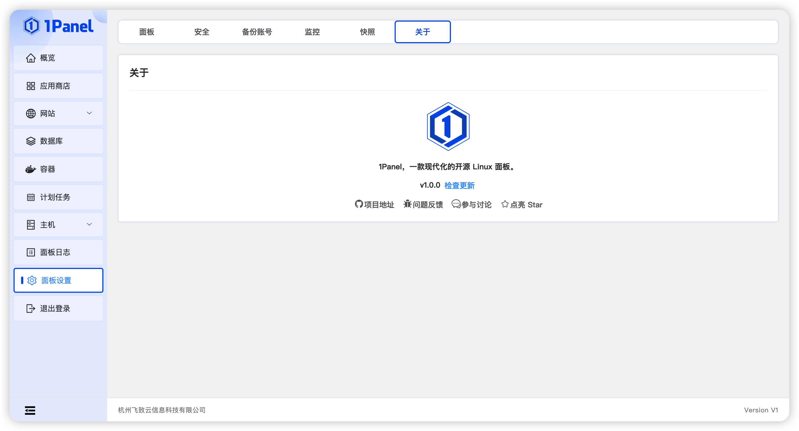
