# 面板设置

面板设置用于配置当前节点的显示、访问安全、告警、备份账号、快照、许可证和版本更新。社区版、专业版和企业版可见的标签页和选项不同；企业版普通用户只能看到角色已授权的告警、备份等页面。

!!! note "个人账号设置"
    登录用户名、密码、MFA、通行密钥和 API 接口已经迁移到左下角头像菜单中的 **用户信息**。企业版的多用户、角色和节点权限由超级管理员在 [用户管理](./enterprise/user_management.md) 中维护。

## 1 面板

!!! note ""
    - **主题颜色**：选择亮色、暗色或跟随系统。专业版和企业版还可自定义主题色。
    - **菜单标签页**：在页面上方显示最近访问过的多标签页。
    - **水印**：专业版和企业版可在页面显示自定义水印。
    - **面板名称**：修改浏览器标题和页面显示的面板名称。更完整的品牌设置参见 [界面设置](./xpack/appearance.md)。
    - **系统语言**：切换当前面板界面语言。
    - **超时时间**：设置登录后无操作自动退出的时间。
    - **默认访问地址**：用于拼接已安装应用的快速访问地址。
    - **代理服务器**：配置 1Panel 部分网络请求使用的代理。
    - **开发者模式**：社区版和专业版可按页面启用预览相关能力，企业版不显示该选项。
    - **菜单设置**：控制左侧菜单项是否显示。
    - **运行环境**：选择当前产品支持的运行环境区域配置。


{: .original}

## 2 安全

!!! note "配置说明"
    该标签页仅管理员可见，包含以下面板访问安全配置：

    - **面板端口**：修改 1Panel 服务端口。修改前应检查端口占用并同步放行防火墙或安全组。
    - **监听地址**：限制 1Panel 服务监听的主机地址。
    - **安全入口**：只有使用指定入口路径才能打开登录页。
    - **未认证设置**：配置未通过安全入口访问时返回的内容。
    - **授权 IP**：只允许指定 IP 或网段访问面板。
    - **域名绑定**：只允许使用指定域名访问面板。
    - **面板 SSL**：为面板启用 HTTPS。证书和域名必须匹配。
    - **密码过期时间**：到期后要求用户修改密码。
    - **密码复杂度校验**：强制新密码满足页面规定的长度和字符类型。


{: .original}

!!! warning "注意"
    以上设置修改后会影响访问 1Panel 服务的方式，可能导致不能正常打开、登录 1Panel 面板的情况。

    此时可以 SSH 登录到服务器后，使用 `1pctl reset` 和 `1pctl update` 命令重置或更新特定配置。

    ```text
    root@hostname:/# 1pctl reset --help
    重置系统信息

    Usage:
    1panel reset [command]

    Available Commands:
    domain      取消 1Panel 访问域名绑定
    entrance    取消 1Panel 安全入口
    https       取消 1Panel https 方式登录
    ips         取消 1Panel 授权 IP 限制
    mfa         取消 1Panel 两步验证

    Flags:
    -h, --help   help for reset

    Use "1panel reset [command] --help" for more information about a command.
    ```

    ```text
    root@hostname:/# 1pctl update
    修改面板信息

    Usage:
    1panel update [command]

    Available Commands:
    password    修改面板密码
    port        修改面板端口
    username    修改面板用户

    Flags:
    -h, --help   help for update

    Use "1panel update [command] --help" for more information about a command.
    ```

## 3 面板告警

!!! note "功能概述"
    面板告警用于在 1Panel 检测到异常或重要事件时，通过 **邮箱**、**企业微信**、**钉钉**、**飞书**、**短信**、**Bark** 等渠道及时通知管理员。

    - 邮箱 / Bark 告警：社区版、专业版和企业版均可使用。
    - 企业微信 / 钉钉 / 飞书 / 短信告警：需要专业版或企业版许可证。

    常见的告警场景包括：主机资源（CPU、内存、磁盘）异常、网站 / 应用运行异常、备份失败、登录异常等。

### 3.1 通用配置

!!! note ""
    1. 登录 1Panel，进入 **面板设置**。
    2. 点击 **面板告警**；企业版普通用户需要具有告警查看或管理权限。
    3. 在告警页面中，可进行以下通用配置：
        - 开启 / 关闭总开关  
        - 选择告警渠道（邮箱、企业微信、钉钉、飞书、短信）  
        - 配置默认收件人 / 通知人  
        - 配置告警级别（如：仅严重告警、包含警告级别等）  
        - 配置不同模块的告警项（如：主机、网站、数据库、容器、计划任务等）  


{: .original}

### 3.2 邮箱告警

!!! note "1Panel 中邮箱设置"

    1. 进入 【面板设置 - 面板告警】  
    2. 选择 **邮箱** 渠道并开启  
    3. 填写 SMTP 相关信息：
        - SMTP 服务器地址（如：smtp.qq.com、smtp.163.com 等）  
        - 端口号（常见为 465/587，根据服务商要求选择 TLS/SSL）  
        - 发件邮箱账号  
        - 授权码 / 应用专用密码（不同邮箱服务商名称略有区别）  
    4. 设置默认收件人邮箱地址（可填写多个，以逗号分隔）  
    5. 保存配置后，点击【发送测试邮件】确认配置是否生效  


{: .original}

!!! note "第三方邮箱服务商常见说明"

    - **QQ 邮箱 / 163 邮箱等个人邮箱服务**  
        - 需在邮箱安全设置中开启「POP3/SMTP 服务」或「客户端授权码」  
        - 获取授权码后填入 1Panel 中的「密码 / 授权码」字段  
    - **企业邮箱 / 自建邮件服务器**  
        - 请从管理员处获取 SMTP 地址、端口、账号和密码  
        - 如服务端启用 IP 访问控制，请将 **1Panel 所在服务器的 IP 地址加入白名单**，以确保发信请求不会被拒绝  

### 3.3 企业微信告警

!!! note "1Panel 中企业微信设置"

    1. 确认当前节点已导入专业版或企业版许可证。
    2. 进入 【面板设置 - 面板告警】  
    3. 选择 **企业微信** 渠道并开启  
    4. 填写自定义机器人 Webhook 地址
    5. 保存配置后，将在实际告警触发时向企业微信推送消息  

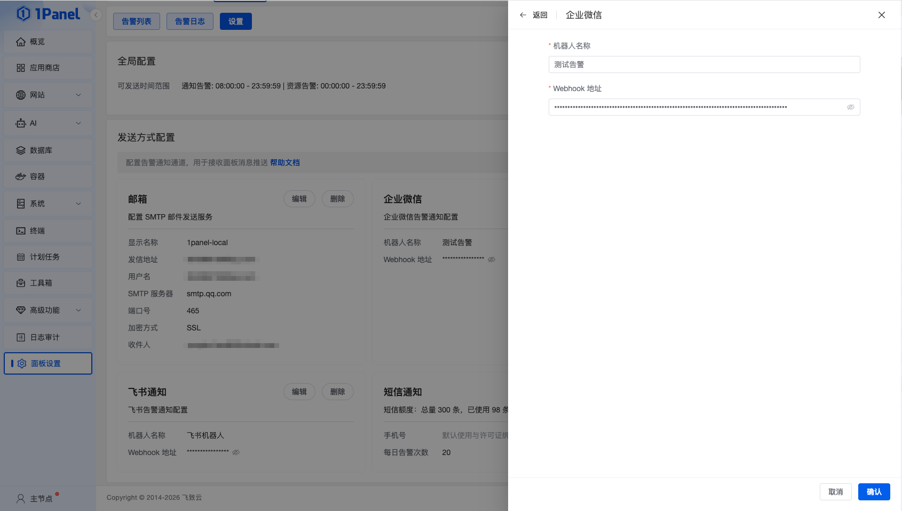
{: .original}

!!! note "企业微信端配置（采用 IP 白名单）"

    1. 登录企业微信管理后台  
    2. 进入 【应用管理】 -> 选择为 1Panel 告警创建或指定的自建应用  
    3. 在 **安全设置 / 可调用 IP 白名单** 中：
        - 如 **开启 IP 白名单** ，则只允许白名单中的 IP 调用接口，建议将运行 1Panel 的服务器公网 IP 地址加入白名单  
        - 如 **未开启 / 未配置 IP 白名单** ，则默认允许任意来源 IP 调用接口  
    4. 若已配置白名单，需确保服务器网络出口 IP 与白名单配置一致，避免因出口 NAT 导致 IP 不匹配  

    配置 IP 白名单后，仅允许来自白名单 IP 的服务器调用相关接口；如果更换服务器或出口 IP，需要同步更新白名单配置。

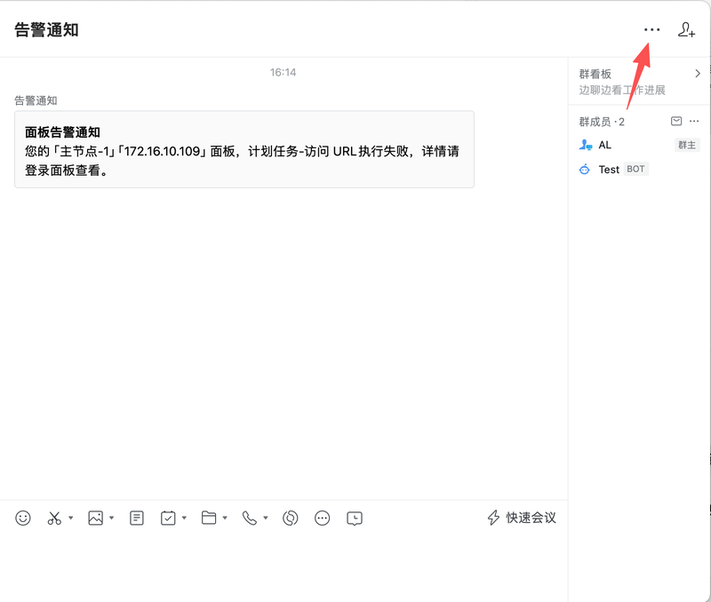
{: .original}

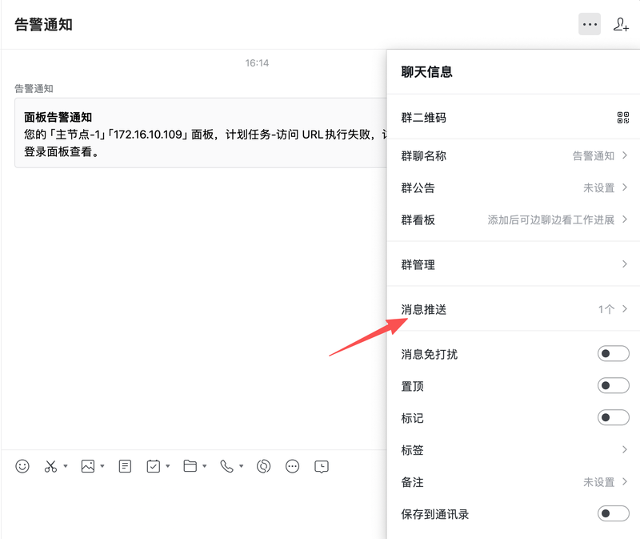
{: .original}

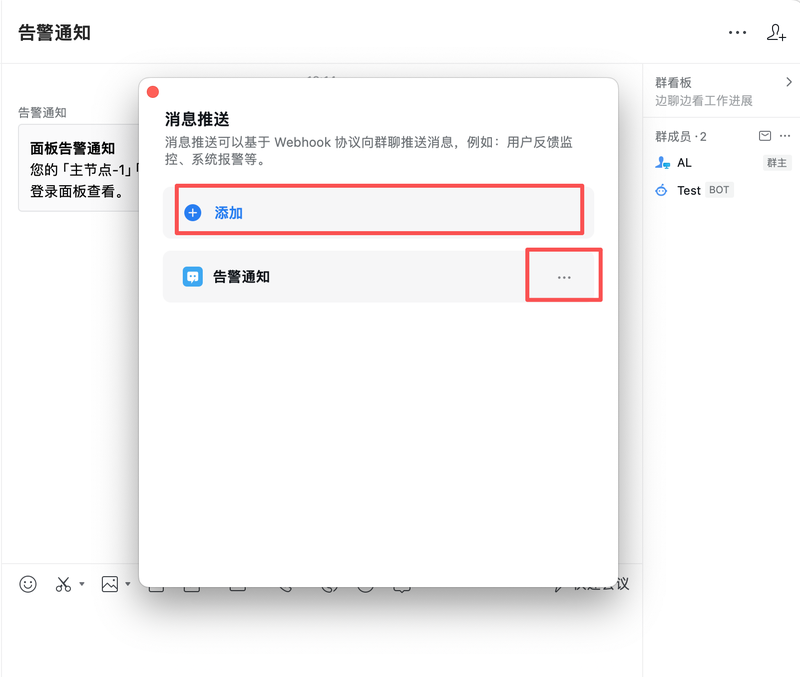
{: .original}

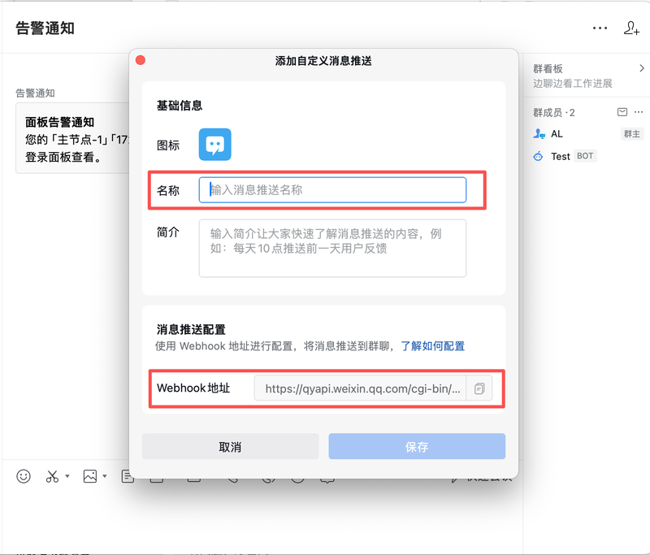
{: .original}

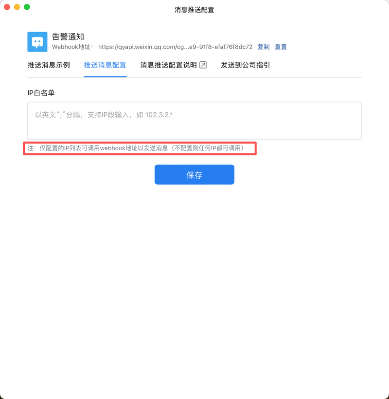
{: .original}

### 3.4 钉钉告警

!!! note "1Panel 中钉钉设置"

    1. 确认当前节点已导入专业版或企业版许可证。
    2. 在 【面板设置 - 面板告警】 中选择 **钉钉** 渠道并开启  
    3. 填写自定义机器人 Webhook 地址 
    4. 保存配置后，在对应告警触发时将向钉钉推送消息  


{: .original}

!!! note "钉钉自定义机器人配置参考"
    钉钉侧需要先创建自定义机器人，并获取 Webhook 地址和安全设置，再回填到 1Panel 中，参考钉钉开放平台文档：

    - [自定义机器人创建与安装](https://open.dingtalk.com/document/dingstart/custom-bot-creation-and-installation)  
    - [自定义机器人安全设置](https://open.dingtalk.com/document/dingstart/customize-robot-security-settings)  
    - [获取自定义机器人 Webhook 地址](https://open.dingtalk.com/document/dingstart/obtain-the-webhook-address-of-a-custom-robot)  

    典型步骤如下：

    1. 在钉钉群中添加「自定义机器人」，选择自定义机器人类型并完成安装  
    2. 在「安全设置」中选择 **IP 地址** 作为安全策略：
        - 将 1Panel 所在服务器的出口 IP 地址添加到 IP 白名单
    3. 在机器人配置页面获取 **Webhook 地址**，复制后粘贴到 1Panel 钉钉告警配置中的 Webhook 字段

### 3.5 飞书告警

!!! note "1Panel 中飞书设置"
    
    1. 确认当前节点已导入专业版或企业版许可证。
    2. 在 【面板设置 - 面板告警】 中选择 **飞书** 渠道并开启  
    3. 填写自定义机器人 Webhook 地址
    4. 保存配置后，当相关告警触发时将向飞书推送消息  


{: .original}

!!! note "飞书端配置（采用 IP 白名单）"

    1. 登录飞书开放平台 / 管理后台  
    2. 找到对应的应用或机器人配置  
    3. 在「安全设置 / IP 白名单」中：
        - 添加 1Panel 所在服务器的公网 IP 地址  
        - 保存并确保配置已发布生效  

    如服务器出口 IP 发生变化（如更换机房、切换出口），需同步更新飞书侧的 IP 白名单，否则飞书可能拒绝来自 1Panel 的请求。

!!! note "飞书自定义机器人配置参考"
    飞书侧可以通过自定义机器人接收 1Panel 告警消息，典型流程参考飞书官方文档 [添加自定义机器人](https://open.feishu.cn/document/client-docs/bot-v3/add-custom-bot?lang=zh-CN)：

    1. 在目标群组中添加「自定义机器人」，按照向导完成创建  
    2. 在机器人配置页获取 **Webhook 地址**，复制后粘贴到 1Panel 飞书告警配置中的 Webhook 字段  
    3. 在飞书开放平台或机器人配置中的「安全设置 / IP 白名单」位置：
        - 将 1Panel 所在服务器的出口 IP 地址加入白名单  
        - 避免使用完全开放的访问策略，降低被恶意调用的风险  
    4. 保存配置后，当 1Panel 中相关告警触发时，将通过自定义机器人向对应飞书群推送消息  

### 3.6 Bark 告警

!!! note "1Panel 中 Bark 设置"
    1. 在 iOS 设备上通过 App Store 安装 **Bark** 应用，并按向导完成首次配置（**当前仅支持 iOS 设备**）  
    2. 打开 Bark 应用，复制个人推送地址（通常为 `https://<你的 Bark 服务器>/<设备 Key>`，可参考 Bark 官方文档 [`Bark 使用教程`](https://bark.day.app/#/tutorial)）  
    3. 登录 1Panel，进入 【面板设置 - 面板告警】 并选择 **Bark** 渠道，将上一步复制的推送地址粘贴到配置中并开启  
    4. 保存配置后，可发送测试告警验证是否能在手机上成功收到通知  

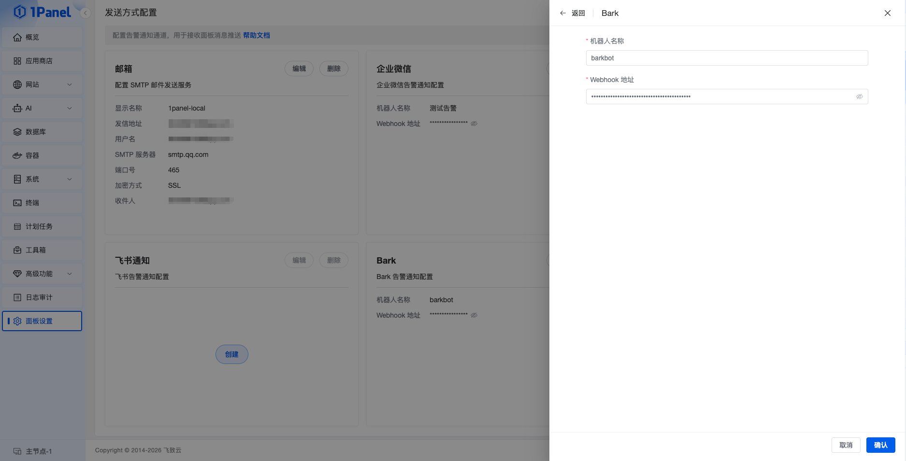
{: .original}

### 3.7 短信告警

!!! note "1Panel 中短信设置"
    1. 确认当前节点已导入专业版或企业版许可证。
    2. 在 【面板设置 - 面板告警】 中选择 **短信** 渠道并开启  
    3. 填写接收手机号码  
    4. 保存配置后，当相关告警触发时将向对应的手机发送告警短信  

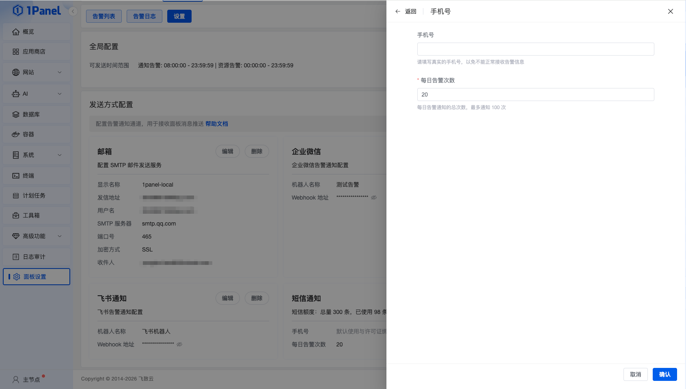
{: .original}

### 3.8 告警调试与常见问题

!!! note ""
    - 如果某个渠道无法收到告警，请确认配置是否正确 
    - 检查 **日志审计 -> 系统日志** 中是否有相关报错信息。
    - 确认当前许可证支持对应渠道。
    - 确认企业微信 / 钉钉 / 飞书 后台的 **IP 白名单** 中，已经正确添加了 1Panel 服务器当前实际出口 IP  
    - 如服务器位于内网且通过代理访问外网，请确保代理出口 IP 同样在第三方平台的 IP 白名单中

## 4 备份账号

备份账号用于保存计划任务、应用、网站、数据库和系统快照等备份。企业版普通用户需要具有备份账号权限；账号密钥、令牌和私钥应按敏感凭证管理。

### 4.1 已支持的备份账号

!!! note ""
    **支持添加本地服务器磁盘和第三方账号：**

    - 阿里云 OSS
    - 腾讯云 COS
    - 亚马逊 S3 云存储
    - 微软 OneDrive
    - 谷歌云盘
    - 阿里云盘
    - MINIO
    - WebDAV
    - SFTP
    - 七牛云 Kodo
    - 又拍云 对象存储

### 4.2 OneDrive 自定义配置

!!! note ""
    **在调用 OneDrive API 时需要使用到 4 个参数：**

    - client_id: 客户端ID
    - client_secret: 客户端密码
    - redirect_uri: 重定向地址
    - scope: API权限

!!! note ""

    （1）访问并登录 Microsoft Azure：https://portal.azure.com/#blade/Microsoft_AAD_RegisteredApps/ApplicationsListBlade。

    （2）点击新注册，并填写注册信息，其中的重定向 URI 作为 重定向 URL 参数。

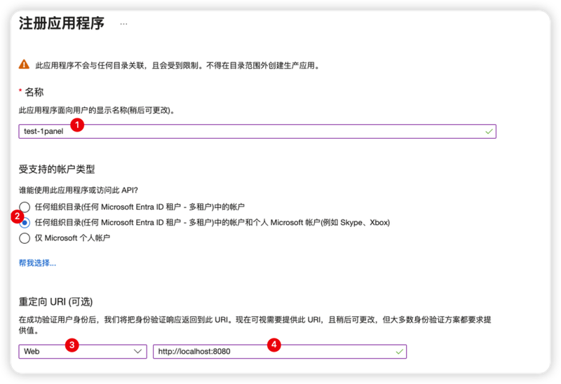
{: .original}

!!! note ""

    （3）主页上的 应用程序(客户端) ID 作为客户端 ID。

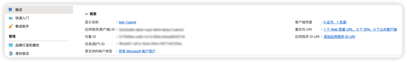
{: .original}

!!! note ""

    （4）在【证书和密码】页面新建客户端密码，填写相关信息，生成的值作为客户端密钥。

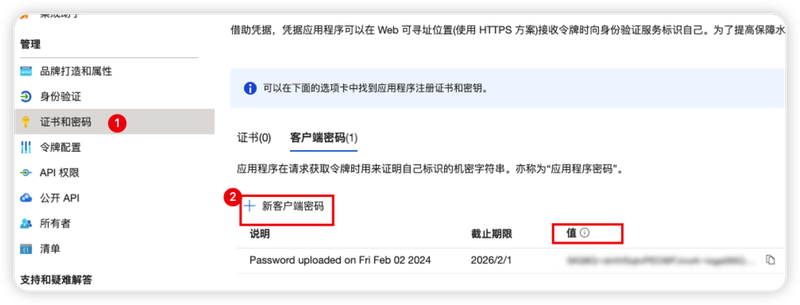
{: .original}

!!! note ""
    
    （5）在【API 权限】页面选择需要的权限，添加权限，Microsoft Graph，委托的权限，勾选 Files.ReadWrite.All、offline_access、User.Read，这将作为 scope 传递。

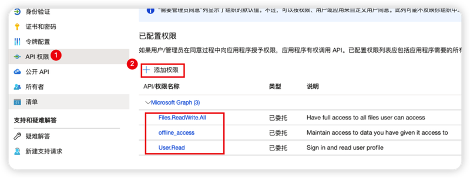
{: .original}

### 4.3 OneDrive 账号绑定

!!! note ""
    （1）点击 OneDrive 授权码获取按钮。

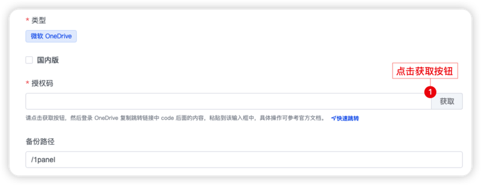
{: .original}

!!! note ""
    （2）输入 Onedrive 账号信息。

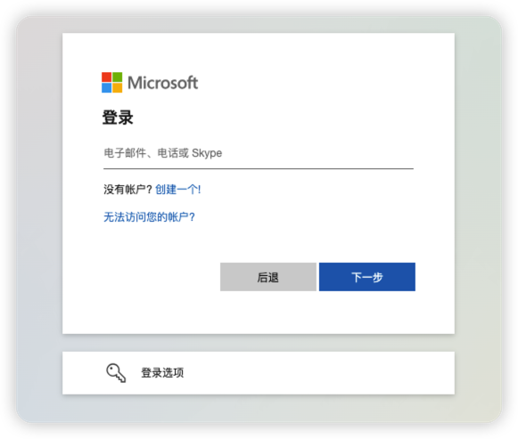
{: .original}

!!! note ""
    （3）信任 1panel 服务。

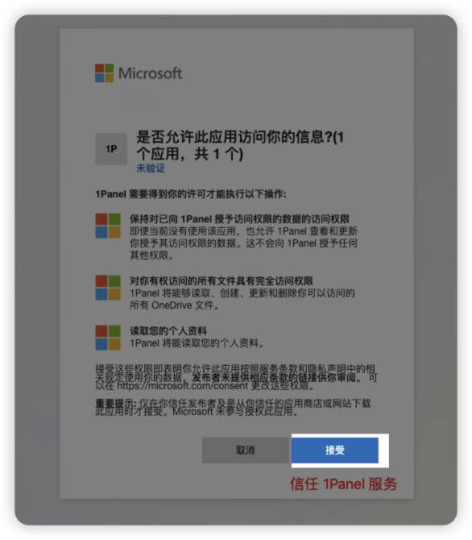
{: .original}

!!! note ""
    （4）复制授权码到 1Panel 授权码输入框 (注意不要包含 &session_state=xxx 部分)。

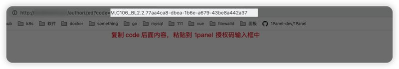
{: .original}

### 4.4 阿里云盘账号绑定

!!! note ""
    （1）登陆网页版阿里云盘 (https://www.alipan.com/)。

    （2）右键检查或者 F12 打开浏览器调试模式，找到 token 信息，复制值。 

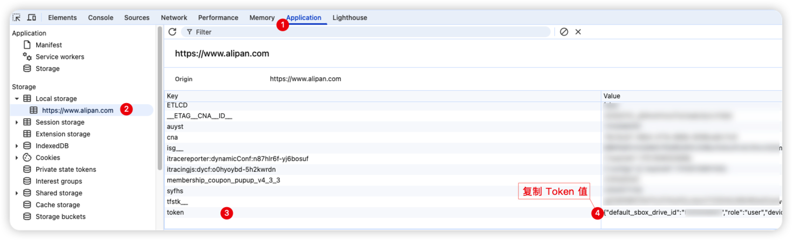
{: .original}

!!! note ""
    （3）将复制的值粘贴到 1 处，点击解析，自动解析出 3 和 4 输入框的值，修改备份目录后点击确认即可。 

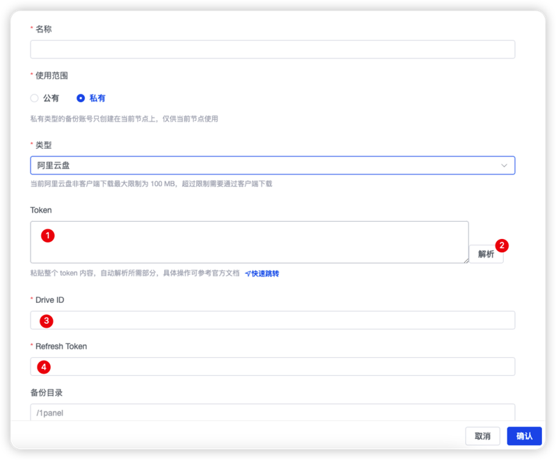
{: .original}

### 4.5 谷歌云盘账号绑定

!!! note ""
    **在调用 Google API 时需要使用到 3 个参数：**

    - client_id: 客户端ID
    - client_secret: 客户端密码
    - redirect_uri: 重定向地址

!!! note ""
    （1）访问并登录 Google Cloud：https://console.cloud.google.com/projectselector2/auth/clients?hl=zh-cn&supportedpurview=project。

    （2）点击创建项目，并填写项目名称。

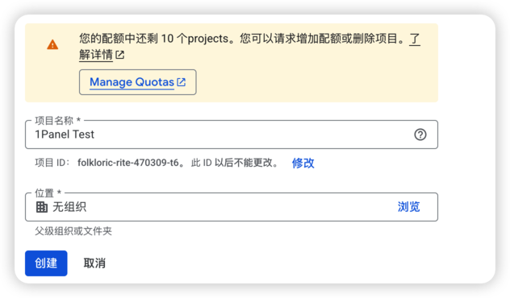
{: .original}

!!! note ""
    （3）配置 Google Auth Platform，受众群体选择外部。

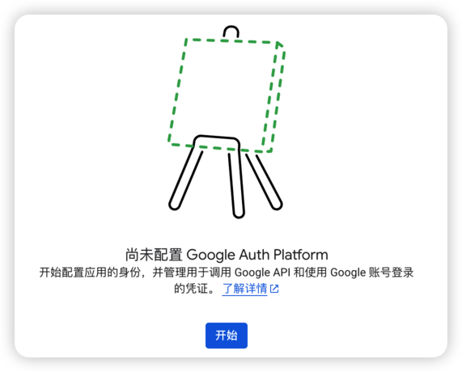
{: .original}

!!! note ""
    （4）创建 OAuth 客户端，应用类型选择 Web应用，添加重定向地址 https://localhost:8080，创建。

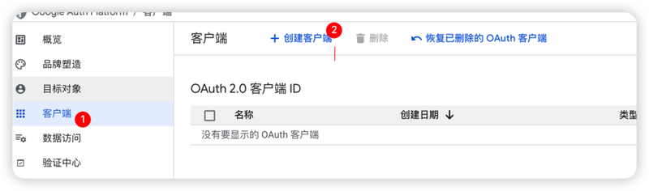
{: .original}

!!! note ""
    （5）复制对应的客户端 ID 以及客户端密钥。

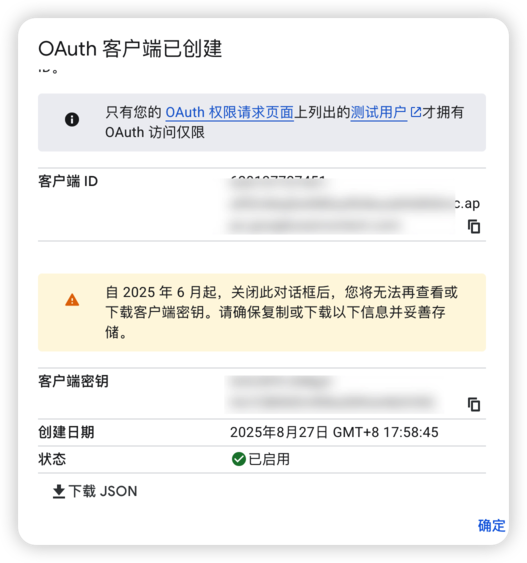
{: .original}

!!! note ""
    （6）发布应用

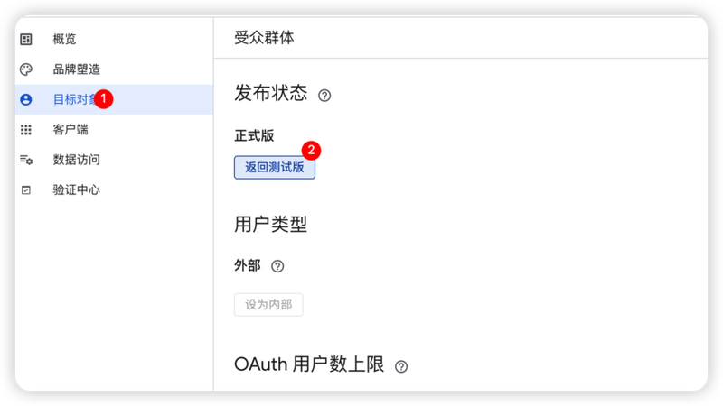
{: .original}

!!! note ""
    （7）启用 google drive API 

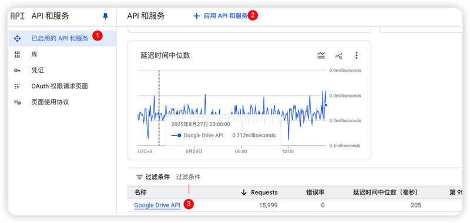
{: .original}

!!! note ""
    （8）点击授权码的获取按钮，登录谷歌账号，跳转至 1Panel 应用，完成登陆。 

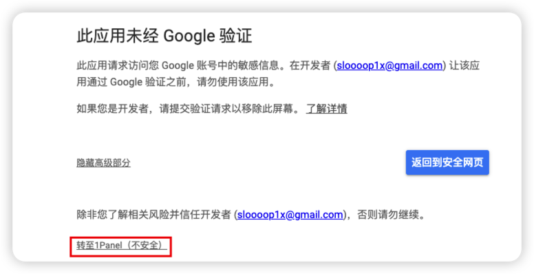
{: .original}

!!! note ""
    （9）完成授权后继续跳转，在浏览器地址中复制授权码（注意！这里只需要复制 code 的值），粘贴复制的授权码到授权码输入框中，修改备份目录后点击确认即可


{: .original}


### 4.6 WebDAV 连接 AList

!!! note ""

    （1）从应用商店安装好 AList 后（记得打开端口外部访问），在容器日志中查看初始化密码，跳转到 AList 管理界面。 

    （2）存储 菜单中添加对应的存储，记住该路径。

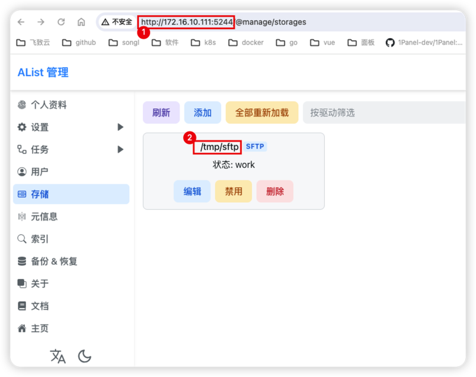
{: .original}

!!! note ""
    （3）1Panel 备份账号中，添加 WebDAV 类型的备份账号。地址参数填写 `${2步骤中的地址}/dav`，备份目录参数填写 `/${2步骤中的存储路径}/xxx`，如此处可以使用 `/tmp/sftp/1panel`，完成绑定。

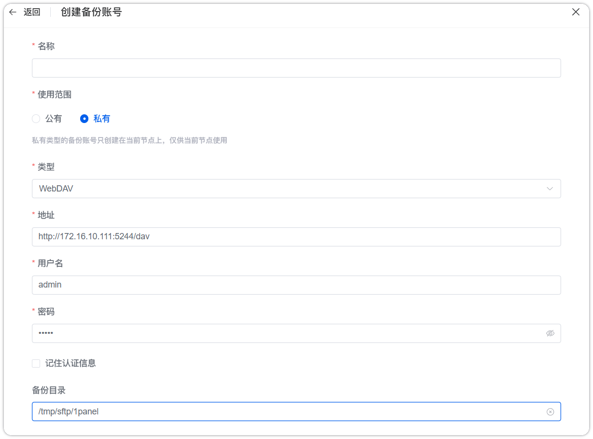
{: .original}

### 4.7 部分对象存储服务商与亚马逊 S3 云存储的兼容性

|服务商|文档|兼容访问风格|兼容性|
| ----- | ---- | ----- | ----- |
|阿里云|https://help.aliyun.com/document_detail/410748.html|Virtual Hosted Style|✅|
|腾讯云|[https://cloud.tencent.com/document/product/436/41284](https://cloud.tencent.com/document/product/436/41284)|Virtual Hosted Style / <br>Path Style|✅|
|七牛云|https://developer.qiniu.com/kodo/4088/s3-access-domainname|Virtual Hosted Style / <br>Path Style|✅|
|百度云|https://cloud.baidu.com/doc/BOS/s/Fjwvyq9xo|Virtual Hosted Style / <br>Path Style|✅|
|京东云| https://docs.jdcloud.com/cn/object-storage-service/api/regions-and-endpoints |Virtual Hosted Style|✅|
|金山云|https://docs.ksyun.com/documents/6761|Virtual Hosted Style|✅|
|青云|https://docsv3.qingcloud.com/storage/object-storage/s3/intro/|Virtual Hosted Style / <br>Path Style|✅|
|网易数帆|[https://sf.163.com/help/documents/89796157866430464](https://sf.163.com/help/documents/89796157866430464)|Virtual Hosted Style|✅|
|Cloudflare|Cloudflare S3 兼容性API<br>[https://developers.cloudflare.com/r2/data-access/s3-api/](https://developers.cloudflare.com/r2/data-access/s3-api/)|Virtual Hosted Style / <br>Path Style|✅|
| Oracle Cloud |[https://docs.oracle.com/en-us/iaas/Content/Object/Tasks/s3compatibleapi.htm](https://docs.oracle.com/en-us/iaas/Content/Object/Tasks/s3compatibleapi.htm)|Virtual Hosted Style / <br>Path Style|✅|
|自建minio|\-|Path Style|✅|
|又拍云|[https://help.upyun.com/knowledge-base/aws-s3%E5%85%BC%E5%AE%B9/](https://help.upyun.com/knowledge-base/aws-s3%E5%85%BC%E5%AE%B9/)|Virtual Hosted Style / <br>Path Style|✅|
|华为云|未明确保证兼容性，实际支持情况以服务商说明为准|Virtual Hosted Style|❓|
|Ucloud|只支持 8MB 大小的分片，本插件暂不支持<br>[https://docs.ucloud.cn/ufile/s3/s3\_introduction](https://docs.ucloud.cn/ufile/s3/s3_introduction)|\-|❌|


## 5 快照

!!! note ""
    快照用于全量备份 1Panel 所产生的数据，具体包括：
    
    - Docker 配置文件，路径为 /etc/docker/daemon.json
    - 应用商店应用，可在【应用商店 - 已安装】中查看
    - 本地备份数据，可在【面板设置 - 备份账号】中查看
    - 1Panel 产生的数据，将压缩整个 [安装目录]/1panel 目录，包括数据库文件
    - 1panel 二进制文件，路径为 /usr/local/bin/1panel
    - 1pctl 命令行工具，路径为 /usr/local/bin/1pctl
    - 1panel.service 路径为 /etc/systemd/system/1panel.service


{: .original}

!!! note ""

    - 创建和同步快照只支持选择第三方账号 
    - 快照恢复过程中，将对恢复前数据进行备份，默认的备份路径为 [安装目录]/original_[快照名] 
    - 快照恢复失败后，可根据 **日志审计 -> 系统日志** 排查失败原因后重试，或者回滚到恢复之前的版本
    - 如果上述操作都不能使服务正常运行，则需要手动拿到恢复前的备份文件，手动替换当前系统数据，然后重启系统 
    - 如机器迁移等，需要将快照放到备份账号对应的指定目录下，如服务器磁盘：/opt/1panel/backup/system_snapshot/  

## 6 许可证

!!! note ""
    用于查看、导入和管理当前许可证。导入专业版或企业版许可证后，系统会按许可证类型、有效期和节点授权范围开放相应功能。

    多节点环境中，应确认许可证绑定的节点和当前所选节点一致。许可证到期、解绑或节点信息不匹配时，商业功能可能不可用，但不会自动把专业版或企业版能力视为社区版默认功能。

    版本能力以 [1Panel 官网](https://1panel.cn/)及当前许可证页面显示为准。


{: .browser-mockup}

## 7 关于

!!! note ""

    - 支持检查 1Panel 服务是否存在新版本，更新将替换 1panel 二进制文件、1pctl 命令行工具以及 1panel.service 文件 
    - 更新失败时，将回滚所有更新内容到更新前的状态。如更新后版本信息没有变化，可在 **日志审计 -> 系统日志** 中查看失败原因，解决后重新执行更新


{: .original}
