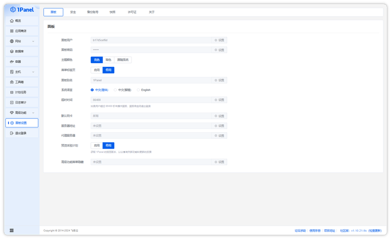
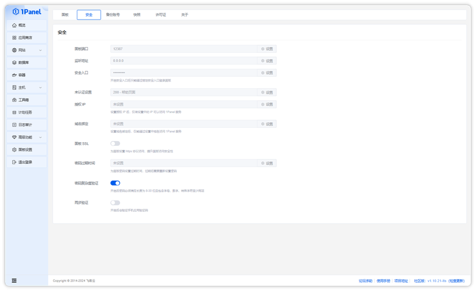
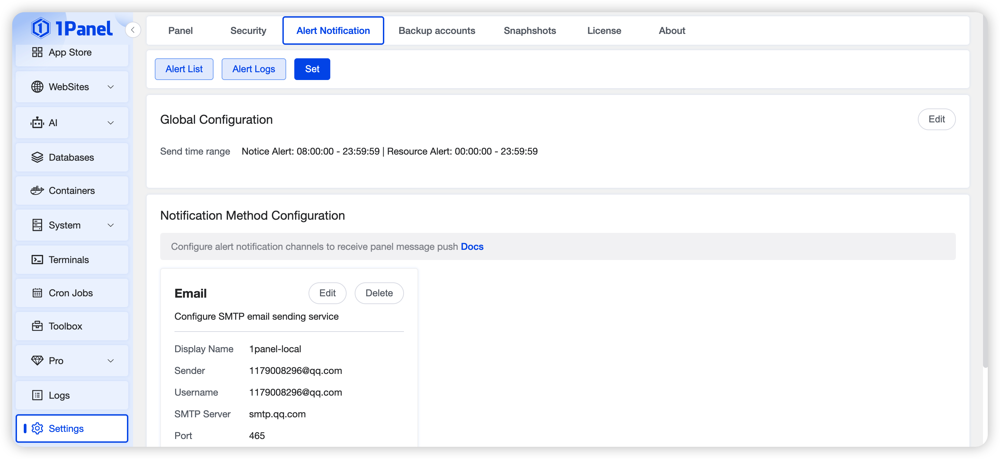
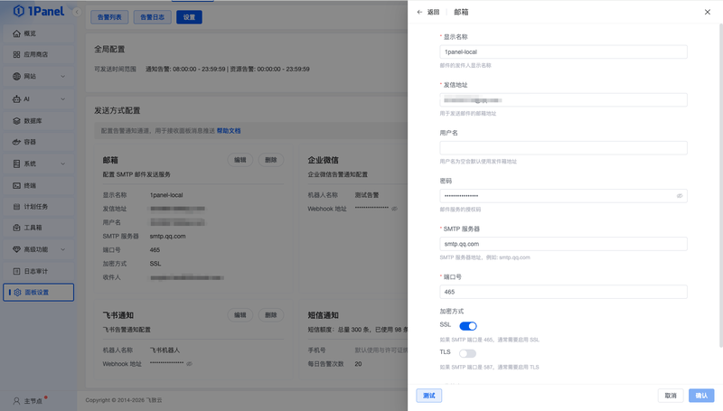
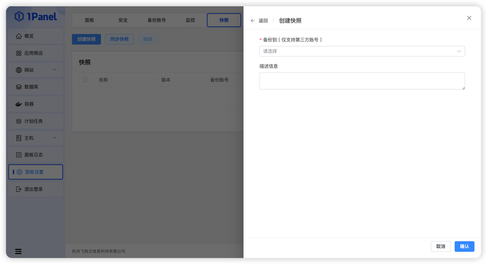
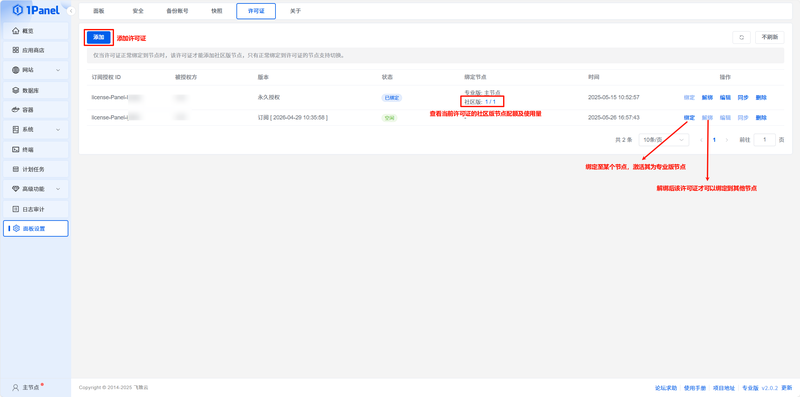
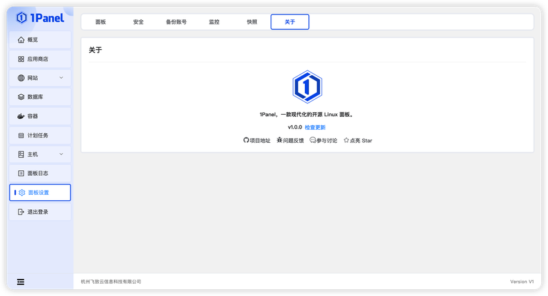

# 1Panel Settings – Full English Translation
## 1 Panel
!!! note ""
    Basic settings for the panel, including:

    - **Panel User**: 1Panel supports one user per host. Used for login, initialized on first access.
    - **Panel Password**: Password for logging into 1Panel.
    - **Theme**: Light / Dark / Follow system.
    - **Menu Tabs**: Show recently visited menus in tabs at the top.
    - **Panel Alias**: Custom panel name.
    - **Language**: Chinese / English.
    - **Session Timeout**: Auto-logout after inactivity (minimum 300 seconds).
    - **Server Address**: Used to quickly open app pages from the App Store.
    - **Proxy Server (✨ Pro)**: Route network requests through a proxy for offline environments.
    - **Preview Program**: Enable to receive beta versions.
    - **Hide Advanced Menu**: Toggle advanced features in the sidebar.


{: .browser-mockup}

## 2 Security
!!! note "Configuration"
    Security settings for high‑security environments:

    - **Panel Port**: Change the 1Panel service port.
      Check usage first: `netstat -tunlp | grep [port]`
    - **Listen Address**: Restrict which IP the panel listens on.
    - **Security Entrance**: Only allow login via a custom path.
    - **Unauthorized Response**: Content returned when accessing without the security entrance.
    - **Allowed IPs**: Only listed IPs can access the panel.
    - **Domain Binding**: Only allow access via bound domains.
    - **Panel SSL**: Enforce HTTPS.
    - **Password Expiration**: Force password change after days.
    - **Password Complexity**: Require 8+ chars with letters, digits, and symbols.
    - **Two‑Factor Auth (MFA)**: Enable TOTP login.
    - **Passkey**: Hardware‑based passwordless login (requires SSL + trusted domain).


{: .browser-mockup}

!!! warning "Note"
    Incorrect changes may block panel access.
    Use SSH and the `1pctl` commands to reset:

    ```text
    root@hostname:/# 1pctl reset --help
    Reset system settings

    Usage:
    1panel reset [command]

    Available Commands:
    domain      Remove domain binding
    entrance    Remove security entrance
    https       Disable HTTPS
    ips         Clear allowed IPs
    mfa         Disable two-factor auth

    Flags:
    -h, --help   help for reset
    ```

    ```text
    root@hostname:/# 1pctl update
    Update panel settings

    Usage:
    1panel update [command]

    Available Commands:
    password    Change panel password
    port        Change panel port
    username    Change panel username

    Flags:
    -h, --help   help for update
    ```

## 3 Panel Alerts
!!! note "Overview"
    Send notifications for anomalies via:
    **Email, WeCom, DingTalk, Feishu, SMS**.

    - Email: Free & Pro
    - WeCom / DingTalk / Feishu / SMS: **Pro only**

    Triggers: resource usage, website/app issues, backup failures, login anomalies.

### 3.1 General Settings
!!! note ""
    1. Log in as admin
    2. Go to **Panel Settings → Panel Alerts**
    3. Configure:
        - Enable/disable alerts
        - Channels
        - Default recipients
        - Alert severity
        - Modules (host, website, database, container, cron etc.)


{: .browser-mockup}

### 3.2 Email Alerts
!!! note "1Panel Email Setup"
    1. Go to **Panel Settings → Panel Alerts**
    2. Enable **Email**
    3. Fill SMTP info:
        - Server (smtp.qq.com, smtp.163.com)
        - Port (465/587)
        - Sender account
        - Auth code / app password
    4. Set recipient emails (comma‑separated)
    5. Save and send test email


{: .browser-mockup}

### 3.3 Troubleshooting
!!! note ""
    - Verify channel configuration
    - Check **Panel Logs → System Logs**
    - Confirm Pro edition for enterprise channels
    - Whitelist 1Panel server IP in WeCom/DingTalk/Feishu
    - If using proxy, whitelist proxy egress IP

## 4 Backup Accounts
### 4.1 Supported Storage
!!! note ""
    Local disk and third‑party storage:

    - Alibaba Cloud OSS
    - Tencent Cloud COS
    - AWS S3
    - Microsoft OneDrive
    - Google Drive
    - AliyunDrive
    - MINIO
    - WebDAV
    - SFTP
    - Qiniu Kodo
    - UPYUN

### 4.2 OneDrive Custom Config
!!! note ""
    Requires 4 parameters:
    - client_id
    - client_secret
    - redirect_uri
    - scope

### 4.3 OneDrive Authorization
!!! note ""
    Follow the wizard to obtain and enter the authorization code.

### 4.4 Google Drive Binding
!!! note ""
    Create a project in Google Cloud, enable Drive API, obtain OAuth credentials.

### 4.5 WebDAV to AList
!!! note ""
    Install AList, set storage, then add WebDAV backup account in 1Panel.

### 4.6 S3 Compatibility
!!! note ""
    Many object storage providers are S3‑compatible. See table in original text.

## 5 Snapshots
!!! note ""
    Full backup of 1Panel data, including:

    - Docker daemon.json
    - Installed apps
    - Local backups
    - 1Panel database
    - 1panel binary, 1pctl, systemd service


{: .browser-mockup}

## 6 License
!!! note ""
    View license status and import Pro licenses.
    Each Pro license can activate:
    - 1 Pro node
    - Multiple Community nodes


{: .browser-mockup}

## 7 About
!!! note ""
    - Check for updates
    - Auto rollback on update failure
    - View logs for update errors


{: .browser-mockup}
