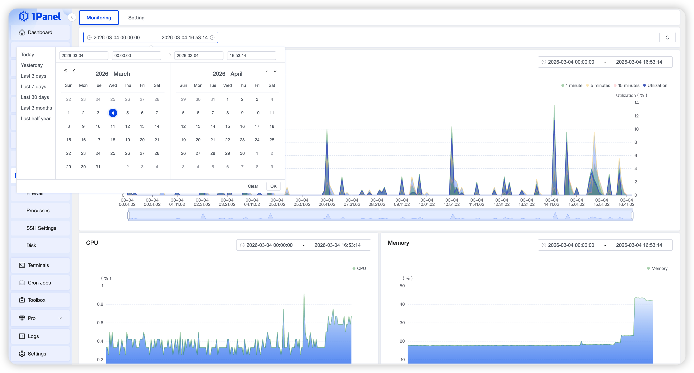

## 1 View Monitoring

!!! note ""
    Go to **Host - Monitoring** to view the server status intuitively, including:
    - Load Average
    - CPU Usage Monitoring
    - Memory Usage Monitoring
    - Disk I/O Monitoring
    - Network I/O Monitoring

    Use the time selector above the charts to adjust the time range of monitoring data.

{: .original}

## 2 Modify Settings

!!! note ""
    On the monitoring settings page, you can:
    - Enable or disable the monitoring function
    - Change the retention period of monitoring data
    - Adjust the monitoring data collection interval
    - Manually clear monitoring records
