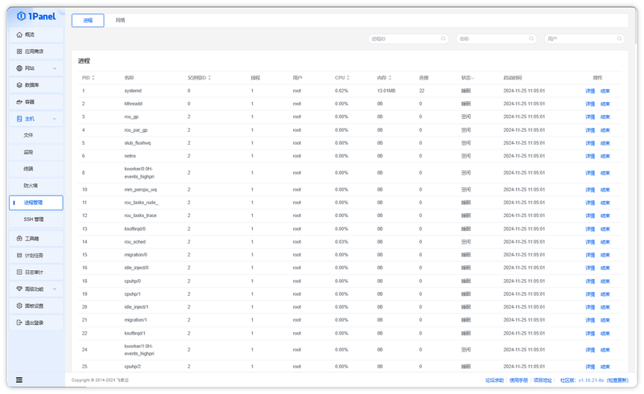
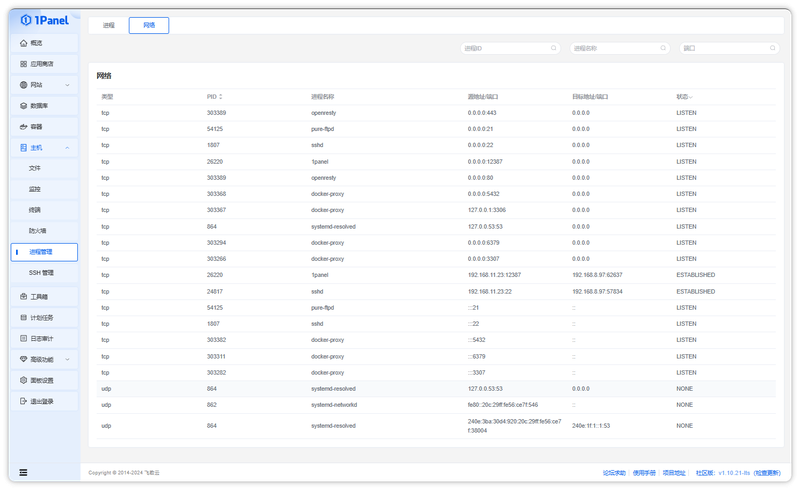

## 1 View Processes

!!! note ""
    Click **Host - Process Management** to enter the process management page.

    - You can view all process information in the system in the list
    - The filter above the list can filter processes by PID, process name, user, etc.
    - The list can be sorted by PID, PPID, CPU usage, memory usage, and filtered by process status
    - Click **Details** in the action column to view more process information, including basic info, memory data, open files, environment variables, and network connections
    - Click **Kill** in the action column to terminate the specified process

{: .browser-mockup}

## 2 View Network Connections

!!! note ""
    Click the **Network** tab at the top of the page to enter the network connection list.

    - You can view all network connections and port usage in the system
    - The filter above the list can filter by PID, process name, and port number
    - The list can be sorted by PID and filtered by connection status

{: .browser-mockup}
