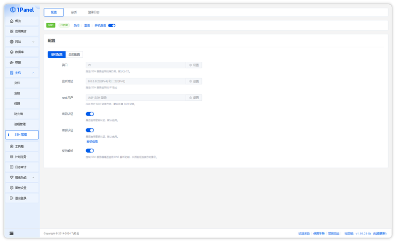
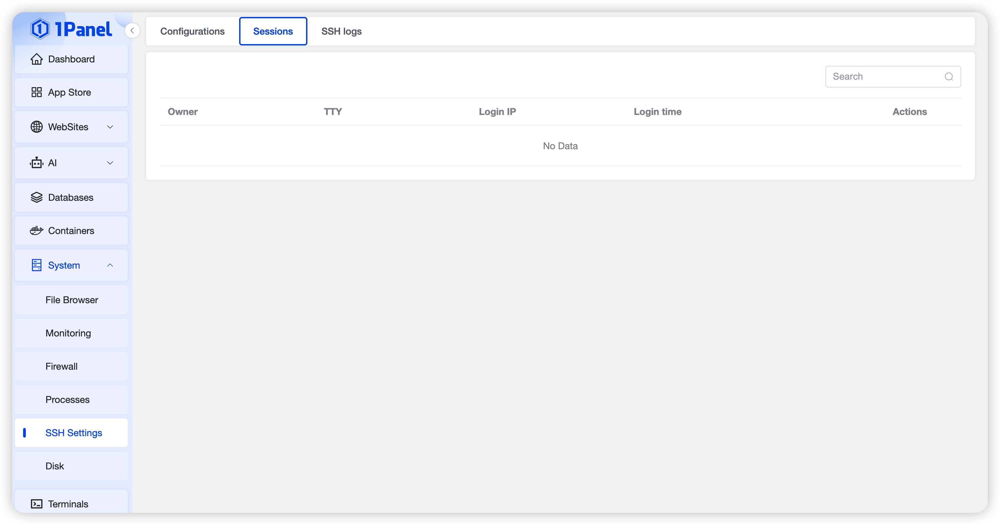
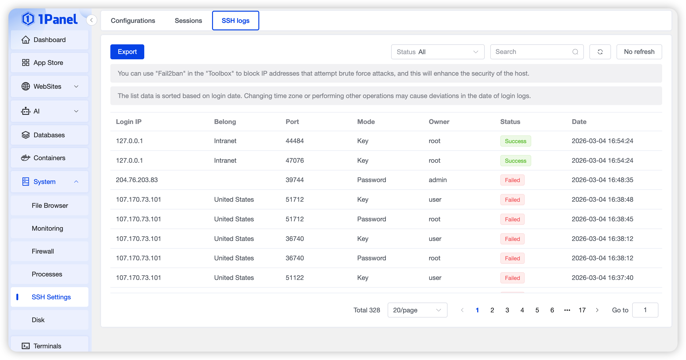

## 1 Configure SSH Service

!!! note ""
    On the SSH management page, you can start, stop, or restart the SSH service, set it to run on boot, and visually configure common settings such as listening port and listening address. You can also edit other configurations via the configuration file.

{: .browser-mockup}

## 2 Manage SSH Sessions

!!! note ""
    Click the **Sessions** tab at the top to view the SSH session list.

    - The list shows all active SSH sessions on the system
    - Click **Disconnect** in the action column to terminate a specific SSH session

{: .browser-mockup}

## 3 View SSH Login Logs

!!! note ""
    Click the **Login Logs** tab at the top to view the SSH login log list.

{: .browser-mockup}
