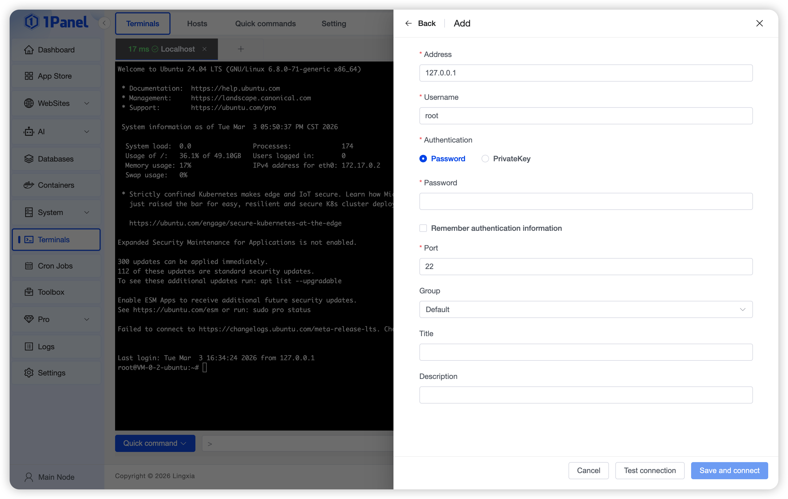
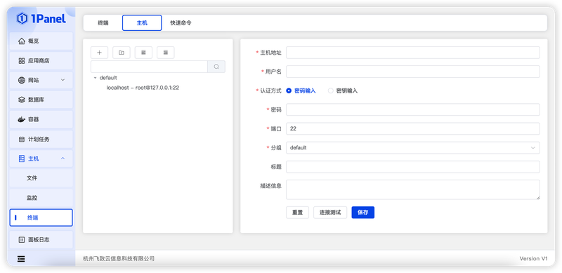

# 终端

!!! note "功能说明"
    终端用于在浏览器中连接本机或远程 Linux 主机，并集中维护连接信息和常用命令。入口为左侧菜单 **终端**，页面包含 **终端**、**主机**、**快速命令** 和 **配置**。

    社区版、专业版和企业版均可使用。普通用户能否查看或操作相应标签页取决于角色权限；节点管理员仅支持连接当前节点的本地终端。

## 1 终端

!!! note ""
    打开页面后，可以连接当前节点的本地服务器、选择已保存的远程主机，或通过 **新建连接** 临时添加主机。终端支持多标签、重新连接、全屏、批量输入和快速命令。

{: .original}

本地终端无法自动连接时，按页面提示填写当前节点的 SSH 用户和认证信息。远程主机支持密码或私钥认证，保存前可执行 **连接测试**。

!!! warning "高权限操作"
    终端命令会直接在目标主机执行。使用批量输入前应再次核对所有已选连接，避免把删除、重启或配置修改命令发送到错误节点。

## 2 主机

!!! note ""
    **主机** 标签页用于维护远程 SSH 连接和主机分组。添加或编辑时配置名称、地址、端口、用户、认证方式、密码或私钥，并先测试连接。

{: .original}

认证信息仅应授予必要权限。删除主机记录不会删除远程服务器数据，也不会停止远程服务器上的服务。

## 3 快速命令

!!! note ""
    快速命令是在终端底部可直接选择的常用命令。可逐条创建，也可按页面提供的 CSV 或批量文本格式导入；批量文本每行使用 `名称---命令` 格式。

快速命令只是命令模板，选择后仍应检查目标主机和命令内容再执行。包含变量、管道或重定向的命令，应先在非生产环境验证。

## 4 配置
!!! note ""
    **配置** 标签页仅管理员可见，主要包括：

    - 终端字体、字号、行高、字距、前景色、背景色、光标和滚动设置；
    - 默认连接信息，以及打开终端时是否自动连接当前节点；
    - 本地连接认证信息；
    - AI 助手设置。

    AI 助手可使用已创建的模型账号，根据“触发前缀 + 空格 + 自然语言”生成并回填命令。Ollama、vLLM 本地模型需要先配置为自定义模型账号。还可配置风险命令拦截列表，命中后阻止生成并以注释形式回填。

!!! warning "AI 生成命令"
    AI 助手只负责生成命令，不代表命令已通过目标环境验证。执行前必须检查命令含义、参数、目标路径和权限范围。
