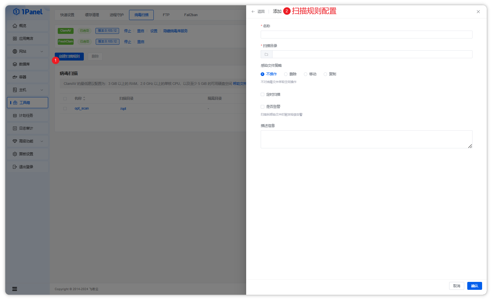

## 1 介绍

!!! note ""
    ClamAV 是一个开源（GPLv2许可）的反病毒工具包，专为邮件网关上的电子邮件扫描而设计。它提供了多种实用工具，包括灵活且可扩展的多线程守护进程、命令行扫描器以及用于自动更新数据库的高级工具。该工具包的核心是一个作为共享库形式提供的反病毒引擎。

## 2 环境要求

!!! note ""
    **ClamAV 的最低建议配置为：**

    * CPU 要求：1 CPU，2.0 Ghz+；
    * 内存要求：3 GiB+；
    * 服务器架构：至少 5GiB 可用磁盘空间。

## 3 安装

=== "RedHat / CentOS"
    !!! note ""
        **1、安装 epel 源**

        ```bash
        yum install -y epel-release
        ```

        **2、安装 ClamAV**
        
        ```bash
        yum install clamav clamd clamav-update -y
        ```

        **3、修改 ClamAV 配置文件**
        
        ```bash
        /etc/clamd.d/scan.conf 取消下面行注释
        LogFile /var/log/clamd.scan
        LogFileMaxSize 2M
        PidFile /run/clamd.scan/clamd.pid
        DatabaseDirectory /var/lib/clamav
        LocalSocket /run/clamd.scan/clamd.sock
        ```

        **4、修改病毒库刷新配置文件**
        
        ```bash
        /etc/freshclam.conf 取消下面行注释
        DatabaseDirectory /var/lib/clamav
        UpdateLogFile  /var/log/freshclam.log
        PidFile  /var/run/freshclam.pid
        DatabaseMirror database.clamav.net
        Checks 12
        ```

        **5、启动 ClamAV 服务**
        
        ```bash
        freshclam
        systemctl start clamd@scan.service
        systemctl start clamav-freshclam.service
        ```
        
        **6、开机自启动**

        ```bash
        systemctl enable clamd@scan.service
        systemctl enable clamav-freshclam.service
        ```
        
        **7、查看 ClamAV 服务状态。**

        ```bash
        systemctl status clamd@scan.service
        systemctl status clamav-freshclam.service
        ```

=== "Ubuntu / Debian"
    !!! note ""
        **1、安装 ClamAV**
        
        ```bash
        sudo apt install clamav clamav-daemon -y
        ```

        **2、启动 ClamAV 服务**
        
        ```bash
        freshclam
        sudo systemctl start clamav-daemon
        sudo systemctl start clamav-freshclam.service
        ```
        
        **4、开机自启动**

        ```bash
        sudo systemctl enable clamav-daemon
        sudo systemctl enable clamav-freshclam.service
        ```
        
        **5、查看 ClamAV 服务状态。**

        ```bash
        sudo systemctl status clamav-daemon
        sudo systemctl status clamav-freshclam.service
        ```

## 4 扫描规则

!!! note "配置说明"

    - 扫描目录：病毒扫描任务扫描的目标目录
    - 感染文件策略：发现感染文件后，需要执行的操作方式，支持不操作、删除文件、移动文件到隔离目录、复制文件到隔离目录
    - 定时扫描（✨专业版）：配置定时任务，定时执行扫描任务
    - 是否告警（✨专业版）：扫描到感染文件后，发送短信告警

!!! note ""

    点击操作列的 `执行` 可以手动执行该条扫描规则，点击 `报告` 即可查看该条扫描规则的执行记录和扫描结果。



## 5 病毒类型说明

|类型|说明|
| ----- | ---- |
|Adware|广告软件，通常在用户不知情的情况下显示广告。|
|Backdoor|后门，允许攻击者远程访问和控制受感染系统的程序或功能。|
|Coinminer|加密货币挖矿程序，用于非法挖掘加密货币的恶意软件。|
|Countermeasure|反对抗措施，指示该签名用于识别防御性安全工具。|
|Downloader|下载器，用于下载和执行其他恶意软件或组件的程序。|
|Dropper|放置器，用于将其他恶意软件注入到受感染系统中的程序。|
|Exploit|漏洞利用程序，利用系统或应用程序中的漏洞进行攻击的恶意软件。|
|File|文件类型，用于描述独立文件的签名。|
|Filetype|文件类型，描述恶意文件的类型。|
|Infostealer|信息窃取程序，用于窃取用户敏感信息的恶意软件。|
|Ircbot|IRC 机器人，用于连接到 IRC（Internet Relay Chat）网络的恶意软件。|
|Joke|恶作剧，不良影响系统但通常不造成实际损害的恶意软件。|
|Keylogger|键盘记录器，用于记录用户输入的恶意软件。|
|Loader|装载器，用于加载和执行其他恶意软件的程序。|
|Macro|宏病毒，针对文档或电子表格中的宏命令进行攻击的恶意软件。|
|Malware|恶意软件，一般术语，指任何有害的计算机程序。|
|Packed/Packer|打包/打包工具，用于压缩和加密恶意软件以逃避检测的程序。|
|Phishing|钓鱼，用于欺骗用户输入个人信息的恶意软件。|
|Proxy|代理，用于通过受感染系统进行网络通信的恶意软件。|
|Ransomware|勒索软件，加密用户文件并勒索解密费用的恶意软件。|
|Revoked|已撤销的，指示签名或证书已被官方撤销的恶意软件。|
|Rootkit|根套件，用于隐藏恶意软件活动和存在的程序。|
|Spyware|间谍软件，用于监视用户活动并发送给攻击者的恶意软件。|

## 6 故障排除

!!! note ""

    - 如果 clamav 服务无法启动，请检查配置信息以及日志;
    - 检查病毒库数据是否正常，在配置文件中会指定 DatabaseDirectory ，即病毒库存放位置，检查是否存在，不存在的话，手动执行一下 freshclam 命令。
    - 如果手动执行 freshclam 也无法正常下载的话，可以从以下地址下载后传到该目录下。
        + https://database.clamav.net/daily.cvd
        + https://database.clamav.net/bytecode.cvd
        + https://database.clamav.net/main.cvd
