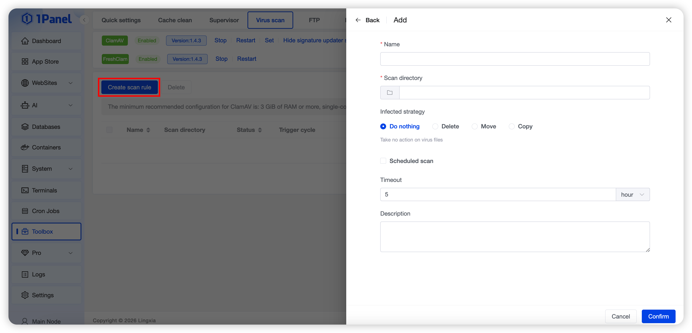

## 1 Introduction

!!! note ""
    ClamAV is an open-source (GPLv2 licensed) anti-virus toolkit designed especially for email scanning on mail gateways. It provides a number of utilities including a flexible and scalable multi-threaded daemon, a command-line scanner, and an advanced tool for automatic database updates. The core of the toolkit is an anti-virus engine available as a shared library.

## 2 Requirements

!!! note ""
    **Minimum recommended configuration for ClamAV:**

    - CPU: 1 CPU, 2.0 GHz+
    - Memory: 3 GiB+
    - Storage: At least 5 GiB available disk space

## 3 Installation

=== "RedHat / CentOS"
    !!! note ""
        **1. Install EPEL repository**

        ```bash
        yum install -y epel-release
        ```

        **2. Install ClamAV**
        
        ```bash
        yum install clamav clamd clamav-update -y
        ```

        **3. Modify ClamAV configuration**
        
        ```bash
        Uncomment these lines in /etc/clamd.d/scan.conf:
        LogFile /var/log/clamd.scan
        LogFileMaxSize 2M
        PidFile /run/clamd.scan/clamd.pid
        DatabaseDirectory /var/lib/clamav
        LocalSocket /run/clamd.scan/clamd.sock
        ```

        **4. Modify virus database update configuration**
        
        ```bash
        Uncomment these lines in /etc/freshclam.conf:
        DatabaseDirectory /var/lib/clamav
        UpdateLogFile  /var/log/freshclam.log
        PidFile  /var/run/freshclam.pid
        DatabaseMirror database.clamav.net
        Checks 12
        ```

        **5. Start ClamAV services**
        
        ```bash
        freshclam
        systemctl start clamd@scan.service
        systemctl start clamav-freshclam.service
        ```
        
        **6. Enable on boot**

        ```bash
        systemctl enable clamd@scan.service
        systemctl enable clamav-freshclam.service
        ```
        
        **7. Check service status**

        ```bash
        systemctl status clamd@scan.service
        systemctl status clamav-freshclam.service
        ```

=== "Ubuntu / Debian"
    !!! note ""
        **1. Install ClamAV**
        
        ```bash
        sudo apt install clamav clamav-daemon -y
        ```

        **2. Start ClamAV services**
        
        ```bash
        freshclam
        sudo systemctl start clamav-daemon
        sudo systemctl start clamav-freshclam.service
        ```
        
        **3. Enable on boot**

        ```bash
        sudo systemctl enable clamav-daemon
        sudo systemctl enable clamav-freshclam.service
        ```
        
        **4. Check service status**

        ```bash
        sudo systemctl status clamav-daemon
        sudo systemctl status clamav-freshclam.service
        ```

## 4 Scan Rules

!!! note "Configuration"

    - Scan Directory: Target directory for the virus scan task
    - Infected File Action: Action to take when an infected file is found: None, Delete, Move to quarantine, Copy to quarantine
    - Scheduled Scan (✨Pro): Configure a scheduled task to run scans automatically
    - Alert (✨Pro): Send SMS alerts when infected files are detected

!!! note ""
    Click **Run** in the action column to manually execute the scan rule. Click **Report** to view execution history and scan results.


{: .original}

## 5 Virus Type Explanation

| Type          | Description |
| ------------- | ----------- |
| Adware        | Advertising software that displays ads without user consent. |
| Backdoor      | Allows attackers remote access and control of the infected system. |
| Coinminer     | Malware for unauthorized cryptocurrency mining. |
| Countermeasure| Signature for identifying defensive security tools. |
| Downloader    | Downloads and runs other malware or components. |
| Dropper       | Injects other malware into the infected system. |
| Exploit       | Attacks using vulnerabilities in systems or applications. |
| File          | Signature for standalone files. |
| Filetype      | Describes the type of malicious file. |
| Infostealer   | Steals sensitive user information. |
| Ircbot        | Malware connecting to IRC networks. |
| Joke          | Prank software with minor impact. |
| Keylogger     | Records user keystrokes. |
| Loader        | Loads and runs other malware. |
| Macro         | Virus targeting macros in documents or spreadsheets. |
| Malware       | General term for harmful software. |
| Packed/Packer | Compresses and encrypts malware to avoid detection. |
| Phishing      | Tricks users into revealing personal information. |
| Proxy         | Uses the infected system as a network proxy. |
| Ransomware    | Encrypts files and demands ransom for decryption. |
| Revoked       | Indicates a revoked signature or certificate. |
| Rootkit       | Hides malware activity and presence. |
| Spyware       | Monitors user activity and sends data to attackers. |

## 6 Troubleshooting

!!! note ""

    - If ClamAV services fail to start, check configuration and logs.
    - Verify virus database files exist at the `DatabaseDirectory` path in the config. If missing, run `freshclam` manually.
    - If `freshclam` fails to download, you can manually download these files and upload them to the database directory:
        + https://database.clamav.net/daily.cvd
        + https://database.clamav.net/bytecode.cvd
        + https://database.clamav.net/main.cvd
