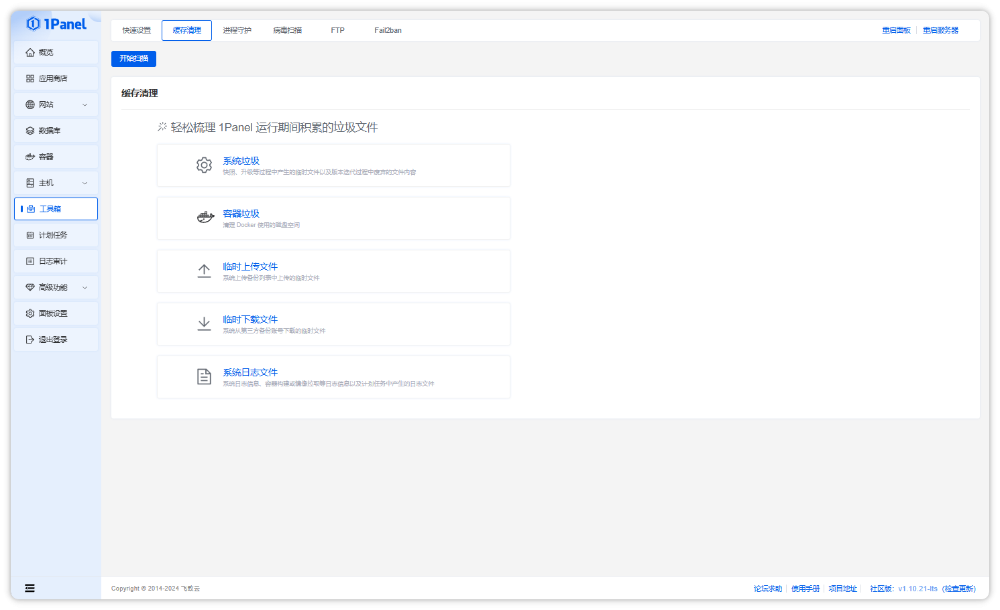

!!! note ""

    在 `缓存清理` 页面，可以扫描并清理 1Panel 运行期间积累的垃圾文件，包括：

    - 系统垃圾
        - 系统快照恢复前备份文件
        - 系统升级备份文件
        - 系统快照临时文件
        - 恢复前备份文件
        - 系统缓存文件
        - 系统废弃目录
    - 容器垃圾
        - 所有违背任何容器使用的镜像
        - 所有处于停止状态的容器
        - 存储卷
        - 构建缓存
    - 临时上传文件
        - 临时长传文件
        - 应用
        - 网站
        - 数据库
        - 文件夹
    - 临时下载文件
        - 应用
        - 网站
        - 数据库
        - 文件夹
    - 系统日志文件
        - 系统日志文件
        - 容器操作日志文件
        - 计划任务执行日志文件

