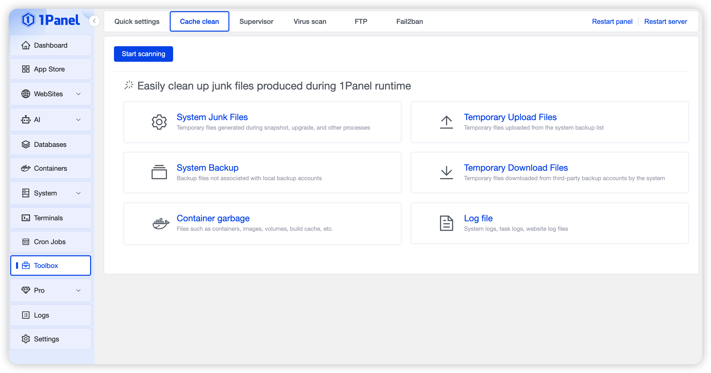

!!! note ""
    On the **Cache Cleanup** page, you can scan and clean up junk files accumulated during 1Panel operation, including:

    - System Junk
        - Backup files before system snapshot restore
        - System upgrade backup files
        - System snapshot temporary files
        - Backup files before restore
        - System cache files
        - Obsolete system directories
    - Container Junk
        - Unused images not associated with any container
        - All stopped containers
        - Volumes
        - Build cache
    - Temporary Upload Files
        - Temporary upload files
        - Apps
        - Websites
        - Databases
        - Folders
    - Temporary Download Files
        - Apps
        - Websites
        - Databases
        - Folders
    - System Log Files
        - System log files
        - Container operation log files
        - Scheduled task execution log files

{: .browser-mockup}
