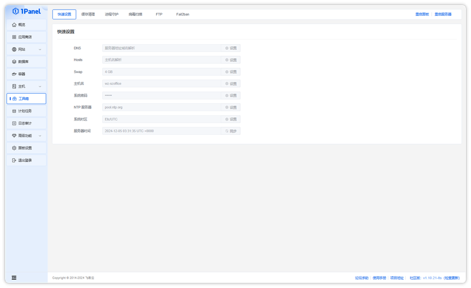

!!! note ""
    On the **Toolbox - Quick Settings** page, you can modify common system settings, including:

    - DNS
    - Hosts
    - Swap
    - Hostname
    - OS user password
    - NTP server
    - System time zone
    - Server time

{: .original}
