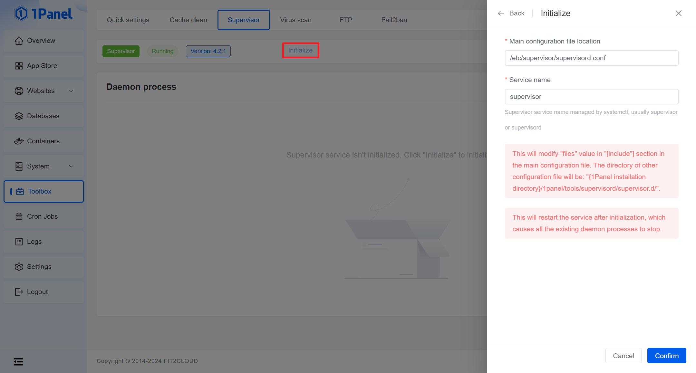
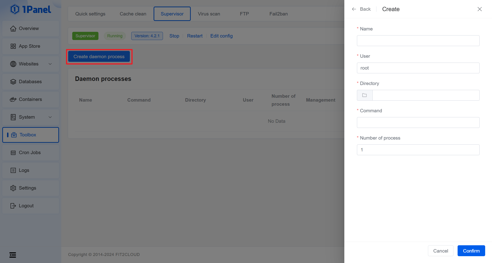
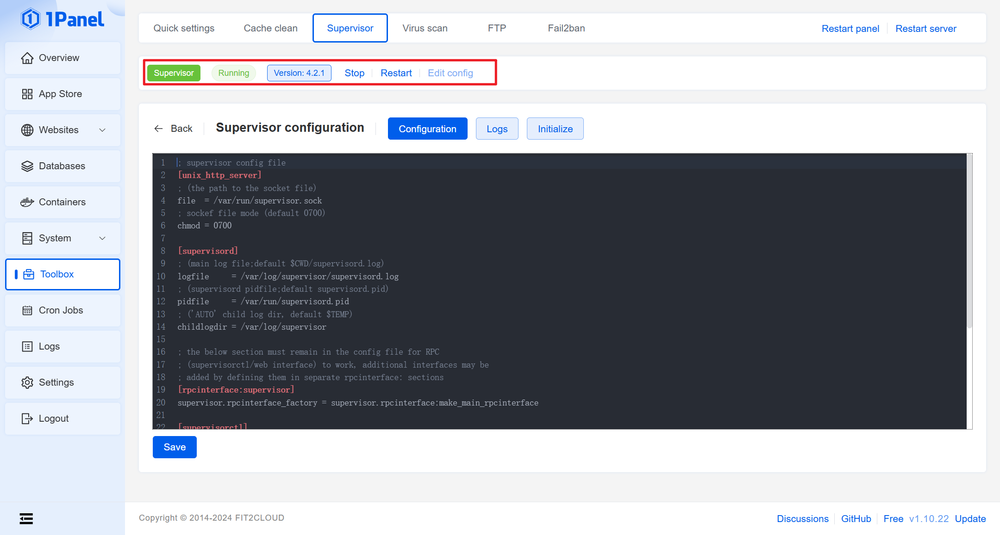

# Supervisor

## Introduction

Supervisor is a client/server system that allows its users to monitor and control a number of processes on UNIX-like operating systems.

## Installing Supervisor

=== "RedHat / CentOS"
    1. Install the EPEL repository
    ```shell
    yum install -y epel-release
    ```
    2. Install supervisor
    ```shell
    yum install -y supervisor
    ```
    3. Start the supervisor service
    ```shell
    systemctl start supervisord
    ```
    4. Enable supervisor to start at boot
    ```shell
    systemctl enable supervisord
    ```
    5. Check the status of the supervisor service
    ```shell
    systemctl status supervisord
    ```

=== "Ubuntu / Debian"
    1. Install supervisor
    ```shell
    sudo apt-get install supervisor
    ```
    
        !!! tips "Tips"
            After successful installation, supervisor will start automatically.

## Initializing Supervisor

After installing Supervisor, the first use on 1Panel requires initializing supervisor, setting the configuration file location and service name.



!!! tips "Tips"
    If the service name or configuration file changes later, you can reinitialize it on the settings page.

## Creating a daemon process

By clicking the "Create daemon process" button at the top of the list, filling in the corresponding parameters, and clicking "Confirm", you can create a daemon process.



## Supervisor operations

The toolbar above the daemon process list is used to view and configure Supervisor service.


