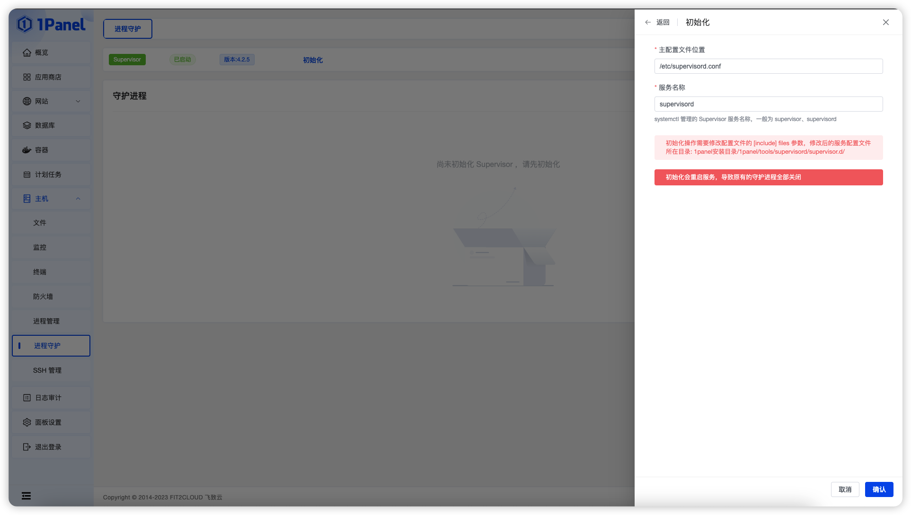
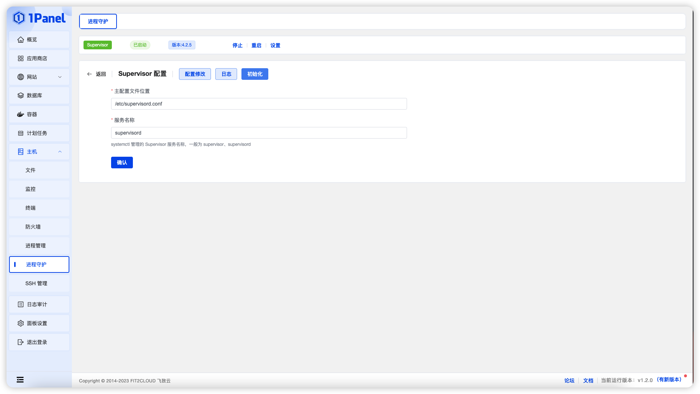
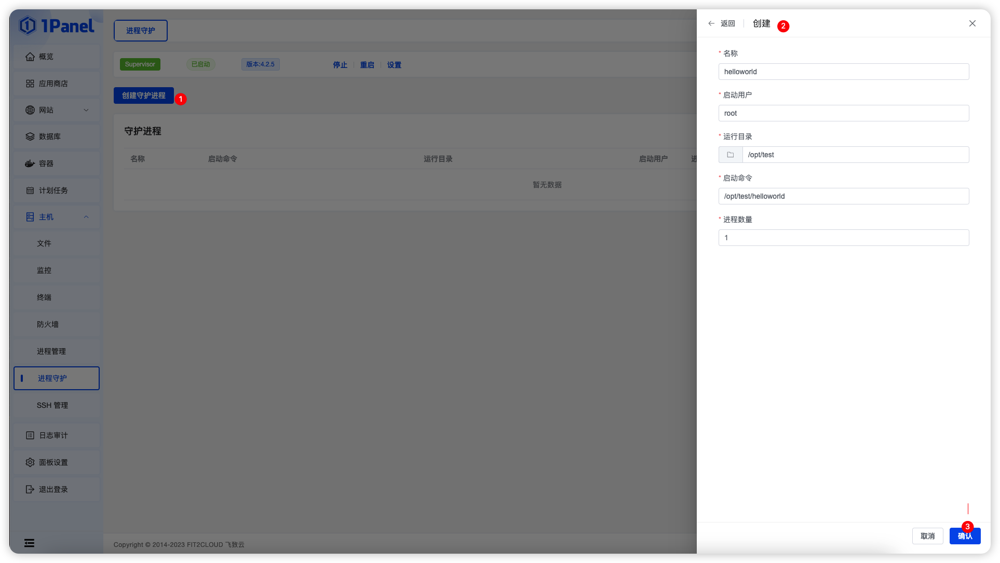
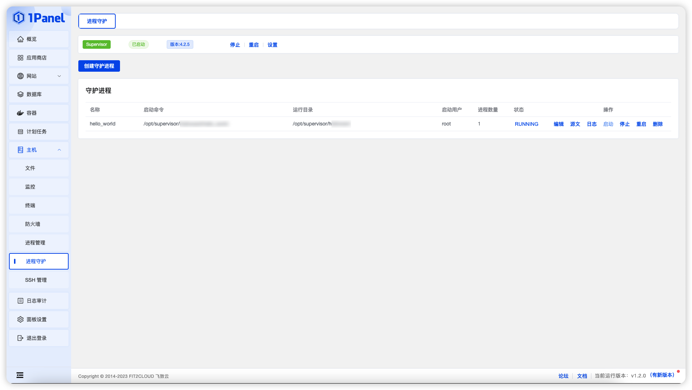
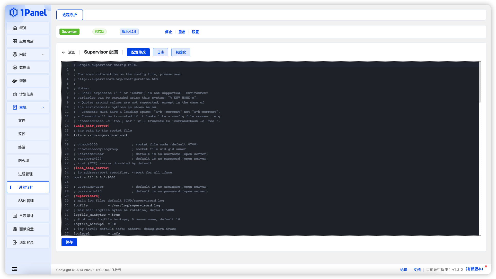

## 1 安装

=== "RedHat / CentOS"
    !!! Abstract ""
        **1、安装 epel 源**

        ```shell
        yum install -y epel-release
        ```

        **2、安装 supervisor**
        
        ```shell
        yum install -y supervisor
        ```

        **3、启动 supervisord 服务**
        
        ```shell
        systemctl start supervisord
        ```
        
        **4、开机自启动**

        ```shell
        systemctl enable supervisord
        ```
        
        **5、查看 supervisord 服务状态。**

        ```shell
        systemctl status supervisord
        ```

=== "Ubuntu / Debian"
    !!! Abstract ""
        **安装 supervisor**
        
        ```shell
        sudo apt-get install supervisor
        ```

        > 安装成功后，supervisor 会默认启动。

## 2、初始化

!!! Abstract ""
    
    首次使用需要先初始化 supervisor，导入配置文件位置和服务名称

{ width="900px" }

!!! Abstract ""

    后期服务名称和配置文件有变动，可以在设置页面进行重新初始化


{ width="900px" }


## 3、创建

!!! Abstract ""
    
    点击创建守护进程按钮，填写相应参数，点击确认

{ width="900px" }


## 4、守护进程管理

!!! Abstract ""

    列表页面可以操作守护进程，包括启动、停止、重启、查看日志、编辑、删除、修改源文等

{ width="900px" }


## 4、Supervisor 管理

!!! Abstract ""

    Supervisor 状态栏可以重启 停止 Supervisor 服务，查看日志，修改配置文件等

{ width="900px" }
