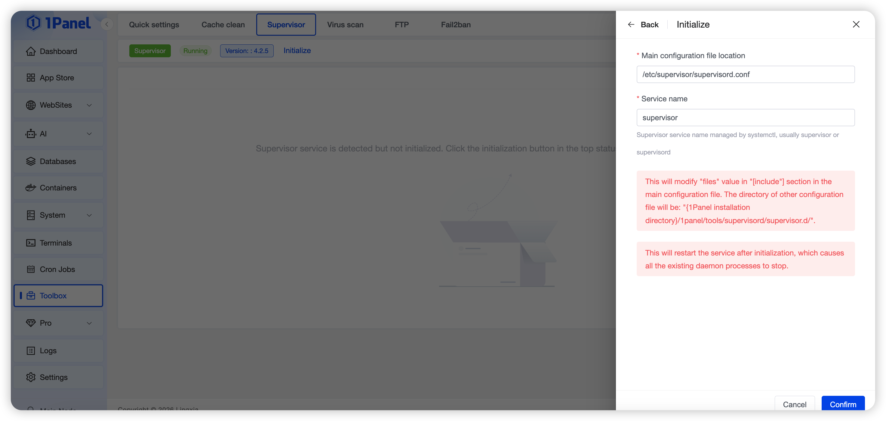
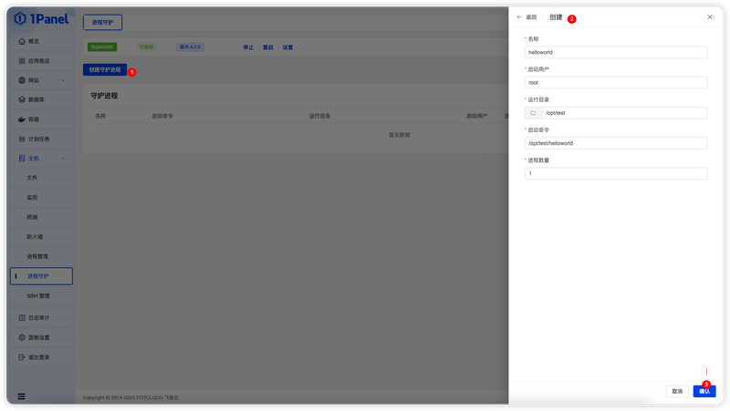
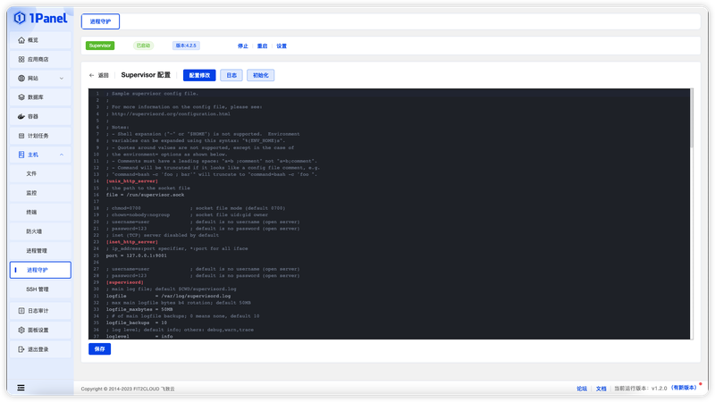

## 1 Installation

=== "RedHat / CentOS"
    !!! note ""
        **1. Install EPEL repository**

        ```bash
        yum install -y epel-release
        ```
    !!! note ""
        **2. Install supervisor**
        
        ```bash
        yum install -y supervisor
        ```
    !!! note ""
        **3. Start supervisord**
        
        ```bash
        systemctl start supervisord
        ```
    !!! note ""        
        **4. Enable on boot**

        ```bash
        systemctl enable supervisord
        ```
    !!! note ""        
        **5. Check status**

        ```bash
        systemctl status supervisord
        ```

=== "Ubuntu / Debian"
    !!! note ""
        **Install supervisor**
        
        ```bash
        sudo apt-get install supervisor
        ```

        > Supervisor starts automatically after installation.

## 2 Initialization

!!! note ""
    Initialization is required on first use to set the configuration path and service name.

{ width="900px" }
{: .browser-mockup}

!!! note ""
    If the service name or configuration changes later, you can reinitialize on the settings page.


## 3 Create Process

!!! note ""
    Click **Create Daemon**, fill in the parameters, and confirm.

{ width="900px" }
{: .browser-mockup}

## 4 Daemon Management

!!! note ""
    You can manage daemons on the list page: start, stop, restart, view logs, edit, delete, modify source files, etc.


## 5 Supervisor Management

!!! note ""
    On the Supervisor status bar, you can restart/stop the Supervisor service, view logs, edit configuration, etc.

{ width="900px" }
{: .browser-mockup}
