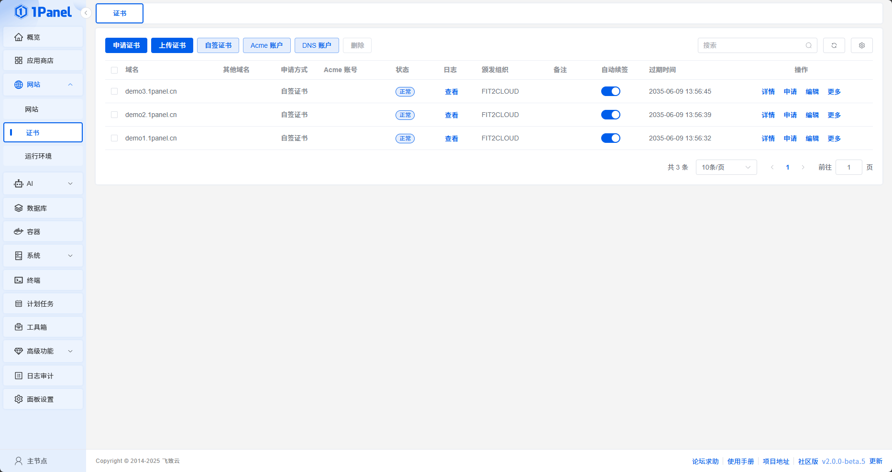

# 证书概述

!!! note "功能说明"
    证书页面用于申请、上传、续签、下载和删除 SSL 证书，并管理 ACME 账户、DNS 账户和自签证书颁发机构。社区版、专业版和企业版均可使用；企业版用户需要证书查看或管理权限。

    列表展示主域名、其他域名、申请方式、ACME 账户、到期时间、状态和自动续签状态，并提供详情、申请/续签、更新、编辑、同步、下载和删除等操作。实际按钮取决于证书来源和当前状态。

{: .browser-mockup}

## 相关操作

- [申请证书](./certificate_create.md)
- [上传证书](./certificate_upload.md)
- [自签证书](./certificate_self_sign.md)
- [续签证书](./certificate_renew.md)
- [ACME 账户](./certificate_acme.md)
- [DNS 账户](./certificate_dns.md)

!!! warning "删除和下载"
    删除证书前应确认没有网站仍在使用。下载包中可能包含私钥，应通过安全渠道保存和传输。
