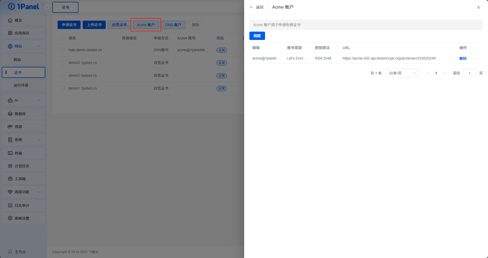

# ACME 账户

!!! note ""

    点击证书列表上方的 **ACME 账户**，可创建或删除 ACME 账户。
    
    目前支持的账户类型有 Let's Encrypt 、 ZeroSSL 、 Buypass、Google Cloud 及自定义的 ACME 服务。
    
    创建 ACME 账户时填写的邮箱可以用于接收证书相关通知。自定义 ACME 服务还需要按页面填写目录地址等信息。

{: .browser-mockup}
