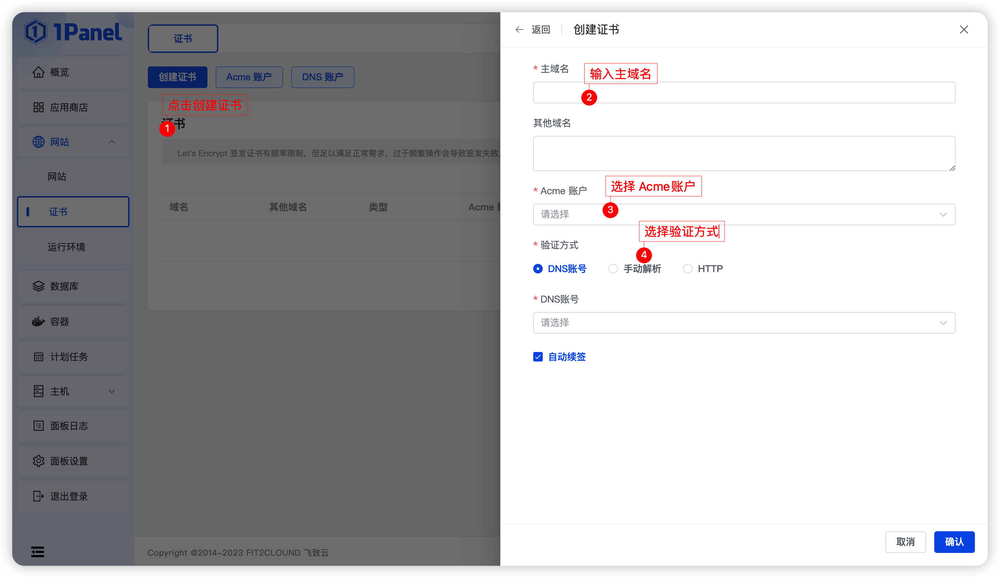

### 1.1 前置条件

!!! Abstract ""

    - 已经创建 Acme 账户
    - 如果是 DNS 验证模式，需要提前准备DNS账号

### 1.2 DNS 账号模式申请证书

!!! Abstract ""

    1. 选择 ACME 账号
    2. 选择 DNS 账号
    3. 选择是否自动续签
    4. 点击确认

### 1.3 手动解析模式申请证书

!!! Abstract ""

    1. 选择 ACME 账号
    3. 点击确认
    4. 等待返回解析内容，然后在 DNS 供应商解析处添加解析内容
    5. 点击确认

### 1.4 HTTP 模式申请证书

!!! Abstract ""

    1. 选择 ACME 账号
    2. 选择是否自动续签
    3. 点击确认
