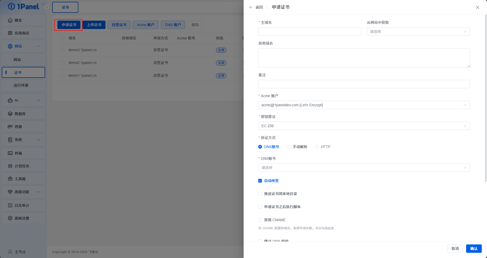

## 1 Prerequisites

!!! note ""
    - An ACME account has been created
    - For DNS validation mode, prepare a DNS account in advance

{: .browser-mockup}

## 2 Apply for Certificate via DNS Account Mode

!!! note ""
    1. Select an ACME account
    2. Select a DNS account
    3. Choose whether to enable auto-renewal
    4. Click Confirm

## 3 Apply for Certificate via Manual DNS Validation Mode

!!! note ""
    1. Select an ACME account
    2. Click Confirm
    3. Wait for the validation records to be generated, then add them at your DNS provider
    4. Click Confirm

## 4 Apply for Certificate via HTTP Mode

!!! note ""
    1. Select an ACME account
    2. Choose whether to enable auto-renewal
    3. Click Confirm
