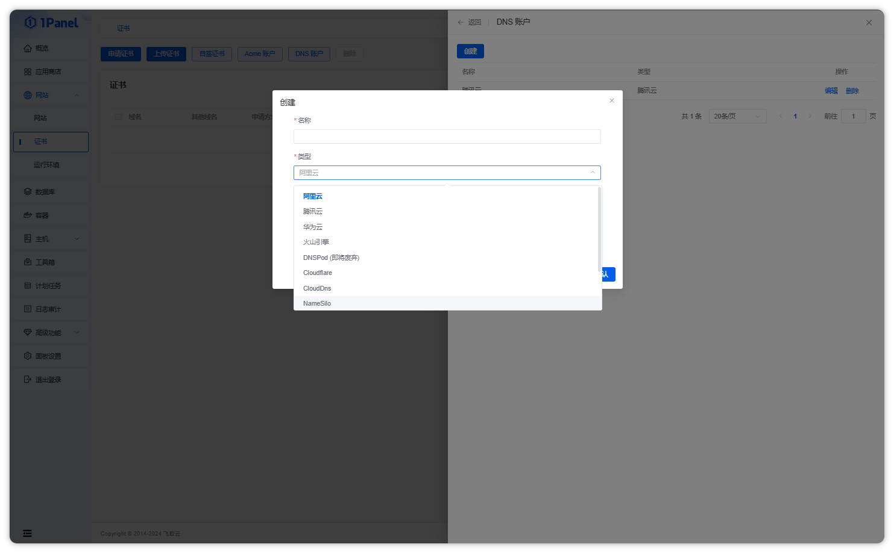

## 1 DNS 账户管理

!!! note ""

    点击证书列表上方的【DNS 账户】按钮，弹出 DNS 账户管理页面。在该页面中可以创建、编辑或删除 DNS 账户。DNS 账户用于调用对应 DNS 服务商 API，自动添加 DNS 解析记录验证域名所有权。
    
    目前支持的账户类型有：
    
    - 阿里云
    - 腾讯云
    - 华为云
    - 火山引擎
    - DNSPod（即将废弃）
    - Cloudflare
    - CloudDNS
    - NameSilo
    - NameCheap
    - Name.com
    - GoDaddy

!!! note "说明"

    关于不同类型 DNS 账户需要的认证信息如何获取，请查阅对应服务商的 API 文档获取支持。
