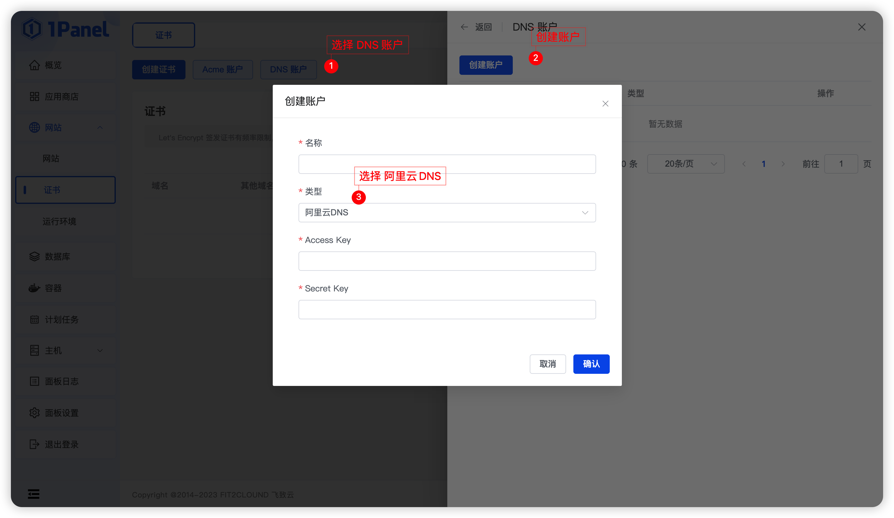
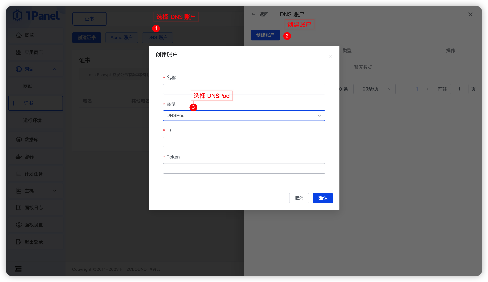
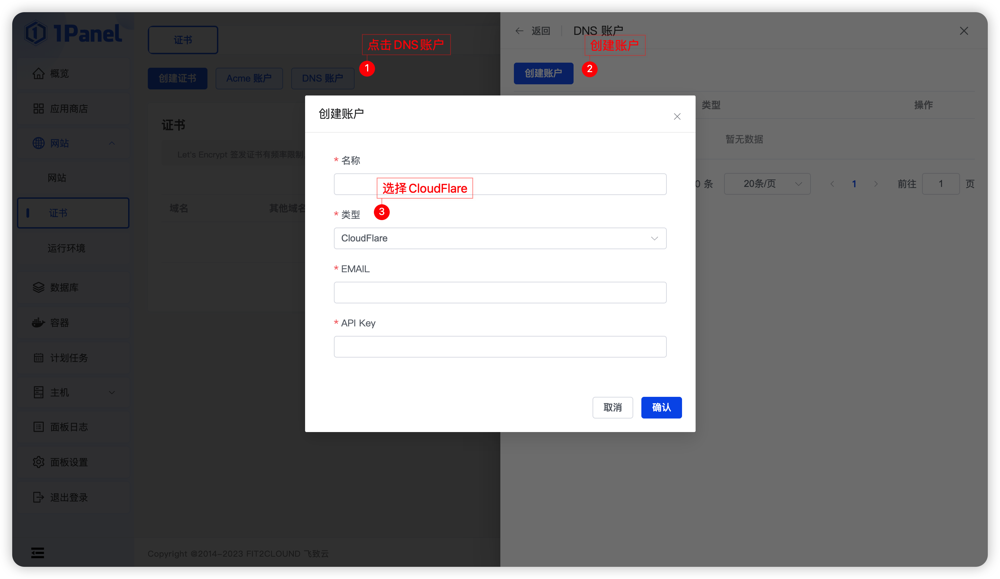

## 1 DNS 账户管理

!!! Abstract ""

    支持 阿里云 DNS 、 DNSPod 、 CloudFlare 等类型的账户。

### 1.1 阿里云 DNS

!!! Abstract ""

    **需要填写以下参数:**

    - Access Key
    - Secret Key

### 1.2 DNSPod

!!! Abstract ""

    **需要填写以下参数:**

    - ID
    - Token

### 1.3 CloudFlare

!!! Abstract ""

    **需要填写以下参数:**

    - EMAIL
    - API Key

