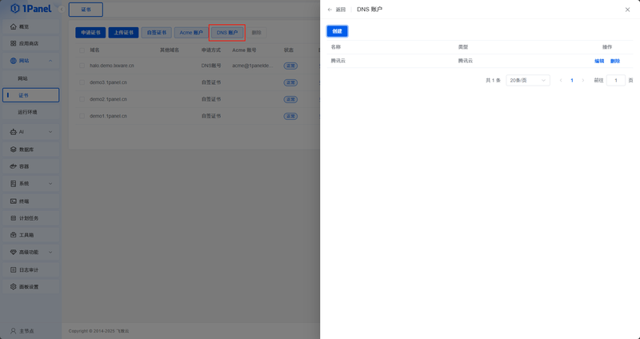

!!! note ""
    Click the **DNS Account** button above the certificate list to open the DNS account management page. You can create, edit, or delete DNS accounts here.
    DNS accounts are used to call the corresponding DNS provider’s API and automatically add DNS records for domain ownership validation.

    Currently supported providers:

    - Alibaba Cloud
    - Tencent Cloud
    - Huawei Cloud
    - GoDaddy
    - Cloudflare
    - Vercel
    - CloudDNS
    - NameSilo
    - NameCheap
    - Name.com
    - FreeMyIP
    - Rain cloud
    - West Digital
    - ClouDNS
    - Spaceship
    - Volcano Engine
    - DNSPod（About to be phased out）

!!! note "Note"
    For how to obtain the required authentication information for different DNS account types, please refer to the API documentation of the corresponding provider.
