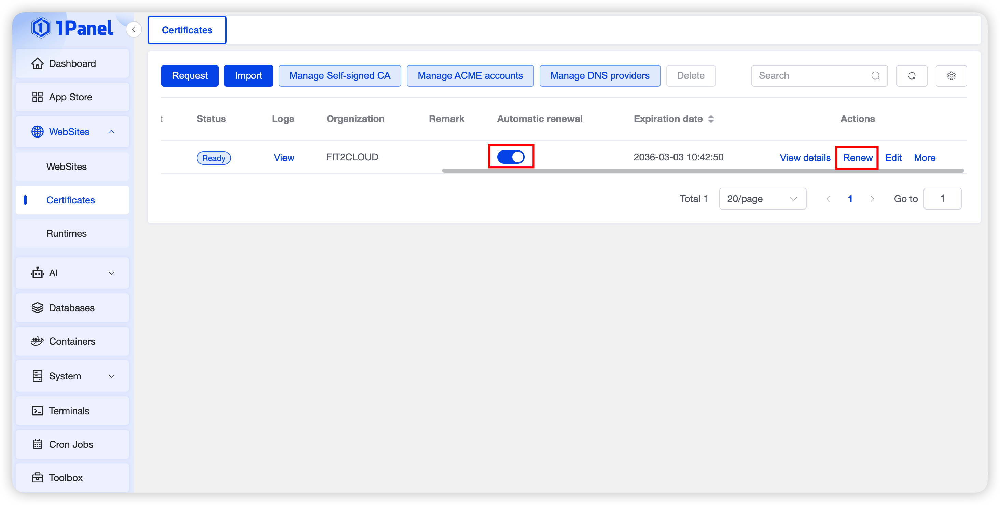

# 续签证书
!!! note ""
    通过 DNS 账户或 HTTP 验证申请的证书可以启用自动续签；使用手动 DNS 验证或手动上传的证书不能按同样方式自动续签。是否支持自动续签以证书列表开关状态为准。

## 自动续签
!!! note ""
    启用 **自动续签** 后，1Panel 会在证书临近到期时发起续签。续签依赖 ACME 账户、DNS 账户或 HTTP 验证路径持续可用；域名解析、API 凭证、网络或网站配置变化都可能导致失败。

## 手动续签
!!! note ""
    点击证书所在行的 **申请** 可手动触发续签。手动 DNS 类型会显示需要添加的解析记录，完成解析后再继续申请。任务状态和错误信息可在证书日志或任务日志中查看。

{: .browser-mockup}

!!! note "续签后的网站证书"
    续签成功后，应确认使用该证书的网站已经加载新证书，并从客户端检查到期时间。业务侧存在 CDN、负载均衡或外部代理时，还需同步更新对应入口。
