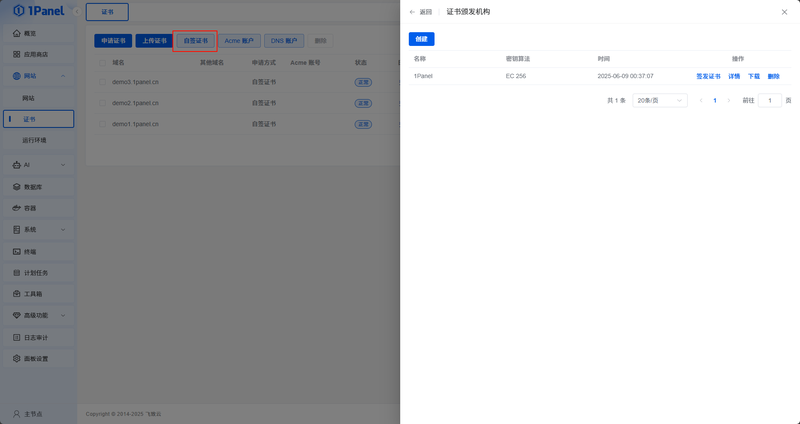
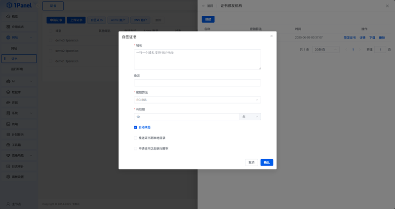

## 1 Certificate Authority

!!! note ""
    Click the **Self-signed Certificate** button above the certificate list to open the self-signed certificate management page.
    Here you can create and manage certificate authorities used for issuing self-signed certificates.

    1Panel creates a default certificate authority named **1Panel**. You can use it to quickly create self-signed certificates if you have no special requirements.

{: .browser-mockup}

## 2 Issue Certificate

!!! note ""
    In the certificate authority list, click the **Issue Certificate** button to open the issuance page.
    You can create self-signed certificates here.

{: .browser-mockup}
