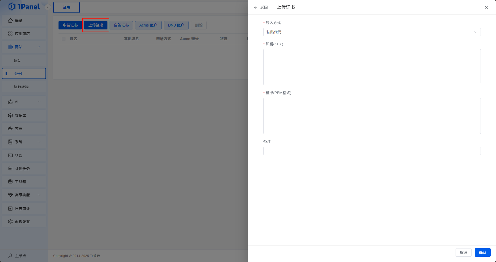

# 上传证书

!!! note ""

    点击证书列表上方的【上传证书】按钮，用户可以将已有的 SSL 证书上传至 1Panel 中，用于网站的 HTTPS 访问。

{: .browser-mockup}

!!! note ""

    上传证书时，用户需要提供 PEM 格式的证书和私钥，两者必须互相匹配。上传后应检查证书域名、签发机构和有效期，再用于网站 HTTPS 配置。

!!! warning "私钥安全"
    私钥属于敏感凭证，应仅通过安全渠道保存和传输。
