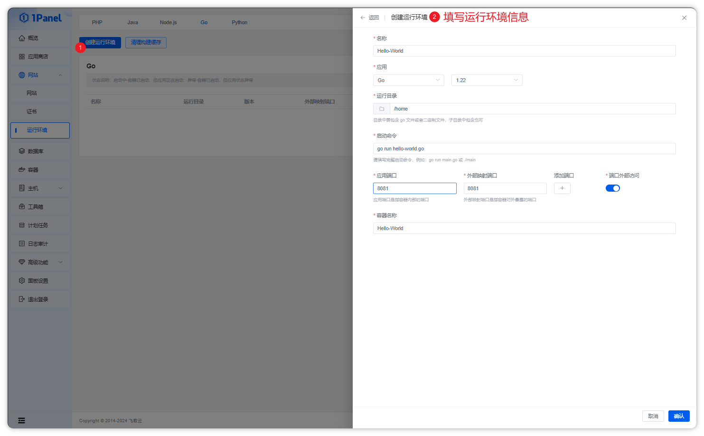
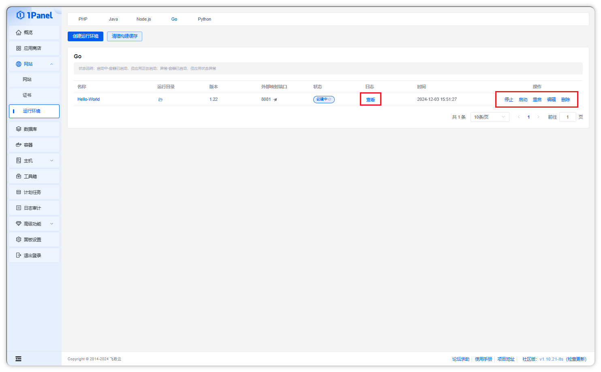

## 创建 .NET 运行环境

**点击创建运行环境按钮，选择 Golang 版本和运行目录等信息**

!!! Abstract ""

    - 目前支持 .NET 9.0、8.0、6.0 版本，用户可以根据自己的需求选择合适的版本。
    - 目前使用的是 mcr.microsoft.com/dotnet/aspnet 镜像，需要先把代码编译成 .dll 文件，然后放到运行目录中。

## 操作 .NET 运行环境

!!! Abstract ""

    - 在列表页面，可以对 .NET 运行环境进行停止、启动、重启、编辑、删除和查看日志等操作

