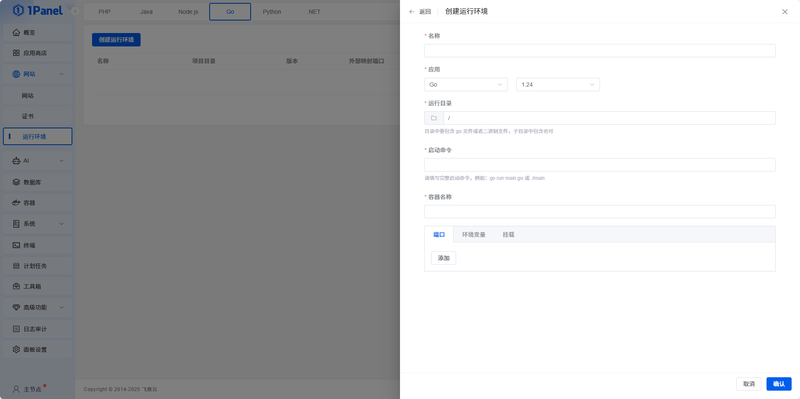
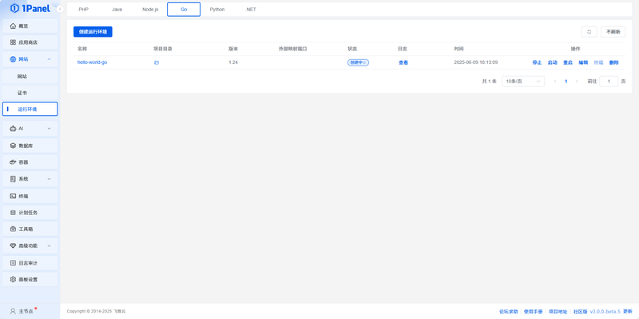

# Go 运行环境

## 1 创建 Go 运行环境

!!! note ""

    点击 **创建运行环境**，选择 Go 版本、运行目录和启动配置。可选版本以当前页面显示为准；创建前应确保项目已经包含可构建或可执行的 Go 程序。

## 2 操作 Go 运行环境

!!! note ""

    - 在列表页面，可以对 Go 运行环境进行停止、启动、重启、编辑、删除和查看日志等操作。
    - 编辑启动命令、运行目录或环境变量后，需通过日志确认程序重新启动成功。

