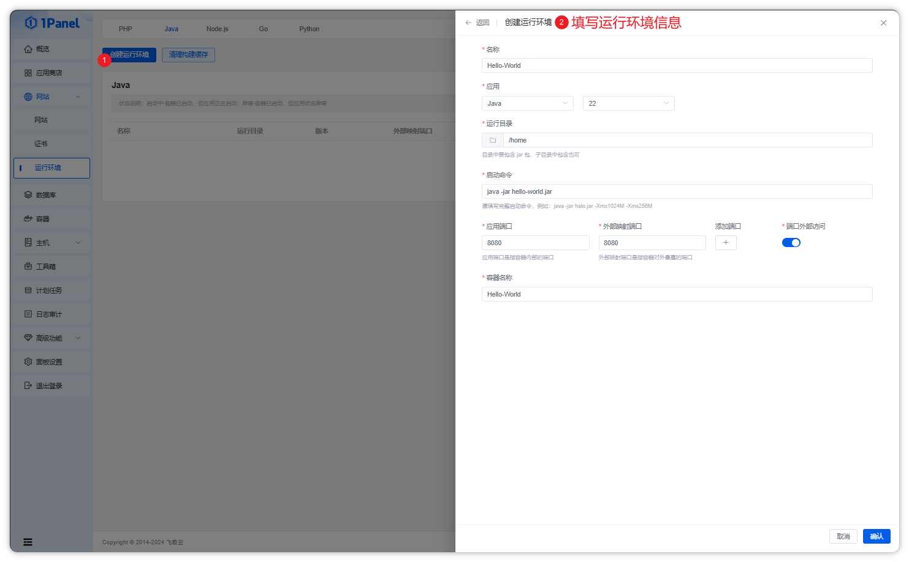
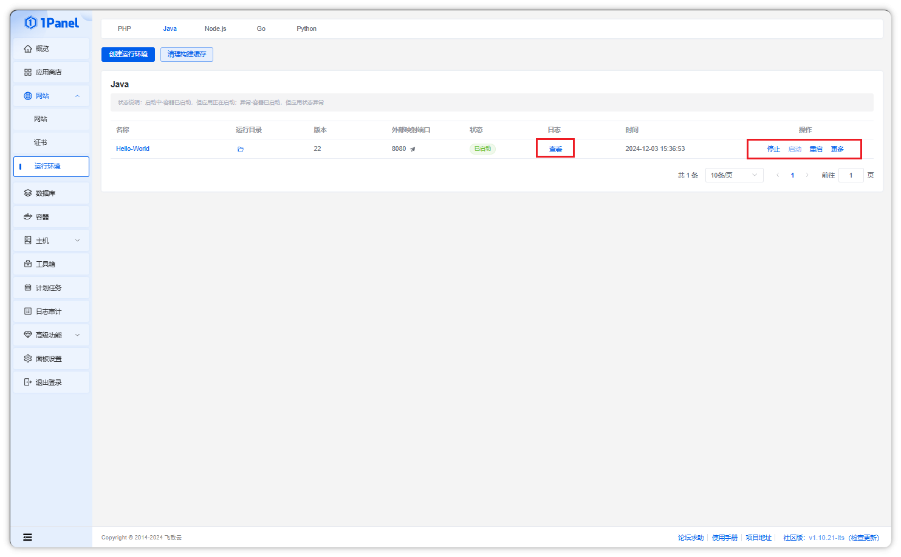
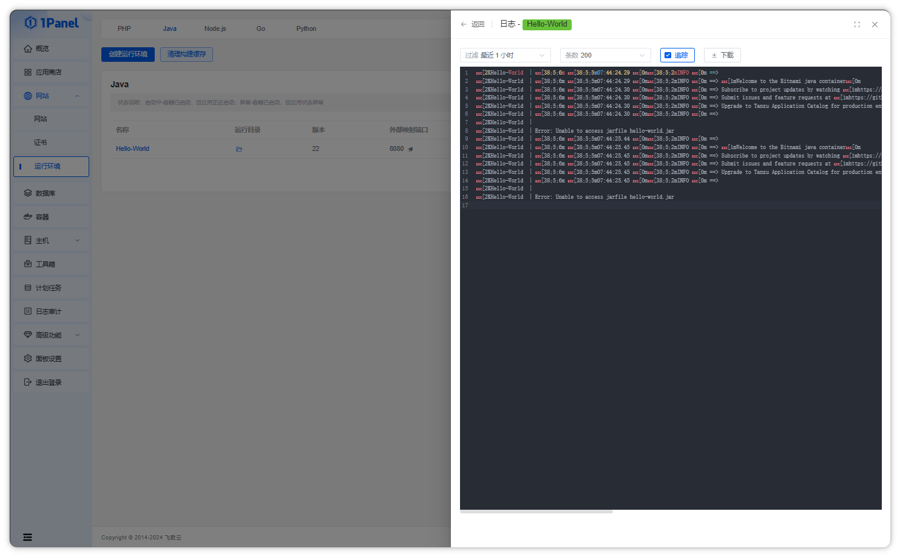

## 创建 Java 运行环境

**点击创建运行环境按钮，选择 Java 版本和运行目录等信息**

!!! note ""

    - 目前支持 Java 1.8、11、17、18、21、22 大版本，用户可以根据自己的需求选择合适的版本。

## 操作 Java 运行环境

!!! note ""

    - 在列表页面，可以对 Java 运行环境进行停止、启动、重启、编辑、删除和查看日志等操作

