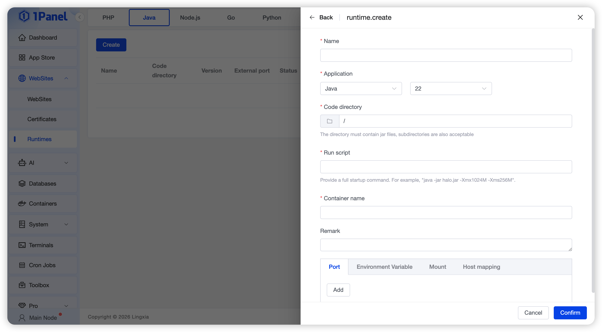

## 1 Create Java Runtime Environment

!!! note ""
    Click the **Create Runtime Environment** button and select the Java version, runtime directory, and other information.

    - Currently supported major versions: Java 1.8, 11, 17, 18, 21, and 22. Choose the appropriate version based on your needs.

{: .browser-mockup}

## 2 Manage Java Runtime Environment

!!! note ""
    - On the list page, you can perform the following operations on the Java runtime environment: stop, start, restart, edit, delete, and view logs.

## 3 View Logs

!!! note ""
    Click the **View Logs** button to check the runtime logs of the Java environment.
