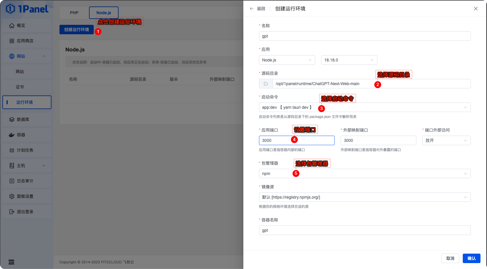
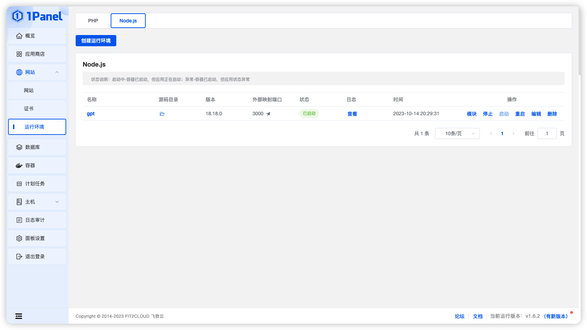
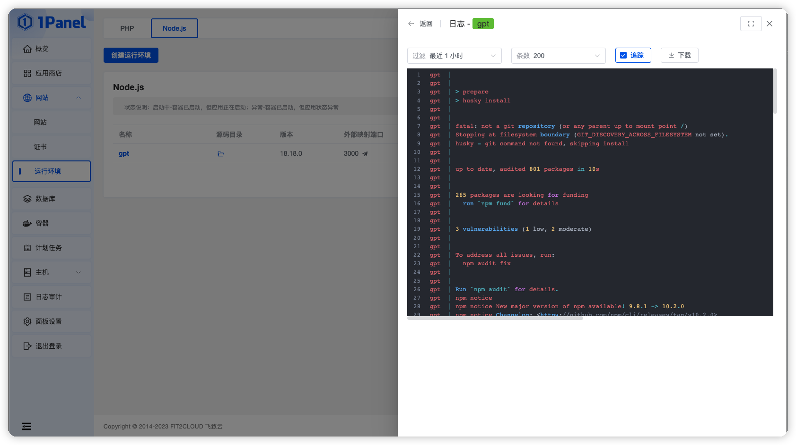
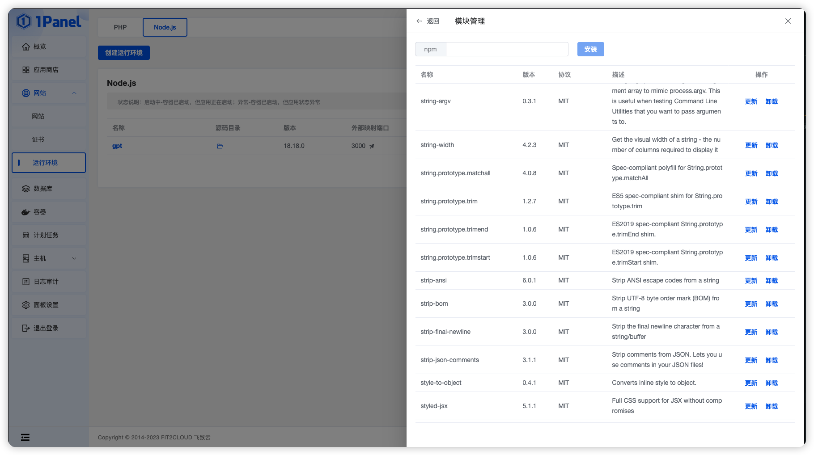

## 创建 Node 运行环境

**点击创建运行环境按钮，选择 Node 版本和源码目录**

!!! Abstract ""

    - 目前支持 12.x、14.x 16.x 和 18.x 四个大版本，用户可以根据自己的需求选择合适的版本。

## 操作 Node 运行环境

!!! Abstract ""
    
    - 在列表页面，可以对 Node 运行环境进行停止、启动、重启、编辑、删除、模块管理和查看日志等操作

## 日志查看

!!! Abstract ""
    
    - 点击查看按钮，可以查看 Node 运行环境的运行日志

## 模块管理

!!! Abstract ""
    
    - 点击模块按钮，可以对 Node 运行环境的模块进行管理

