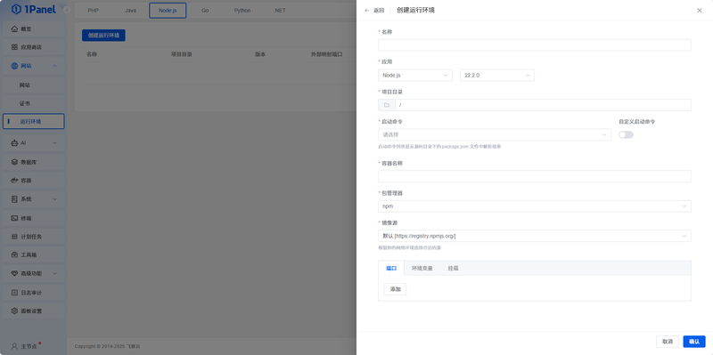

## 1 Create Node Runtime Environment

!!! note ""
    Click the **Create Runtime Environment** button and select the Node version and source code directory.

    Currently supported major versions: 12.x, 14.x, 16.x, and 18.x. Choose the appropriate version based on your needs.

{: .browser-mockup}

## 2 Manage Node Runtime Environment

!!! note ""
    On the list page, you can view installed modules of the Node runtime environment, and perform operations including stop, start, restart, edit, delete, module management, and view logs.

## 3 View Logs

!!! note ""
    Click the **View Logs** button to check the runtime logs of the Node environment.

## 4 Module Management

!!! note ""
    Click the **Modules** button to manage modules of the Node runtime environment.
