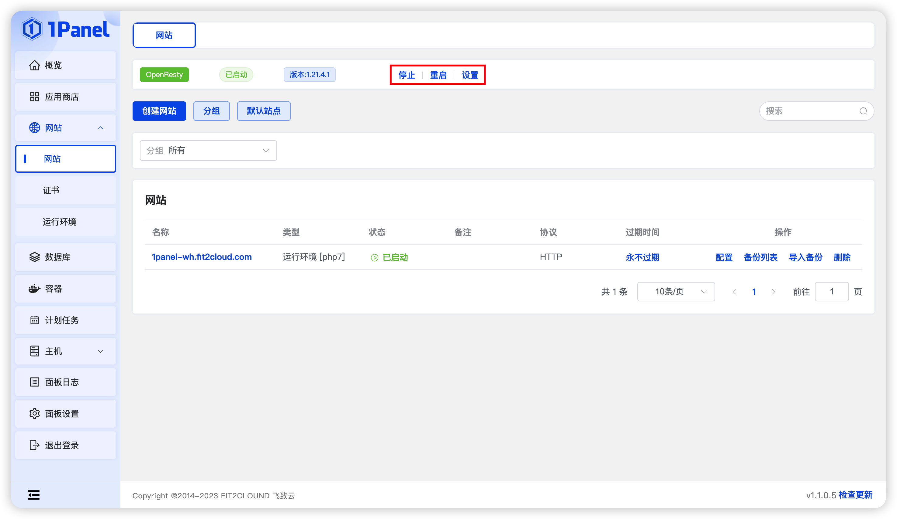
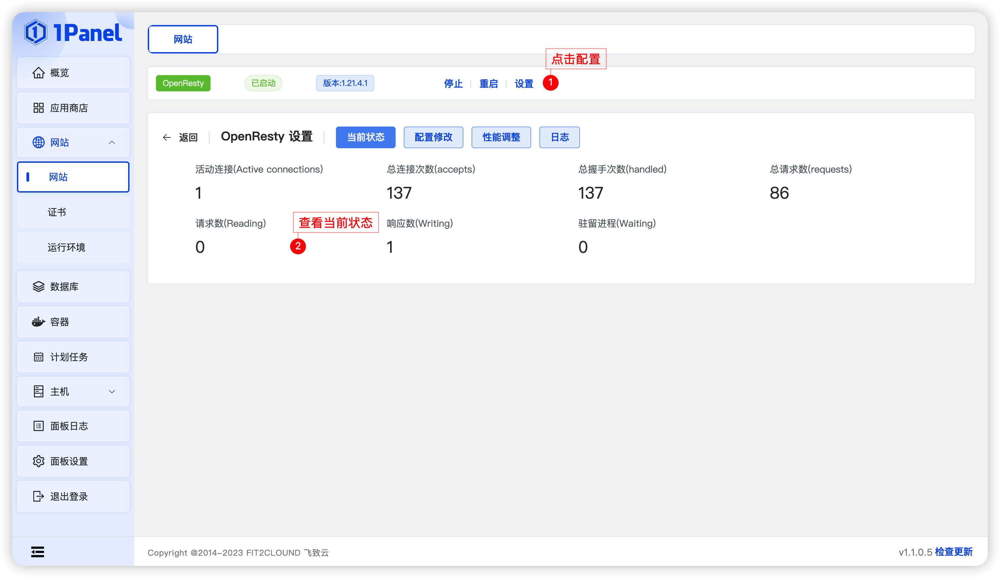
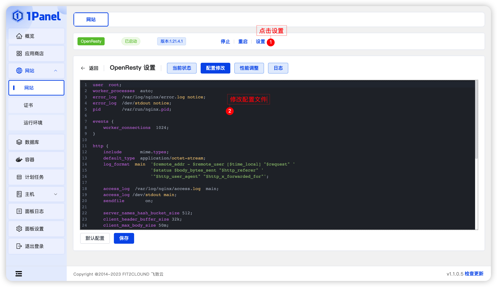
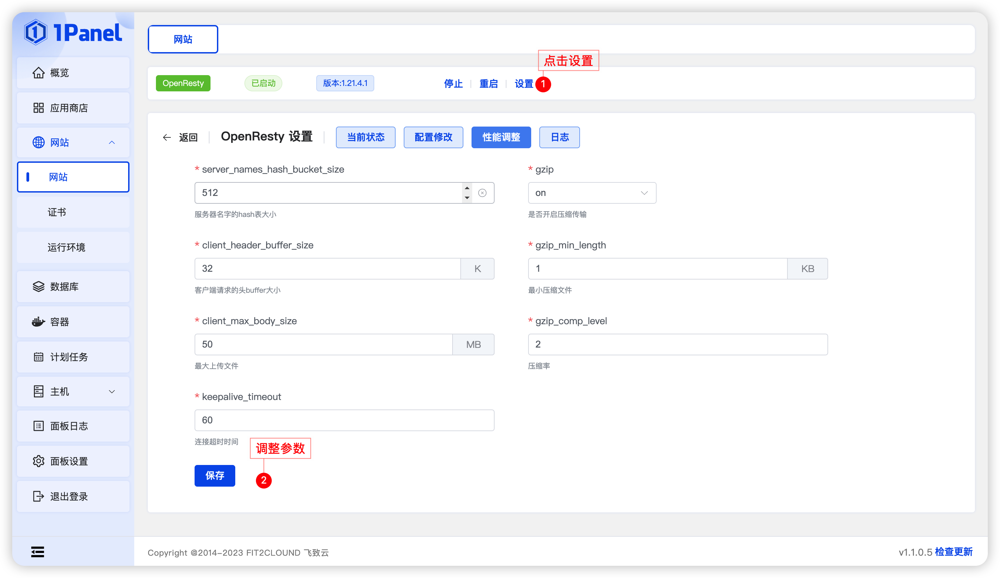
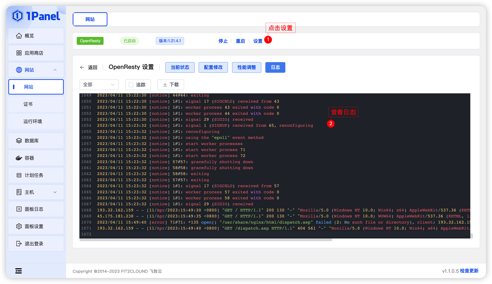

!!! Abstract ""

    网站列表上方的工具栏，可以查看并配置 OpenResty。

### 1.1 停止/启动/重启

!!! Abstract ""

    可以通过按钮 停止/启动/重启 来管理 OpenResty 应用。

### 1.2 当前状态

!!! Abstract ""

    显示 OpenResty 的相关状态。

### 1.3 配置修改

!!! Abstract ""

    - 设置 OpenResty 的配置文件
    - 默认配置按钮可以将配置文件恢复到默认状态

### 1.4 性能调整

    调整 OpenResty 的相关配置参数。

### 1.5 日志

    查看 OpenResty 的日志。

