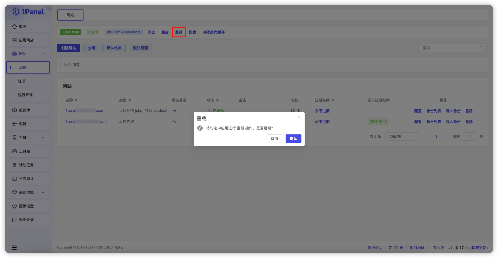

!!! Abstract ""

    网站列表上方的工具栏可用于查看和配置 OpenResty。

## 1 停止 / 启动 / 重启

!!! Abstract ""

    可以通过按钮停止、启动或重启来管理 OpenResty 应用。

## 2 重载

!!! Abstract ""

    允许用户在无需停机的情况下快速应用配置更改，确保网站服务的高可用性。

## 3 设置

### 3.1 当前状态

!!! Abstract ""

    查看当前网站状态，包括活动连接数、总连接数、总握手次数、总请求数、请求数、响应数及驻留进程等信息。

### 3.2 配置修改

!!! Abstract ""

    - 配置 OpenResty 的配置文件
    - 点击【默认配置】按钮可将配置文件恢复到默认状态

### 3.3 性能调整

!!! Abstract ""

    调整 OpenResty 的相关配置参数。

### 3.4 日志

!!! Abstract ""

    查看 OpenResty 日志，支持实时追踪、下载、清空等操作，并可按指定时间段和行数筛选日志。

## 4 清除反代缓存

!!! Abstract ""

    清除反向代理缓存的功能，以确保用户获取最新的内容和资源。

