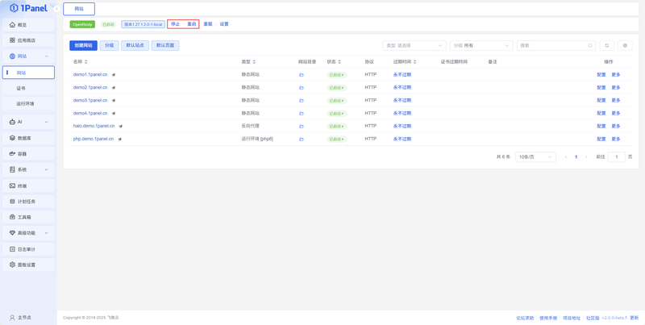
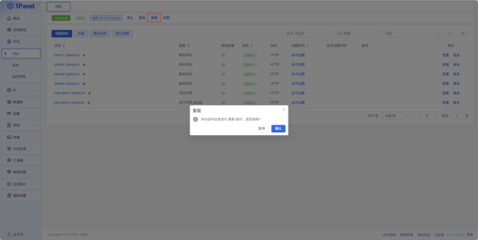
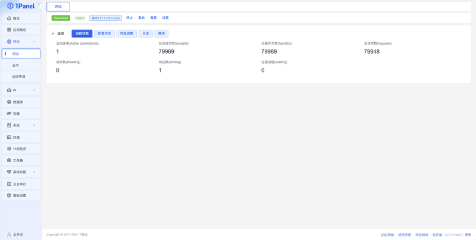
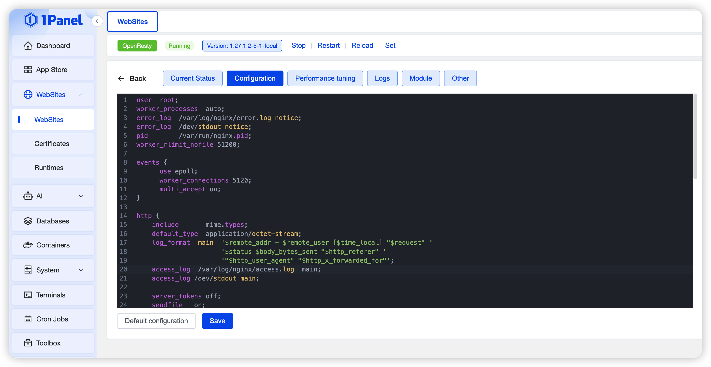
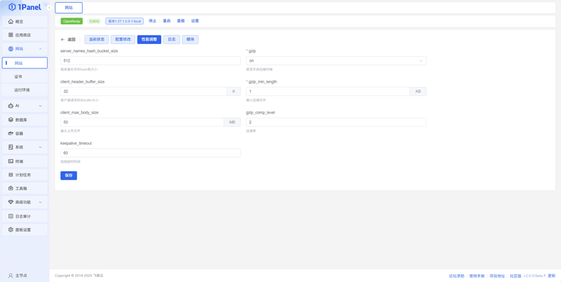
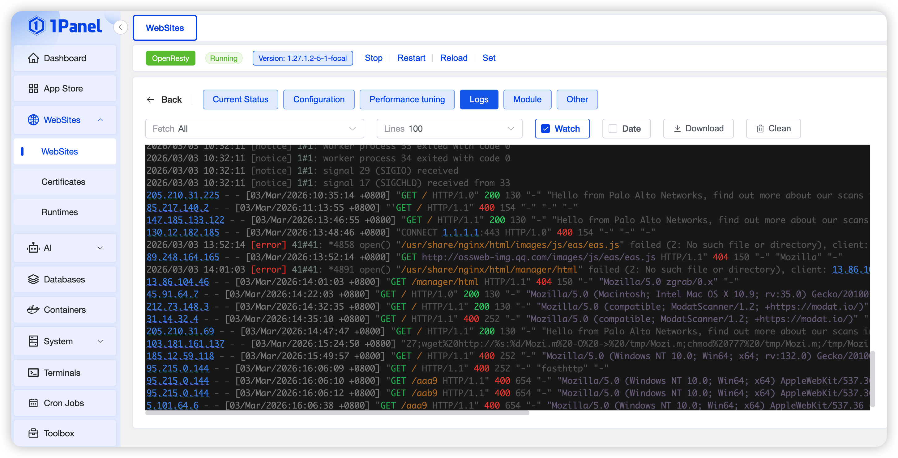
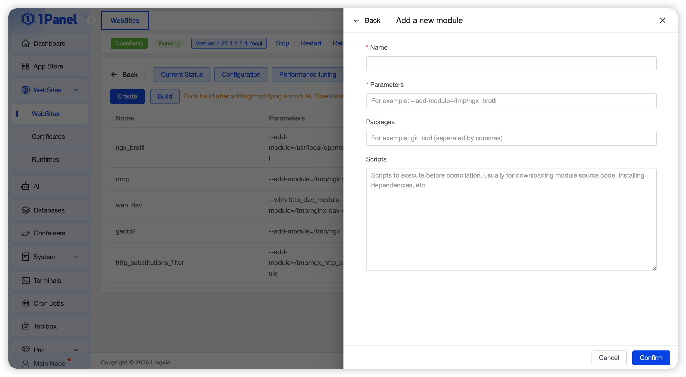

!!! note ""
    The toolbar above the website list can be used to view and configure OpenResty.

## 1 Stop / Start / Restart

!!! note ""
    You can manage the OpenResty application by clicking the Stop, Start, or Restart buttons.

{: .browser-mockup}

## 2 Reload

!!! note ""
    Allows you to quickly apply configuration changes without downtime, ensuring high availability of website services.

{: .browser-mockup}

## 3 Settings

### 3.1 Current Status

!!! note ""
    View the current status of the website, including active connections, total connections, total handshakes, total requests, number of requests, number of responses, and resident processes.

{: .browser-mockup}

### 3.2 Configuration Modification

!!! note ""
    - Configure OpenResty's configuration files
    - Click the **Default Configuration** button to restore the configuration file to its default state

{: .browser-mockup}

### 3.3 Performance Tuning

!!! note ""
    Adjust relevant configuration parameters of OpenResty.

{: .browser-mockup}

### 3.4 Logs

!!! note ""
    View OpenResty logs, with support for real-time tracking, downloading, clearing, and filtering logs by specified time range and number of lines.

{: .browser-mockup}

### 3.5 Modules

!!! note ""
    Manage OpenResty modules, including:
    
    - View the list of installed modules
    - Enable/disable specified modules
    - Create, edit, and delete modules

    After changing module configurations, click the **Build** button to apply the settings. OpenResty will automatically restart after a successful build.

!!! note ""
    If building custom modules, place the module's source package in the directory `/opt/1panel/apps/openresty/openresty/build/tmp` (/opt is the installation directory of 1Panel).  
    The parameter format is similar to `--add-module=/tmp/nginx-rtmp-module` (must use /tmp).  
    Example script: `unzip -o /tmp/nginx-rtmp-module.zip -d /tmp` (must use /tmp).  

{: .browser-mockup}
