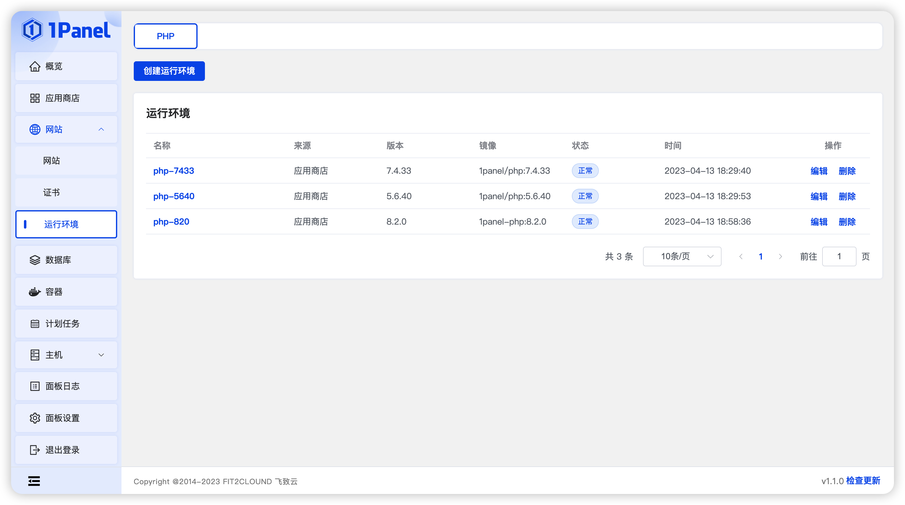
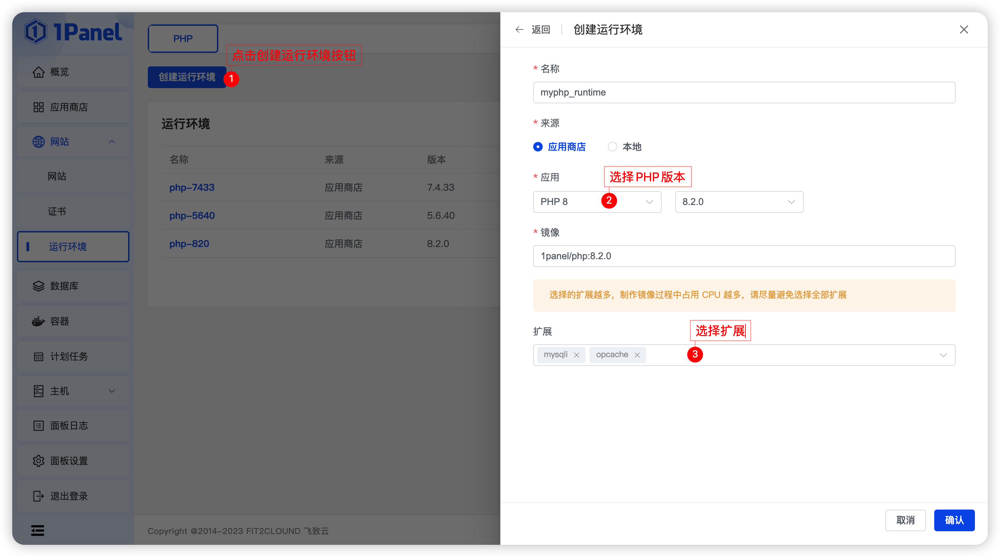

## 创建 PHP 运行环境

!!! Abstract ""
    **点击创建运行环境按钮，选择 PHP 版本和扩展**

    - 1Panel 支持维护 5.x、7.x 和 8.x 三个大版本，用户可以根据自己的需求选择合适的版本。

## PHP 扩展列表

<!-- START OF EXTENSIONS TABLE -->
<!-- ########################################################### -->
<!-- #                                                         # -->
<!-- #  DO NOT EDIT THIS TABLE: IT IS GENERATED AUTOMATICALLY  # -->
<!-- #                                                         # -->
<!-- #  EDIT THE data/supported-extensions FILE INSTEAD        # -->
<!-- #                                                         # -->
<!-- ########################################################### -->
| Extension | PHP 5.5 | PHP 5.6 | PHP 7.0 | PHP 7.1 | PHP 7.2 | PHP 7.3 | PHP 7.4 | PHP 8.0 | PHP 8.1 | PHP 8.2 |
|:---:|:---:|:---:|:---:|:---:|:---:|:---:|:---:|:---:|:---:|:---:|
| amqp | &check; | &check; | &check; | &check; | &check; | &check; | &check; | &check; | &check; | &check; |
| apcu | &check; | &check; | &check; | &check; | &check; | &check; | &check; | &check; | &check; | &check; |
| apcu_bc |  |  | &check; | &check; | &check; | &check; | &check; |  |  |  |
| ast |  |  | &check; | &check; | &check; | &check; | &check; | &check; | &check; | &check; |
| bcmath | &check; | &check; | &check; | &check; | &check; | &check; | &check; | &check; | &check; | &check; |
| blackfire | &check; | &check; | &check; | &check; | &check; | &check; | &check; | &check; | &check; |  |
| bz2 | &check; | &check; | &check; | &check; | &check; | &check; | &check; | &check; | &check; | &check; |
| calendar | &check; | &check; | &check; | &check; | &check; | &check; | &check; | &check; | &check; | &check; |
| cassandra[*](#special-requirements-for-cassandra) |  |  |  |  | &check; | &check; | &check; | &check; | &check; | &check; |
| cmark |  |  | &check; | &check; | &check; | &check; | &check; |  |  |  |
| csv |  |  |  |  |  | &check; | &check; | &check; | &check; | &check; |
| dba | &check; | &check; | &check; | &check; | &check; | &check; | &check; | &check; | &check; | &check; |
| ddtrace[*](#special-requirements-for-ddtrace) |  | &check; | &check; | &check; | &check; | &check; | &check; | &check; | &check; | &check; |
| decimal |  |  | &check; | &check; | &check; | &check; | &check; | &check; | &check; | &check; |
| ds |  |  | &check; | &check; | &check; | &check; | &check; | &check; | &check; | &check; |
| enchant | &check; | &check; | &check; | &check; | &check; | &check; | &check; | &check; | &check; | &check; |
| ev | &check; | &check; | &check; | &check; | &check; | &check; | &check; | &check; | &check; | &check; |
| event | &check; | &check; | &check; | &check; | &check; | &check; | &check; | &check; | &check; | &check; |
| excimer |  |  |  | &check; | &check; | &check; | &check; | &check; | &check; | &check; |
| exif | &check; | &check; | &check; | &check; | &check; | &check; | &check; | &check; | &check; | &check; |
| ffi |  |  |  |  |  |  | &check; | &check; | &check; | &check; |
| gd | &check; | &check; | &check; | &check; | &check; | &check; | &check; | &check; | &check; | &check; |
| gearman | &check; | &check; | &check; | &check; | &check; | &check; | &check; | &check; |  |  |
| geoip | &check; | &check; | &check; | &check; | &check; | &check; | &check; |  |  |  |
| geos[*](#special-requirements-for-geos) | &check; | &check; | &check; | &check; | &check; | &check; | &check; |  |  |  |
| geospatial | &check; | &check; | &check; | &check; | &check; | &check; | &check; | &check; | &check; | &check; |
| gettext | &check; | &check; | &check; | &check; | &check; | &check; | &check; | &check; | &check; | &check; |
| gmagick | &check; | &check; | &check; | &check; | &check; | &check; | &check; | &check; | &check; | &check; |
| gmp | &check; | &check; | &check; | &check; | &check; | &check; | &check; | &check; | &check; | &check; |
| gnupg | &check; | &check; | &check; | &check; | &check; | &check; | &check; | &check; | &check; | &check; |
| grpc | &check; | &check; | &check; | &check; | &check; | &check; | &check; | &check; | &check; | &check; |
| http | &check; | &check; | &check; | &check; | &check; | &check; | &check; | &check; | &check; | &check; |
| igbinary | &check; | &check; | &check; | &check; | &check; | &check; | &check; | &check; | &check; | &check; |
| imagick | &check; | &check; | &check; | &check; | &check; | &check; | &check; | &check; | &check; | &check; |
| imap | &check; | &check; | &check; | &check; | &check; | &check; | &check; | &check; | &check; | &check; |
| inotify | &check; | &check; | &check; | &check; | &check; | &check; | &check; | &check; | &check; | &check; |
| interbase | &check; | &check; | &check; | &check; | &check; | &check; |  |  |  |  |
| intl | &check; | &check; | &check; | &check; | &check; | &check; | &check; | &check; | &check; | &check; |
| ion |  |  |  |  |  |  |  |  | &check; | &check; |
| ioncube_loader | &check; | &check; | &check; | &check; | &check; | &check; | &check; |  | &check; |  |
| jsmin | &check; | &check; | &check; | &check; | &check; | &check; | &check; |  |  |  |
| json_post | &check; | &check; | &check; | &check; | &check; | &check; | &check; | &check; | &check; | &check; |
| ldap | &check; | &check; | &check; | &check; | &check; | &check; | &check; | &check; | &check; | &check; |
| luasandbox | &check; | &check; | &check; | &check; | &check; | &check; | &check; | &check; | &check; | &check; |
| lz4[*](#special-requirements-for-lz4) |  | &check; | &check; | &check; | &check; | &check; | &check; | &check; | &check; | &check; |
| lzf | &check; | &check; | &check; | &check; | &check; | &check; | &check; | &check; | &check; | &check; |
| mailparse | &check; | &check; | &check; | &check; | &check; | &check; | &check; | &check; | &check; | &check; |
| maxminddb |  |  |  |  | &check; | &check; | &check; | &check; | &check; | &check; |
| mcrypt | &check; | &check; | &check; | &check; | &check; | &check; | &check; | &check; | &check; | &check; |
| memcache | &check; | &check; | &check; | &check; | &check; | &check; | &check; | &check; | &check; | &check; |
| memcached | &check; | &check; | &check; | &check; | &check; | &check; | &check; | &check; | &check; | &check; |
| memprof[*](#special-requirements-for-memprof) | &check; | &check; | &check; | &check; | &check; | &check; | &check; | &check; | &check; | &check; |
| mongo | &check; | &check; |  |  |  |  |  |  |  |  |
| mongodb | &check; | &check; | &check; | &check; | &check; | &check; | &check; | &check; | &check; | &check; |
| mosquitto | &check; | &check; | &check; | &check; | &check; | &check; | &check; |  |  |  |
| msgpack | &check; | &check; | &check; | &check; | &check; | &check; | &check; | &check; | &check; | &check; |
| mssql | &check; | &check; |  |  |  |  |  |  |  |  |
| mysql | &check; | &check; |  |  |  |  |  |  |  |  |
| mysqli | &check; | &check; | &check; | &check; | &check; | &check; | &check; | &check; | &check; | &check; |
| oauth | &check; | &check; | &check; | &check; | &check; | &check; | &check; | &check; | &check; | &check; |
| oci8 | &check; | &check; | &check; | &check; | &check; | &check; | &check; | &check; | &check; | &check; |
| odbc | &check; | &check; | &check; | &check; | &check; | &check; | &check; | &check; | &check; | &check; |
| opcache | &check; | &check; | &check; | &check; | &check; | &check; | &check; | &check; | &check; | &check; |
| opencensus |  |  | &check; | &check; | &check; | &check; | &check; | &check; | &check; | &check; |
| openswoole |  |  |  |  | &check; | &check; | &check; | &check; | &check; | &check; |
| opentelemetry |  |  |  |  |  |  |  | &check; | &check; | &check; |
| parallel[*](#special-requirements-for-parallel) |  |  |  | &check; | &check; | &check; | &check; | &check; | &check; | &check; |
| parle[*](#special-requirements-for-parle) |  |  | &check; | &check; | &check; | &check; | &check; | &check; | &check; | &check; |
| pcntl | &check; | &check; | &check; | &check; | &check; | &check; | &check; | &check; | &check; | &check; |
| pcov |  |  | &check; | &check; | &check; | &check; | &check; | &check; | &check; | &check; |
| pdo_dblib | &check; | &check; | &check; | &check; | &check; | &check; | &check; | &check; | &check; | &check; |
| pdo_firebird | &check; | &check; | &check; | &check; | &check; | &check; | &check; | &check; | &check; | &check; |
| pdo_mysql | &check; | &check; | &check; | &check; | &check; | &check; | &check; | &check; | &check; | &check; |
| pdo_oci |  |  | &check; | &check; | &check; | &check; | &check; | &check; | &check; | &check; |
| pdo_odbc | &check; | &check; | &check; | &check; | &check; | &check; | &check; | &check; | &check; | &check; |
| pdo_pgsql | &check; | &check; | &check; | &check; | &check; | &check; | &check; | &check; | &check; | &check; |
| pdo_sqlsrv[*](#special-requirements-for-pdo_sqlsrv) |  |  | &check; | &check; | &check; | &check; | &check; | &check; | &check; | &check; |
| pgsql | &check; | &check; | &check; | &check; | &check; | &check; | &check; | &check; | &check; | &check; |
| php_trie |  |  |  |  |  | &check; | &check; | &check; | &check; | &check; |
| propro | &check; | &check; | &check; | &check; | &check; | &check; | &check; |  |  |  |
| protobuf | &check; | &check; | &check; | &check; | &check; | &check; | &check; | &check; | &check; | &check; |
| pspell | &check; | &check; | &check; | &check; | &check; | &check; | &check; | &check; | &check; | &check; |
| pthreads[*](#special-requirements-for-pthreads) | &check; | &check; | &check; |  |  |  |  |  |  |  |
| raphf | &check; | &check; | &check; | &check; | &check; | &check; | &check; | &check; | &check; | &check; |
| rdkafka | &check; | &check; | &check; | &check; | &check; | &check; | &check; | &check; | &check; | &check; |
| recode | &check; | &check; | &check; | &check; | &check; | &check; |  |  |  |  |
| redis | &check; | &check; | &check; | &check; | &check; | &check; | &check; | &check; | &check; | &check; |
| relay |  |  |  |  |  |  | &check; | &check; | &check; | &check; |
| seaslog | &check; | &check; | &check; | &check; | &check; | &check; | &check; | &check; | &check; | &check; |
| shmop | &check; | &check; | &check; | &check; | &check; | &check; | &check; | &check; | &check; | &check; |
| simdjson[*](#special-requirements-for-simdjson) |  |  |  | &check; | &check; | &check; | &check; | &check; | &check; | &check; |
| smbclient | &check; | &check; | &check; | &check; | &check; | &check; | &check; | &check; | &check; | &check; |
| snappy | &check; | &check; | &check; | &check; | &check; | &check; | &check; | &check; | &check; | &check; |
| snmp | &check; | &check; | &check; | &check; | &check; | &check; | &check; | &check; | &check; | &check; |
| snuffleupagus |  |  | &check; | &check; | &check; | &check; | &check; | &check; | &check; | &check; |
| soap | &check; | &check; | &check; | &check; | &check; | &check; | &check; | &check; | &check; | &check; |
| sockets | &check; | &check; | &check; | &check; | &check; | &check; | &check; | &check; | &check; | &check; |
| sodium[*](#special-requirements-for-sodium) |  | &check; | &check; | &check; |  |  |  |  |  |  |
| solr | &check; | &check; | &check; | &check; | &check; | &check; | &check; | &check; | &check; | &check; |
| sourceguardian | &check; | &check; | &check; | &check; | &check; | &check; | &check; | &check; | &check; | &check; |
| spx |  | &check; | &check; | &check; | &check; | &check; | &check; | &check; | &check; | &check; |
| sqlsrv[*](#special-requirements-for-sqlsrv) |  |  | &check; | &check; | &check; | &check; | &check; | &check; | &check; | &check; |
| ssh2 | &check; | &check; | &check; | &check; | &check; | &check; | &check; | &check; | &check; | &check; |
| stomp | &check; | &check; | &check; | &check; | &check; | &check; | &check; |  |  | &check; |
| swoole | &check; | &check; | &check; | &check; | &check; | &check; | &check; | &check; | &check; | &check; |
| sybase_ct | &check; | &check; |  |  |  |  |  |  |  |  |
| sysvmsg | &check; | &check; | &check; | &check; | &check; | &check; | &check; | &check; | &check; | &check; |
| sysvsem | &check; | &check; | &check; | &check; | &check; | &check; | &check; | &check; | &check; | &check; |
| sysvshm | &check; | &check; | &check; | &check; | &check; | &check; | &check; | &check; | &check; | &check; |
| tensor[*](#special-requirements-for-tensor) |  |  |  |  | &check; | &check; | &check; | &check; |  |  |
| tidy | &check; | &check; | &check; | &check; | &check; | &check; | &check; | &check; | &check; | &check; |
| timezonedb | &check; | &check; | &check; | &check; | &check; | &check; | &check; | &check; | &check; | &check; |
| uopz | &check; | &check; | &check; | &check; | &check; | &check; | &check; | &check; | &check; | &check; |
| uploadprogress | &check; | &check; | &check; | &check; | &check; | &check; | &check; | &check; | &check; | &check; |
| uuid | &check; | &check; | &check; | &check; | &check; | &check; | &check; | &check; | &check; | &check; |
| vips[*](#special-requirements-for-vips) |  |  | &check; | &check; | &check; | &check; | &check; | &check; | &check; | &check; |
| wddx | &check; | &check; | &check; | &check; | &check; | &check; |  |  |  |  |
| xdebug | &check; | &check; | &check; | &check; | &check; | &check; | &check; | &check; | &check; | &check; |
| xdiff | &check; | &check; | &check; | &check; | &check; | &check; | &check; | &check; | &check; | &check; |
| xhprof | &check; | &check; | &check; | &check; | &check; | &check; | &check; | &check; | &check; | &check; |
| xlswriter |  |  | &check; | &check; | &check; | &check; | &check; | &check; | &check; | &check; |
| xmldiff | &check; | &check; | &check; | &check; | &check; | &check; | &check; | &check; | &check; | &check; |
| xmlrpc | &check; | &check; | &check; | &check; | &check; | &check; | &check; | &check; | &check; | &check; |
| xsl | &check; | &check; | &check; | &check; | &check; | &check; | &check; | &check; | &check; | &check; |
| yac |  |  | &check; | &check; | &check; | &check; | &check; | &check; | &check; | &check; |
| yaml | &check; | &check; | &check; | &check; | &check; | &check; | &check; | &check; | &check; | &check; |
| yar | &check; | &check; | &check; | &check; | &check; | &check; | &check; | &check; | &check; |  |
| zephir_parser |  |  | &check; | &check; | &check; | &check; | &check; | &check; | &check; | &check; |
| zip | &check; | &check; | &check; | &check; | &check; | &check; | &check; | &check; | &check; | &check; |
| zmq | &check; | &check; | &check; | &check; | &check; | &check; | &check; | &check; | &check; | &check; |
| zookeeper | &check; | &check; | &check; | &check; | &check; | &check; | &check; | &check; | &check; | &check; |
| zstd | &check; | &check; | &check; | &check; | &check; | &check; | &check; | &check; | &check; | &check; |

*Number of supported extensions: 132*
<!-- END OF EXTENSIONS TABLE -->