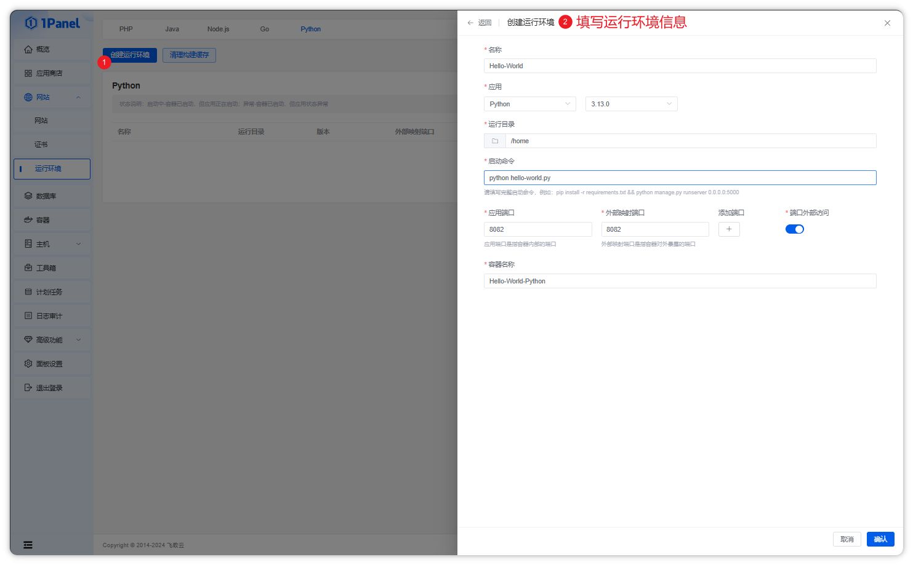
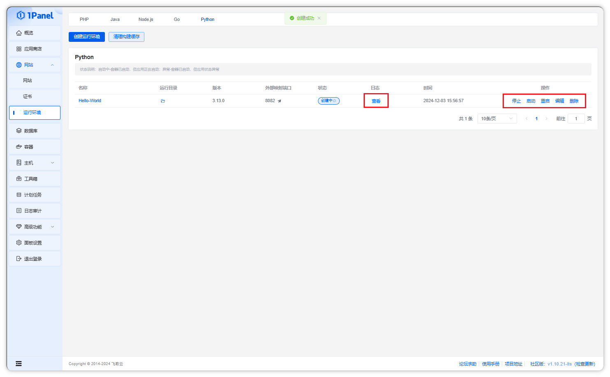

## 创建 Python 运行环境

**点击创建运行环境按钮，选择 Python 版本和运行目录等信息**

!!! note ""

    - 目前支持 Python 3.10、3.11、3.12、3.13 版本，用户可以根据自己的需求选择合适的版本。

## 操作 Python 运行环境

!!! note ""

    - 在列表页面，可以对 Python 运行环境进行停止、启动、重启、编辑、删除和查看日志等操作

